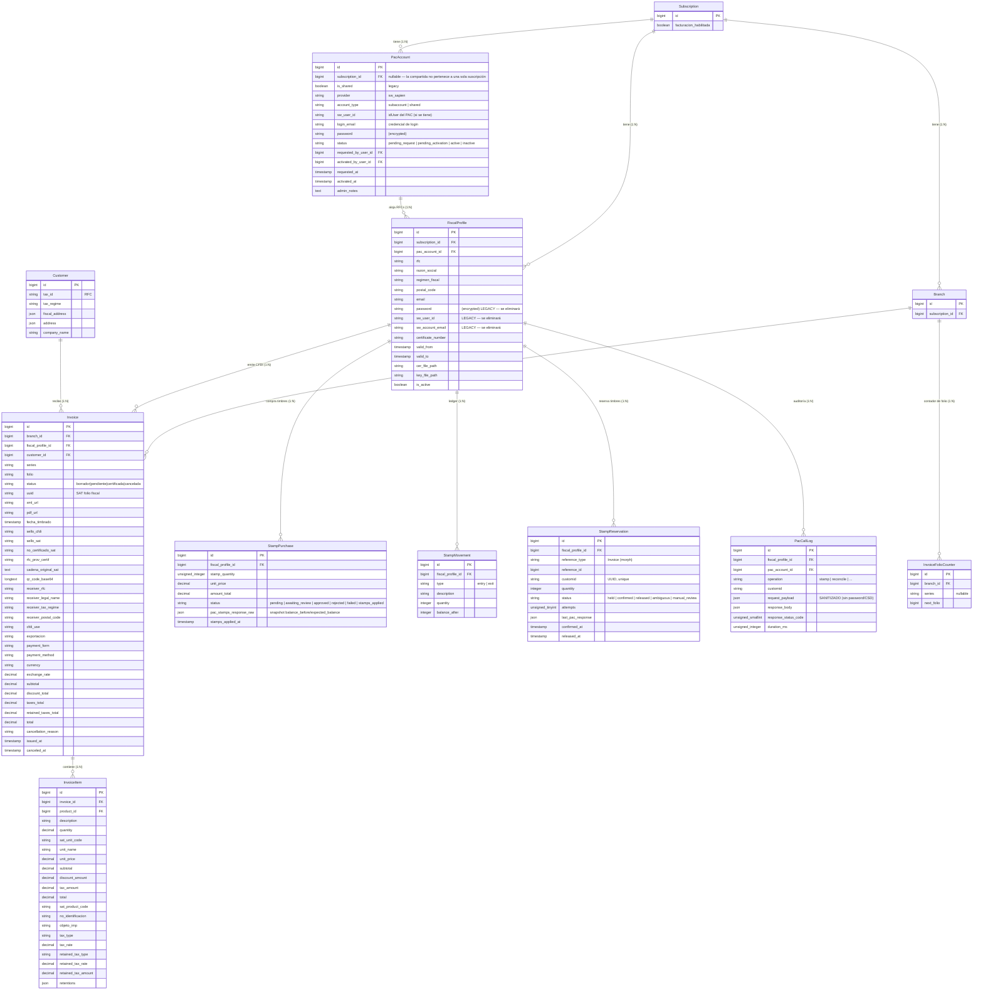
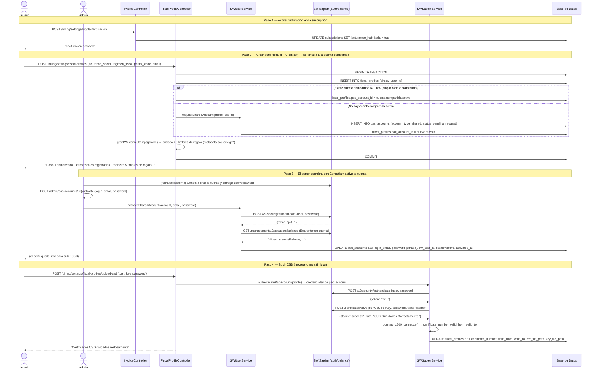
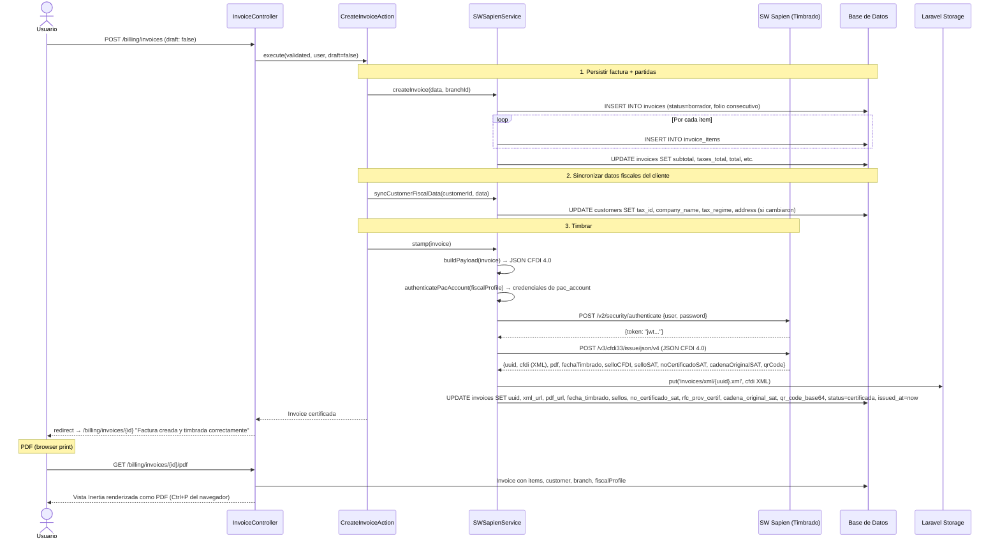
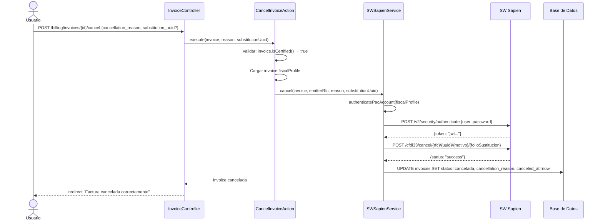

# Módulo de Facturación CFDI 4.0 — Documentación Técnica Completa

> **Proyecto:** EzyVentas  
> **Stack:** Laravel 12 (PHP 8.3+) + Vue 3 (Composition API `<script setup>`) + Inertia.js 2 + PrimeVue 4 + Tailwind CSS  
> **PAC:** SW Sapien — Dos tipos de cuenta: **subcuenta propia** (dealer, legacy) y **cuenta compartida** (externa, Conectia)  
> **Fecha del análisis:** 2026-07-18 · **Última actualización:** 2026-08-15 (cuenta compartida + timbres locales)  

---

## 1. Resumen general

### 1.1 Qué hace el módulo actualmente

| Funcionalidad | Estado | Descripción |
|---|---|---|
| **Timbrado CFDI 4.0** | ✅ Implementado | Creación de facturas electrónicas vía SW Sapien. Persiste factura localmente, construye payload JSON SAT-compliant, timbra contra el PAC, almacena XML/UUID/QR/sellos digitales. |
| **Prefacturas (borrador)** | ✅ Implementado | Permite guardar facturas en estado `borrador` sin timbrar. Se pueden timbrar posteriormente (`POST /stamp`). |
| **Cancelación de facturas** | ✅ Implementado | Cancelación UUID-based con los 4 motivos SAT (`01`–`04`) y UUID de sustitución. |
| **PDF / representación impresa** | ✅ Implementado | Vista Inertia renderizada como PDF vía navegador (Ctrl+P). Incluye timbre fiscal, comprobante, QR, logo de empresa, desglose de impuestos. |
| **Descarga de XML** | ✅ Implementado | Descarga del CFDI XML timbrado desde storage. |
| **Cuentas PAC (`pac_accounts`)** | ✅ Implementado | Entidad separada que representa la cuenta de login en el PAC. Una cuenta puede alojar **varios RFC** (`fiscal_profiles`). Dos tipos: `subaccount` (dealer, legacy) y `shared` (**cuenta compartida** externa de Conectia). La cuenta compartida puede alojar RFCs de **varias suscripciones**. |
| **Onboarding con cuenta compartida** | ✅ Implementado | Al crear un perfil fiscal, el RFC se vincula **automáticamente** a la cuenta compartida activa de la plataforma (Conectia); si no existe, se crea una `pending_request` que el admin activa con las credenciales del revendedor. Al vincularse, el RFC recibe **5 timbres de regalo** en su wallet local. |
| **Perfiles fiscales** | ✅ Implementado | CRUD completo: crear, subir CSD (.cer + .key), subir logo, desactivar/eliminar. Varios RFC por suscripción. |
| **Compra y ajuste de timbres (100% local)** | ✅ Implementado | Compra por Mercado Pago o transferencia y ajustes manuales del admin. Los timbres se aplican **localmente** a la wallet del RFC (`stamp_movements`): al aprobar una compra o hacer un ajuste, se suman/restan sin tocar el PAC. Si la wallet llega a 0, no se puede timbrar. |
| **Panel admin de cuentas PAC** | ✅ Implementado | `admin/pac-accounts`: solicitudes, activación con validación contra el PAC, actualización de credenciales y bitácora. |
| **Dashboard de facturación** | ✅ Parcial | KPIs: total comprobantes, facturas certificadas (="timbres usados"), canceladas, total facturado. Tabla de perfiles fiscales con estado genérico (Activo/Pendiente de activación). |
| **Toggle facturación** | ✅ Implementado | Activar/desactivar facturación a nivel suscripción. Al desactivar, todos los endpoints de PAC retornan safe defaults. |
| **Sincronización fiscal de clientes** | ✅ Implementado | Auto-actualiza RFC, razón social, régimen fiscal y CP del modelo `Customer` al facturar. |
| **Multi-retención** | ✅ Implementado | Soporte para array JSON de retenciones (ISR + IVA retenido) por concepto. |

### 1.2 Qué falta o está marcado como pendiente

| Hallazgo | Ubicación | Detalle |
|---|---|---|
| **TODO: Exportación del dashboard** | `Dashboard/Index.vue:75` | `// TODO: implement export logic` — el botón "Exportar" del dashboard no hace nada. |
| **Sin conteo de timbres por perfil en el dashboard de cliente** | Dashboard (`InvoiceController::dashboard()`) | El dashboard de cliente usa conteo local (facturas certificadas). Para cuentas compartidas el saldo disponible por RFC es la **wallet local** (`WalletService::availableBalance`); el saldo real del PAC solo lo ve el admin. |
| **Reserva de timbres / CustomID** | ✅ Implementado (Fase 2.8–2.13) | `stamp_reservations` con `customid`, folios atómicos (`invoice_folio_counters`), `pac_call_logs` sanitizado, `ResolveAmbiguousStampJob` y panel de revisión manual. |
| **Flujo de revendedor (`awaiting_reseller`)** | ✅ Eliminado (2026-08-15) | Ya no existe asignación por revendedor: los timbres se aplican **localmente** a la wallet del RFC al aprobar/ajustar, sin conexión al PAC. |
| **Sin webhook de cancelación** | Todo el proyecto | No se reciben notificaciones del PAC cuando una cancelación es aceptada/rechazada asíncronamente. |
| **BillingSetting legacy sin uso real** | Modelo `BillingSetting`, migración `2026_06_12_000008` | La tabla y modelo existen pero el sistema migró a `FiscalProfile`. El `SaveBillingSettingsAction` referencia `BillingSetting` pero no se usa desde ningún controller. |

---

## 2. Estructura de archivos

### 2.1 Backend

```
app/
├── Actions/Billing/
│   ├── ActivatePacAccountAction.php       — Orquestador de activación de cuentas compartidas (valida contra el PAC)
│   ├── ApproveStampPurchaseAction.php     — Aprueba compra y aplica timbres (localmente)
│   ├── CancelInvoiceAction.php            — Orquestador de cancelación de CFDI
│   ├── CreateFiscalSubaccountAction.php   — Orquestador de vinculación de subcuenta (dealer, legacy)
│   ├── CreateInvoiceAction.php            — Orquestador de creación + timbrado de CFDI
│   ├── CreateStampPurchaseAction.php      — Creación de compra de timbres (mínimo para cuentas compartidas)
│   └── SaveBillingSettingsAction.php      — Legacy: upsert de BillingSetting (sin uso activo)
│
├── Enums/
│   ├── InvoiceStatus.php                  — Estados: borrador, pendiente, certificada, cancelada (+ legacy suscripción)
│   ├── PacAccountType.php                 — subaccount | shared
│   ├── PacAccountStatus.php               — pending_request | pending_activation | active | inactive
│   └── StampPurchaseStatus.php            — pending, awaiting_review, approved, rejected, failed, stamps_applied (awaiting_reseller legacy sin uso)
│
├── Http/Controllers/Billing/
│   ├── FiscalProfileController.php        — CRUD de perfiles fiscales, onboarding (cuenta compartida), upload CSD, upload logo, delete
│   ├── InvoiceController.php              — Dashboard, CRUD facturas, timbrado, cancelación, PDF, XML, toggle facturación
│   └── StampPurchaseController.php        — Compra de timbres (quote, store, return Mercado Pago)
│
├── Http/Controllers/Admin/
│   ├── AdminPacAccountController.php      — Panel de cuentas PAC (solicitudes, activación, credenciales, notas)
│   ├── AdminStampDashboardController.php  — Panel global de timbres (saldo maestro, KPIs, emisores)
│   └── AdminStampPurchaseController.php   — Bandeja de revisión + ajustes manuales (100% local para compartidas)
│
├── Http/Requests/Billing/
│   ├── CancelInvoiceRequest.php           — Validación motivo cancelación + UUID sustitución
│   ├── SaveBillingSettingsRequest.php     — Legacy: validación emitter settings
│   ├── StoreFiscalProfileRequest.php      — Validación RFC, razón social, régimen, CP, email
│   └── StoreInvoiceRequest.php            — Validación completa de CFDI 4.0 (emisor, receptor, conceptos, impuestos, retenciones)
│
├── Http/Requests/Admin/
│   └── ActivatePacAccountRequest.php      — Validación login_email/password para activar cuenta compartida
│
├── Models/Billing/
│   ├── FiscalProfile.php                  — RFC emisor; pertenece a un PacAccount (N:1)
│   ├── PacAccount.php                     — Cuenta de login en el PAC (subaccount o shared); password cifrado; is_shared
│   ├── StampPurchase.php                  — Compra/ajuste de timbres (auditoría + estado)
│   ├── StampMovement.php                  — Ledger de movimientos de timbres por perfil
│   └── Invoice.php                        — CFDI 4.0 con todos los campos SAT y timbre fiscal
│
├── Models/
│   ├── InvoiceItem.php                    — Partidas/conceptos del CFDI
│   ├── Customer.php                       — Cliente (campos fiscales: tax_id, tax_regime, fiscal_address)
│   ├── Subscription.php                   — Suscripción (facturacion_habilitada, fiscalProfiles(), pacAccounts())
│   └── Branch.php                         — Sucursal (billingSetting() legacy)
│
├── Services/Billing/
│   ├── SWSapienService.php                — Servicio central: createInvoice, buildPayload, stamp, cancel, uploadCsd, authenticatePacAccount, syncCustomerFiscalData
│   ├── StampPurchaseService.php           — Precios y aplicación de timbres (local para cuentas compartidas)
│   └── StampMovementService.php           — Backfill del ledger + grantWelcomeStamps (5 timbres de regalo)
│
└── Services/SW/
    └── SWUserService.php                  — Cuentas PAC: createSubaccountForAccount, activateSharedAccount, getOwnBalance, getStampsBalance, add/removeStamps, requestSharedAccount
```

### 2.2 Frontend

```
resources/js/Pages/Billing/
├── Dashboard/
│   └── Index.vue                          — KPIs (comprobantes, timbres usados, canceladas, total facturado) + tabla de perfiles fiscales
├── Invoices/
│   ├── Index.vue                          — Listado paginado con filtros (búsqueda, status)
│   ├── Create.vue                         — Formulario de creación de CFDI 4.0 con todos los campos SAT
│   ├── Show.vue                           — Detalle de factura + acciones (cancelar, XML, PDF)
│   ├── Pdf.vue                            — Representación impresa CFDI 4.0 (timbre, QR, emisor, receptor, conceptos, impuestos)
│   └── Partials/
│       └── InvoiceTotals.vue              — Componente de totales (subtotal, descuento, IVA, retenciones, total)
└── Settings/
    ├── Index.vue                          — Gestión de perfiles fiscales (tabla, crear, toggle facturación, subir CSD)
    └── Partials/
        └── LogoUploadModal.vue            — Modal para subir/eliminar logo de perfil fiscal
```

### 2.3 Rutas

```
routes/web/billing.php                     — Grupo /billing con dashboard, invoices (CRUD + stamp + cancel + xml + pdf) y settings (fiscal profiles + CSD)
```

### 2.4 Migraciones

```
database/migrations/
├── 2026_06_12_000008_create_billing_settings_table.php          — Tabla billing_settings (legacy)
├── 2026_06_12_000009_create_invoices_table.php                  — Tabla invoices
├── 2026_06_12_000010_create_invoice_items_table.php             — Tabla invoice_items
├── 2026_06_22_000000_add_fiscal_fields_to_customers.php         — Campos tax_regime, fiscal_address en customers
├── 2026_06_22_000001_add_logo_path_to_billing_settings.php      — logo_path en billing_settings (legacy)
├── 2026_06_26_000001_create_fiscal_profiles_table.php           — Tabla fiscal_profiles
├── 2026_06_26_000002_add_fiscal_profile_id_to_invoices_table.php — FK fiscal_profile_id en invoices
├── 2026_06_26_000003_add_postal_code_to_fiscal_profiles_table.php — postal_code en fiscal_profiles
├── 2026_06_27_000001_add_email_password_to_fiscal_profiles_table.php — email, password en fiscal_profiles
├── 2026_06_27_000002_add_csd_columns_to_fiscal_profiles_table.php   — certificate_number, valid_from/to, cer/key paths
├── 2026_06_29_000001_add_cfdi_exportacion_and_retentions_to_invoices_and_items.php — exportacion, retenciones
├── 2026_06_29_000002_add_unit_name_and_sku_to_invoice_items.php — unit_name, no_identificacion
├── 2026_07_04_000001_add_exchange_rate_and_retentions_json.php  — exchange_rate, retentions JSON
├── 2026_07_09_000001_add_timbre_fiscal_columns_to_invoices.php  — Timbre fiscal: fecha_timbrado, sello_cfdi, sello_sat, no_certificado_sat, rfc_prov_certif, cadena_original_sat, qr_code_base64
├── 2026_07_18_000001_create_stamp_pricing_tiers_table.php       — Tramos de precio de timbres
├── 2026_07_18_000002_create_stamp_purchases_table.php           — Compras/ajustes de timbres
├── 2026_07_18_000004_add_manifest_columns_to_fiscal_profiles.php — Manifiesto SAT (firma)
├── 2026_07_22_000002_create_stamp_global_stats_snapshots_table.php — Snapshots de KPIs globales
├── 2026_07_24_000001_create_stamp_movements_table.php           — Ledger de movimientos de timbres
├── 2026_08_12_000001_create_pac_accounts_table.php              — Cuentas PAC (subaccount | normal → luego shared)
├── 2026_08_12_000002_add_pac_account_id_to_fiscal_profiles_table.php — FK pac_account_id en fiscal_profiles
├── 2026_08_13_000001_create_invoice_folio_counters_table.php     — Contadores atómicos de folio por (branch, serie)
├── 2026_08_13_000002_create_stamp_reservations_table.php         — Reservas de timbres con customid
├── 2026_08_13_000003_create_pac_call_logs_table.php              — Auditoría de llamadas al PAC (sanitizada)
├── 2026_08_13_000004_add_reservation_fields_to_invoices_table.php — requires_manual_review + unique folio
├── 2026_08_13_000005_make_pac_accounts_shared.php                — subscription_id nullable + is_shared
└── 2026_08_15_000001_rename_pac_account_type_normal_to_shared.php — normal → shared (enum + datos)
```

> **Backfill:** `php artisan pac-accounts:backfill` (idempotente, con `--dry-run` y `--profile=`) crea un `pac_account` tipo `subaccount` por cada `fiscal_profile` con `sw_user_id` legacy y lo vincula. Se ejecutó en dev; en TEST debe correrse antes de la validación end-to-end.

---

## 3. Modelos de datos

### 3.1 Diagrama Entidad-Relación



### 3.2 Relaciones clave

| Origen | Destino | Tipo | Descripción |
|---|---|---|---|
| `Subscription` | `FiscalProfile` | HasMany | Una suscripción puede facturar bajo múltiples RFC |
| `Subscription` | `PacAccount` | HasMany | Una suscripción puede tener una o varias cuentas PAC |
| `PacAccount` | `FiscalProfile` | HasMany | **Una cuenta PAC aloja varios RFC** (relación N:1 desde el perfil) |
| `FiscalProfile` | `PacAccount` | BelongsTo | Cada perfil fiscal pertenece a una cuenta PAC |
| `FiscalProfile` | `Subscription` | BelongsTo | Cada perfil fiscal pertenece a una suscripción |
| `FiscalProfile` | `StampPurchase` | HasMany | Compras/ajustes de timbres del perfil |
| `FiscalProfile` | `StampMovement` | HasMany | Ledger de movimientos de timbres |
| `Invoice` | `Branch` | BelongsTo | Cada factura se emite desde una sucursal |
| `Invoice` | `FiscalProfile` | BelongsTo | RFC emisor de la factura |
| `Invoice` | `Customer` | BelongsTo | Cliente receptor (nullable) |
| `Invoice` | `InvoiceItem` | HasMany | Partidas/conceptos del CFDI |
| `InvoiceItem` | `Invoice` | BelongsTo | Factura padre |
| `InvoiceItem` | `Product` | BelongsTo | Producto relacionado (nullable) |
| `Branch` | `BillingSetting` | HasOne | Configuración legacy por sucursal (deprecado) |

### 3.3 Tablas legacy sin uso activo

| Tabla | Estado |
|---|---|
| `billing_settings` | Creada pero reemplazada funcionalmente por `fiscal_profiles`. El modelo `BillingSetting` no se usa desde ningún controller activo. |

---

## 4. Integración con el PAC (SW Sapien)

### 4.0 Dos tipos de cuenta

| Tipo | Quién la crea | Timbres | Saldo | Activación |
|---|---|---|---|---|
| `subaccount` | Nosotros (API dealer, `POST /management/v2/api/dealers/users`) | Se asignan vía API dealer (`addStampsToSubaccount`) | Por usuario (`GET /management/v2/api/dealers/balance/users/{id}` con token dealer) | Automática |
| `shared` | El revendedor (Conectia), por fuera del sistema | Se gestionan **100% localmente** (wallet por RFC: 5 de regalo + compras + ajustes del admin) | Compartido / pozo — el saldo real (`GET /management/v2/api/users/balance` con token de la propia cuenta, **sin** dealer) **solo lo ve el admin** | Manual por admin (`activateSharedAccount`, valida credenciales contra el PAC) |

**Regla clave:** el timbrado/CSD/cancelación funciona **igual** para ambos tipos — solo cambia **de dónde salen las credenciales** (`PacAccount.login_email/password`) y **cómo se administra el saldo** (subcuentas → PAC en vivo; compartidas → wallet local por RFC). El tipo de cuenta es información administrativa: **nunca se muestra en la UI de cliente** (el cliente solo ve su wallet local).

### 4.1 Superficies de API

| Superficie | Host (test) | Autenticación | Propósito |
|---|---|---|---|
| **Timbrado/Cancelación/CSD** | `services.test.sw.com.mx` | Token de la cuenta PAC (temporal, 2h) | Timbrar CFDI, cancelar, subir CSD |
| **Management V2** | `api.test.sw.com.mx` | Token dealer (permanente) **o** token de la cuenta (compartida) | Crear/desactivar subcuentas, saldo de la cuenta |

### 4.2 Autenticación

#### Token dealer (cuenta maestra)
- Configurado en `SW_SAPIEN_TOKEN` (.env)
- Se usa para Management V2 de **subcuentas** (crear/desactivar/asignar timbres)
- Es permanente, no expira

#### Token de cuenta PAC (subcuenta o compartida)
- Se obtiene autenticando como la cuenta: `POST /v2/security/authenticate` con `{user, password}`
- El `user` es `pac_account.login_email` (antes `sw_account_email` / `email` del perfil)
- El `password` está cifrado en `pac_accounts.password` (antes en `fiscal_profiles.password`)
- Se cachea en Laravel Cache por 110 minutos (el PAC otorga 2h de validez)
- Se usa para timbrar, cancelar y subir CSD — **ambos tipos de cuenta**
- **Clave:** cada cuenta timbra con el CSD cargado bajo ella; una cuenta compartida comparte el saldo entre todos sus RFCs

### 4.3 Endpoints del PAC consumidos

| Endpoint | Método | Autenticación | Archivo | Propósito |
|---|---|---|---|---|
| `/v3/cfdi33/issue/json/v4` | POST | Cuenta PAC | `SWSapienService::stamp()` | Timbrar CFDI 4.0 → retorna UUID, XML, QR, sellos |
| `/cfdi33/cancel/{rfc}/{uuid}/{motivo}/{folioSustitucion}` | POST | Cuenta PAC | `SWSapienService::cancel()` | Cancelar CFDI |
| `/certificates/save` | POST | Cuenta PAC | `SWSapienService::uploadCsd()` | Subir .cer + .key para la cuenta |
| `/v2/security/authenticate` | POST | Ninguna (login) | `SWSapienService::authenticatePacAccount()` / `SWUserService::authenticateWithCredentials()` | Login de cuenta → token temporal |
| `/management/v2/api/dealers/users` | POST | Dealer | `SWUserService::createSubaccountForAccount()` | Crear sub-usuario (subcuenta) |
| `/management/v2/api/dealers/users` | GET | Dealer | `SWUserService::listSubaccounts()` | Listar subcuentas (debug/reconciliación) |
| `/management/v2/api/dealers/users/{userId}` | PATCH | Dealer | `SWUserService::deactivateSubaccount()` | Desactivar sub-usuario |
| `/management/v2/api/dealers/users/{userId}/stamps` | POST/DELETE | Dealer | `SWUserService::addStampsToSubaccount()` / `removeStampsFromSubaccount()` | Asignar/retirar timbres (solo subcuentas) |
| `/management/v2/api/dealers/balance/users/{userId}` | GET | Dealer | `SWUserService::getStampsBalance()` | Saldo de una subcuenta |
| `/management/v2/api/users/balance` | GET | Token de la cuenta | `SWUserService::getOwnBalance()` | Saldo de una cuenta compartida (sin dealer) |

### 4.4 Configuración (.env)

```env
SW_SAPIEN_ENDPOINT=https://services.test.sw.com.mx
SW_SAPIEN_TOKEN=<token_dealer_permanente>
SW_SAPIEN_MANAGEMENT_ENDPOINT=https://api.test.sw.com.mx
SW_SAPIEN_MANAGEMENT_USERS_PATH=/management/v2/api/dealers/users
SW_SAPIEN_DEFAULT_STAMPS=10
SW_SAPIEN_NORMAL_MIN_PURCHASE=100
SW_SAPIEN_MOCK=false
```

### 4.5 Conteo de timbres

**Según el tipo de cuenta:**

- **Subcuenta:** el saldo vive en el PAC por usuario. Se consulta con `getStampsBalance(sw_user_id)` (token dealer). El ledger local `stamp_movements` es solo auditoría.
- **Cuenta compartida (Conectia):** el saldo se administra **100% localmente** por RFC: `stamp_movements` es la **wallet** que bloquea el timbrado (`WalletService::availableBalance` = entradas − salidas − reservas held/ambiguous). El saldo real del PAC (`getOwnBalance()`, token de la cuenta) **solo lo ve el admin**, a nivel de cuenta.

**Flujo de timbres (cuenta compartida):**
1. Al registrar un RFC se le otorgan **5 timbres de regalo** (`StampMovementService::grantWelcomeStamps`, idempotente, `metadata.source = 'gift'`).
2. El suscriptor compra timbres (Mercado Pago o transferencia) o el admin ajusta (agregar/quitar) — mínimo `SW_SAPIEN_NORMAL_MIN_PURCHASE` (100).
3. Al **aprobar** la compra o aplicar un ajuste manual, `applyStampsToPac()` marca `stamps_applied` → el `StampMovementObserver` crea el movimiento local (entry/exit). **No se llama al PAC ni existe flujo de revendedor.**
4. Al timbrar, `StampInvoiceAction` verifica la wallet; si no hay timbres → `InsufficientStampsException` (no se puede timbrar). La reserva (`stamp_reservations` + `customid`) asegura que **solo se descuenta 1 timbre si el timbrado fue exitoso**.

**Ya implementado (Fase 2.8–2.13):**
- Reserva de timbres con `customid`, folios atómicos (`invoice_folio_counters`), `pac_call_logs` sanitizado, `ResolveAmbiguousStampJob`, panel de revisión manual.
- Reconciliación diaria (`ReconcileSharedAccountBalancesJob`, 04:00): compara `Σ wallet local − regalos` vs saldo real del PAC.

---

## 5. Flujo funcional actual (paso a paso)

### 5.1 Alta de suscriptor → cuenta PAC (compartida) → perfil fiscal → CSD



### 5.2 Prefactura → timbrado → PDF



### 5.3 Cancelación de factura



---

## 6. Dashboard actual

### 6.1 Endpoint

**Ruta:** `GET /billing/dashboard` → `InvoiceController::dashboard()`

### 6.2 Datos que retorna

| Prop | Fuente | Query |
|---|---|---|
| `fiscalProfiles` | `subscription->fiscalProfiles()` | Todos los perfiles ordenados por created_at |
| `totalStampsUsed` | `Invoice::certified()->count()` | Conteo local de facturas con status `certificada` |
| `totalInvoices` | `Invoice::count()` | Total de facturas (cualquier status) |
| `canceledInvoices` | `Invoice::canceled()->count()` | Facturas canceladas |
| `totalAmount` | `Invoice::certified()->sum('total')` | Suma MXN de facturas certificadas |
| `facturacionHabilitada` | `subscription->facturacion_habilitada` | Booleano toggle |

### 6.3 De dónde saca los números de timbres

**Exclusivamente de la base de datos local.** El conteo de "timbres usados" es simplemente el número de facturas en estado `certificada` para la sucursal del usuario. **No consulta al PAC:**

- ❌ No consulta `GET /management/v2/api/dealers/users/{id}/stamps` (el endpoint puede no existir en SW Sapien Management V2)
- ❌ No hay tabla local `stamp_credits` o `stamp_usage`
- ❌ No descuenta timbres al cancelar (la factura pasa de `certificada` a `cancelada`, reduciendo artificialmente el conteo)

### 6.4 UX del dashboard

- Si `facturacionHabilitada = false`, muestra un banner con link a configuración
- Si está habilitado: 4 KPI cards + tabla de perfiles fiscales con estado PAC (Activo/Pendiente)
- Selector de rango de fechas (hoy, semana, mes, año, personalizado) — **pero no filtra los datos**, solo es decorativo (TODO pendiente)

---

## 7. Parte administrativa actual

### 7.1 Lo que existe

| Funcionalidad | Ruta | Descripción |
|---|---|---|
| Lista de suscriptores | `GET /admin/subscriptions` | Vista admin con todos los suscriptores, filtro por status (activo/expirado/suspendido) |
| Detalle de suscriptor | `GET /admin/subscriptions/{id}` | Versiones, pagos, usuarios, sucursales, módulos + **perfiles fiscales con wallet local y tipo de cuenta** + **tarjeta de cuenta compartida** (saldo PAC real + RFCs vinculados) |
| Panel global de timbres | `GET /admin/stamps` | Saldo maestro, timbres distribuidos (subcuentas), KPIs, tabla de emisores con wallet local + **tarjeta de cuenta compartida** (saldo PAC real + RFCs) |
| Bandeja de revisión | `GET /admin/stamps/review-queue` | Compras pendientes de revisión (transferencias, montos grandes) — aprobar/rechazar |
| Cuentas PAC | `GET /admin/pac-accounts` | Solicitudes de cuentas compartidas, activación con credenciales (valida contra el PAC), actualización de credenciales, notas |
| Ajustes manuales de timbres | `POST /admin/stamps/manual-adjustment` | Agregar/retirar timbres de un perfil (**100% local** para cuentas compartidas) o registrar compra |
| Precios de timbres | `GET /admin/stamps/pricing-tiers` | CRUD de tramos de precio por cantidad |

### 7.2 Lo que NO existe (o está pendiente)

| Funcionalidad | Prioridad | Notas |
|---|---|---|
| **Alertas de saldo bajo** | 🟡 Media | No hay notificaciones cuando una cuenta se acerca a 0 timbres |
| **Reserva de timbres / reintentos por timeout** | ✅ Implementado | Fase 2.8–2.13: `stamp_reservations`, `ResolveAmbiguousStampJob`, panel de revisión manual |
| **Conteo local por perfil (cuentas compartidas)** | ✅ Implementado | `WalletService::availableBalance()` |
| **Reconciliación periódica cuenta compartida vs PAC** | ✅ Implementado | `ReconcileSharedAccountBalancesJob` diario (04:00): compara wallet local (sin regalos) vs `getOwnBalance()` |
| **Bloqueo automático al agotar timbres** | ✅ Implementado | `InsufficientStampsException` en `StampInvoiceAction` si la wallet llega a 0 |
| **Reporte de facturación por suscriptor** | 🟢 Baja | Exportable de facturas emitidas por período |

---

## 8. Configuraciones / perfiles fiscales

### 8.1 Modelo de relación

```
Subscription (1)
  ├── PacAccount (N)  — cuentas de login en el PAC (subaccount | shared)
  │     └── FiscalProfile (N)  — una cuenta aloja VARIOS RFCs (la compartida puede alojar RFCs de varias suscripciones)
  │           └── CSD (1:1)  — un par .cer/.key por RFC
  │           └── StampPurchase (N)  — compras/ajustes de timbres
  │           └── StampMovement (N)  — ledger de movimientos (wallet local)
  │
  └── FiscalProfile (N)  — múltiples RFC por suscripción (sin cuenta, legacy/backfill)
```

**Antes (Fase 1):** `FiscalProfile (1:1) ── SW Sapien Subaccount` — un RFC = una subcuenta.
**Ahora (Fase 2):** `PacAccount (1:N) FiscalProfile` — una cuenta puede alojar varios RFC. La **cuenta compartida** (Conectia) puede alojar RFCs de **varias suscripciones** (pool compartido). Las columnas legacy `sw_user_id`, `sw_account_email`, `password` de `fiscal_profiles` **se conservan temporalmente** y se eliminarán en una migración posterior cuando el 100% de los perfiles activos tengan `pac_account_id`.

### 8.2 Restricciones y validaciones

| Regla | Dónde se aplica |
|---|---|
| `subscription_id + rfc` único | Unique constraint en BD + validación implícita |
| `email` único en `fiscal_profiles` | `StoreFiscalProfileRequest::rules()` |
| RFC: 12-13 caracteres, uppercase | `prepareForValidation()` → `strtoupper()` |
| CP: exactamente 5 dígitos | `size:5` |
| Régimen fiscal: catálogo SAT (10 chars máx) | Validación `max:10` |
| Un `fiscal_profile` puede ligarse a la **cuenta compartida de la plataforma** (RFCs de varias suscripciones) o a una subcuenta de su propia suscripción | Lógica en `storeFiscalProfile`/`requestSharedAccount` + test automatizado |
| Solo perfiles con cuenta PAC **activa** (o legacy `sw_user_id`) pueden facturar | `scopeReadyForInvoicing()` + guard en `create()`/`edit()` |
| Solo perfiles activos aparecen en selector de facturación | `scopeActive()` |
| Si un perfil tiene facturas asociadas → soft-delete (is_active=false) | `FiscalProfileController::destroy()` |
| Si no tiene facturas → hard-delete | `FiscalProfileController::destroy()` |
| CSD solo se puede subir si la cuenta PAC está activa | Guard en `uploadCsd()` (`isLinkedToPac()`) |
| Mínimo de compra de timbres para cuentas compartidas | `CreateStampPurchaseAction` (`SW_SAPIEN_NORMAL_MIN_PURCHASE`, default 100) |
| Ajustes de timbres (agregar/quitar) en cuentas compartidas son **100% locales** | `manualAdjustment`/`applyStampsToPac` → movimiento en la wallet del RFC (sin PAC) |

### 8.3 Permisos Spatie

| Permiso | Descripción |
|---|---|
| `invoices.access` | Acceder al listado de facturas |
| `invoices.see_details` | Ver detalles de facturas |
| `invoices.create` | Crear nuevas facturas |
| `invoices.edit` | Editar facturas existentes |
| `invoices.delete` | Eliminar prefacturas |
| `invoices.stamp` | Timbrar facturas ante el PAC |
| `invoices.cancel` | Cancelar facturas |
| `invoices.download_xml` | Descargar XML |
| `invoices.download_pdf` | Ver/descargar PDF |
| `invoices.dashboard.access` | Acceder al dashboard |
| `invoices.settings.access` | Acceder a configuración |
| `invoices.settings.manage_fiscal_profiles` | Crear/editar perfiles fiscales |
| `invoices.settings.upload_csd` | Subir CSD |
| `invoices.settings.manage_logo` | Gestionar logotipo |
| `invoices.settings.delete_fiscal_profiles` | Eliminar perfiles |
| `invoices.settings.toggle` | Activar/desactivar facturación |

---

## 9. Dependencias y conexiones entre archivos

### 9.1 Mapa de llamadas — Flujo de timbrado

```
HTTP Request POST /billing/invoices
  │
  ├─ StoreInvoiceRequest        (validación CFDI 4.0)
  │
  └─ InvoiceController::store()
       │
       └─ CreateInvoiceAction::execute()
            │
            ├─ SWSapienService::createInvoice()
            │   ├─ Invoice::create()              (Model)
            │   ├─ InvoiceItem::create()          (Model × N)
            │   ├─ SWSapienService::generateFolio()
            │   └─ Invoice::update()              (totales)
            │
            ├─ SWSapienService::syncCustomerFiscalData()
            │   └─ Customer::update()             (Model)
            │
            └─ SWSapienService::stamp()
                ├─ SWSapienService::buildPayload()
                │   └─ Invoice (Model) + InvoiceItem (Model) + FiscalProfile (Model)
                ├─ SWSapienService::authenticatePacAccount()
                │   ├─ Cache::remember()           (Laravel Cache)
                │   └─ Http::post('/v2/security/authenticate')  (HTTP → PAC)
                ├─ Http::withToken()->post('/v3/cfdi33/issue/json/v4')  (HTTP → PAC)
                ├─ Storage::put()                  (guardar XML)
                └─ Invoice::update()               (uuid, xml_url, sellos, QR, status=certificada)
```

### 9.2 Mapa de llamadas — Creación de perfil fiscal (cuenta compartida)

```
HTTP Request POST /billing/settings/fiscal-profiles
  │
  ├─ StoreFiscalProfileRequest   (validación)
  │
  └─ FiscalProfileController::storeFiscalProfile()
       │
       ├─ DB::transaction()
       │   ├─ $subscription->fiscalProfiles()->create()
       │   │   └─ FiscalProfile (Model)
       │   │
       │   ├─ ¿Existe PacAccount compartida ACTIVA (propia o de la plataforma)?
       │   │   ├─ SÍ → $profile->update(['pac_account_id' => cuenta compartida])
       │   │   └─ NO → SWUserService::requestSharedAccount(profile, userId)
       │   │         └─ PacAccount::create(status='pending_request') + link
       │   │
       │   ├─ StampMovementService::grantWelcomeStamps(profile) → +5 timbres de regalo
       │   │
       │   └─ DB::commit()
       │
       └─ redirect: "Datos fiscales registrados. Un administrador activará tu cuenta..."

Activación (panel admin) → POST admin/pac-accounts/{id}/activate
  │
  └─ AdminPacAccountController::activate()
       └─ ActivatePacAccountAction::execute()
            └─ SWUserService::activateSharedAccount()
                 ├─ Http::post('/v2/security/authenticate')   (valida credenciales)
                 ├─ Http::withToken(account)->get('/management/v2/api/users/balance')
                 └─ $account->update([login_email, password, sw_user_id, status='active'])
```

### 9.3 Mapa de llamadas — Subida de CSD

```
HTTP Request POST /billing/settings/fiscal-profiles/upload-csd
  │
  └─ FiscalProfileController::uploadCsd()
       │
       └─ SWSapienService::uploadCsd()
            ├─ SWSapienService::extractDerFromPem()       (PEM → DER)
            ├─ SWSapienService::authenticatePacAccount()   (credenciales de pac_account)
            │   └─ Http::post('/v2/security/authenticate')
            ├─ Http::withToken(account)->post('/certificates/save')
            └─ SWSapienService::processCsdResponse()
                ├─ SWSapienService::extractCertificateData()
                │   └─ openssl_x509_parse()               (PHP nativo)
                └─ $profile->update([certificate_number, valid_from, valid_to])
```

### 9.4 Mapa de llamadas — Dashboard

```
HTTP Request GET /billing/dashboard
  │
  └─ InvoiceController::dashboard()
       │
       ├─ Auth::user()->branch->subscription              (Model)
       ├─ $subscription->fiscalProfiles()                 (Model)
       ├─ Invoice::where('branch_id')->count()            (Model)
       ├─ Invoice::where('branch_id')->certified()->count()
       ├─ Invoice::where('branch_id')->canceled()->count()
       └─ Invoice::where('branch_id')->certified()->sum('total')
```

---

## 10. Preguntas abiertas / decisiones pendientes

### 10.1 Gestión de timbres (paquetes, cobro, descuento)

| # | Pregunta | Impacto | Estado |
|---|---|---|---|
| 1 | **¿Cómo se venden los timbres?** ¿Por paquete (100, 500, 1000)? ¿Por plan mensual con timbres incluidos? ¿Pay-as-you-go? | Define el modelo de negocio completo del módulo | ✅ Implementado (compra por cantidad con tramos de precio + Mercado Pago / transferencia) |
| 2 | **¿Dónde se almacena el saldo de timbres?** | Define la arquitectura de datos | ✅ Resuelto: subcuentas → saldo en el PAC en tiempo real; cuentas compartidas → **wallet local por RFC** (`stamp_movements` + `WalletService`); el saldo real del PAC solo lo ve el admin |
| 3 | **¿Quién asigna timbres?** | Define el flujo de administración y la UX del suscriptor | ✅ Resuelto: subcuentas → automático al aprobar; cuentas compartidas → **el admin agrega/quita localmente** (sin revendedor ni PAC) |
| 4 | **¿Se descuentan timbres al cancelar?** | Infla artificialmente el conteo de "timbres disponibles" | 🟡 Sin cambios (el SAT no devuelve timbres) |
| 5 | **¿Cómo se integra con MercadoPago?** | Define la integración de pagos | ✅ Implementado (`CreateStampPurchaseAction` + webhook) |
| 6 | **¿El parámetro `stamps: 10` en el alta de subcuenta debe ser configurable?** | Afecta el aprovisionamiento inicial | ✅ `SW_SAPIEN_DEFAULT_STAMPS` configurable; para cuentas compartidas el mínimo es `SW_SAPIEN_NORMAL_MIN_PURCHASE` |

### 10.2 Dashboard y reporting

| # | Pregunta | Impacto | Estado |
|---|---|---|---|
| 7 | El selector de fechas del dashboard no filtra nada actualmente. ¿Debe implementarse un filtro real con `start_date`/`end_date`? | La UI insinúa funcionalidad que no existe | 🟡 Pendiente |
| 8 | ¿Hace falta un dashboard administrativo global (superadmin) que muestre consumo de timbres por suscriptor? | Influye en las rutas `admin.*` y queries | ✅ Implementado (`Admin/Stamps/Index.vue` + emisores) |

### 10.3 Robustez del timbrado

| # | Pregunta | Impacto | Estado |
|---|---|---|---|
| 9 | ¿Se necesita job queue con reintentos para el timbrado? | Define la resiliencia del sistema | 🔴 Pendiente — Fase 2.8+ (`fase2-reserva-timbres-customid.md`): `stamp_reservations`, `ResolveAmbiguousStampJob`, `customid` |
| 10 | ¿Se necesita webhook de cancelación? | Define si el status `cancelada` es confiable | 🟡 Pendiente |

### 10.4 Multi-RFC y cuentas PAC

| # | Pregunta | Impacto | Estado |
|---|---|---|---|
| 11 | ¿Hay límite de perfiles fiscales por suscripción? Actualmente no. | Puede requerir validación adicional | 🟡 Pendiente (la cuenta compartida de prueba tenía 145 CSDs; confirmar tope comercial con Conectia) |
| 12 | ¿Un mismo RFC puede estar en dos suscripciones distintas? Actualmente el unique constraint es `(subscription_id, rfc)`, así que sí. ¿Es correcto? | Podría causar conflictos en el PAC | 🟡 Sin cambios |

### 10.5 Monetización

| # | Pregunta | Impacto |
|---|---|---|
| 13 | ¿Los timbres son un costo separado de la suscripción mensual? ¿O están incluidos en el plan? | Define el modelo de pricing |
| 14 | ¿Se necesita facturación de suscripción con CFDI 4.0? Los estados legacy `no_solicitada/solicitada/generada` en `InvoiceStatus` sugieren que existía un sistema de facturación de suscripción previo que no se migró a CFDI 4.0. | Posible deuda técnica |

---

> **Nota:** Este documento refleja el estado del código al 2026-08-15 (cuenta compartida + timbres locales). Cualquier modificación posterior debe actualizar este archivo.
