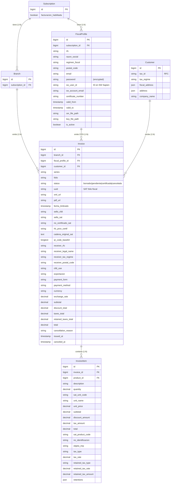
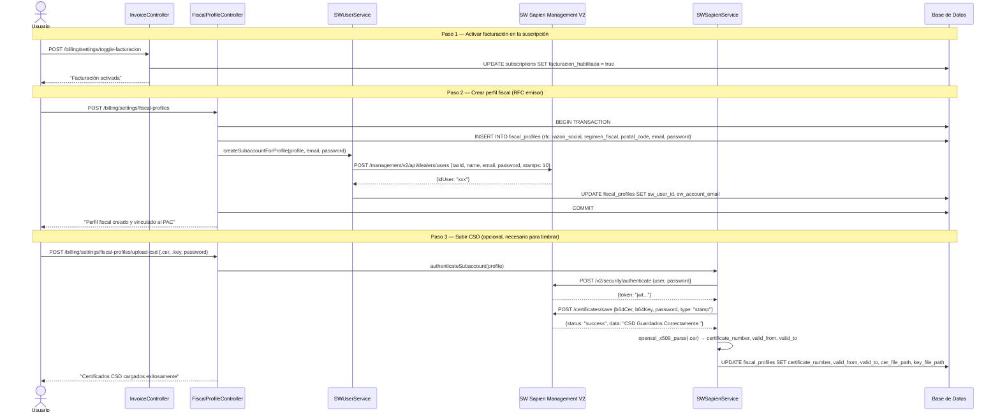
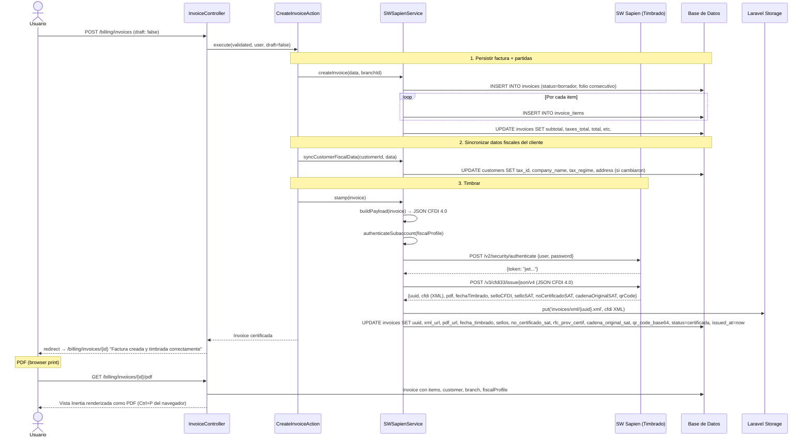

# Módulo de Facturación CFDI 4.0 — Documentación Técnica Completa

> **Proyecto:** EzyVentas  
> **Stack:** Laravel 12 (PHP 8.3+) + Vue 3 (Composition API `<script setup>`) + Inertia.js 2 + PrimeVue 4 + Tailwind CSS  
> **PAC:** SW Sapien — Esquema Multi-RFC con subcuentas (Management V2)  
> **Fecha del análisis:** 2026-07-18  

---

## 1. Resumen general

### 1.1 Qué hace el módulo actualmente

| Funcionalidad | Estado | Descripción |
|---|---|---|
| **Timbrado CFDI 4.0** | ✅ Implementado | Creación de facturas electrónicas vía SW Sapien. Persiste factura localmente, construye payload JSON SAT-compliant, timbra contra el PAC, almacena XML/UUID/QR/sellos digitales. |
| **Prefacturas (borrador)** | ✅ Implementado | Permite guardar facturas en estado `borrador` sin timbrar. Se pueden timbrar posteriormente (`POST /stamp`). |
| **Cancelación de facturas** | ✅ Implementado | Cancelación UUID-based con los 4 motivos SAT (`01`–`04`) y UUID de sustitución. |
| **PDF / representación impresa** | ✅ Implementado | Vista Inertia renderizada como PDF vía navegador (Ctrl+P). Incluye timbre fiscal, comprobante, QR, logo de empresa, desglose de impuestos. |
| **Descarga de XML** | ✅ Implementado | Descarga del CFDI XML timbrado desde storage. |
| **Subcuentas PAC (multi-RFC)** | ✅ Implementado | Cada `FiscalProfile` se provisiona automáticamente como sub-usuario en SW Sapien Management V2. |
| **Perfiles fiscales** | ✅ Implementado | CRUD completo: crear, subir CSD (.cer + .key), subir logo, desactivar/eliminar. Varios RFC por suscripción. |
| **Dashboard de facturación** | ✅ Parcial | KPIs: total comprobantes, facturas certificadas (="timbres usados"), canceladas, total facturado. Tabla de perfiles fiscales con estado PAC. |
| **Toggle facturación** | ✅ Implementado | Activar/desactivar facturación a nivel suscripción. Al desactivar, todos los endpoints de PAC retornan safe defaults. |
| **Sincronización fiscal de clientes** | ✅ Implementado | Auto-actualiza RFC, razón social, régimen fiscal y CP del modelo `Customer` al facturar. |
| **Multi-retención** | ✅ Implementado | Soporte para array JSON de retenciones (ISR + IVA retenido) por concepto. |

### 1.2 Qué falta o está marcado como pendiente

| Hallazgo | Ubicación | Detalle |
|---|---|---|
| **TODO: Exportación del dashboard** | `Dashboard/Index.vue:75` | `// TODO: implement export logic` — el botón "Exportar" del dashboard no hace nada. |
| **Sin conteo real de timbres** | Dashboard (`InvoiceController::dashboard()`) | `totalStampsUsed` = conteo de facturas `certificadas` en BD. **No consulta al PAC** cuántos timbres contratados/disponibles tiene la subcuenta. |
| **Sin columna `timbres_contratados` en BD** | `fiscal_profiles` / `subscriptions` | No existe campo para almacenar el saldo/paquete de timbres contratados por suscripción o perfil fiscal. |
| **Sin panel admin de gestión de timbres** | `routes/web/super-admin.php` | No hay rutas ni vistas para que el superadmin asigne timbres, vea consumo por suscriptor, o administre paquetes. |
| **Sin historial de compras de timbres** | Todo el proyecto | No hay modelo/tabla para registrar compras de paquetes de timbres por suscripción. |
| **Sin alertas de saldo bajo** | Todo el proyecto | No hay notificación ni webhook que avise cuando una subcuenta se queda sin timbres. |
| **Sin plan de precios de timbres** | Todo el proyecto | No existe modelo `StampPlan` o `StampPackage`. Los timbres se asignan con valor fijo `default_stamps = 10` al crear la subcuenta. |
| **Sin consulta de saldo al PAC** | `SWSapienService` | No existe método para consultar `GET /management/v2/api/dealers/users/{id}/stamps` u obtener saldo de timbres del PAC. |
| **Sin reintentos ni queue** | `SWSapienService::stamp()` | El timbrado es síncrono. Si el PAC falla, la factura queda en `borrador`. No hay job queue para reintentos. |
| **BillingSetting legacy sin uso real** | Modelo `BillingSetting`, migración `2026_06_12_000008` | La tabla y modelo existen pero el sistema migró a `FiscalProfile`. El `SaveBillingSettingsAction` referencia `BillingSetting` pero no se usa desde ningún controller. |
| **Sin facturación global (suscripción)** | `InvoiceStatus::NOT_REQUESTED/REQUESTED/GENERATED` | Estados legacy del sistema de facturación de suscripciones que no están integrados con el módulo CFDI 4.0. |
| **Sin webhook de cancelación** | Todo el proyecto | No se reciben notificaciones del PAC cuando una cancelación es aceptada/rechazada asíncronamente. |

---

## 2. Estructura de archivos

### 2.1 Backend

```
app/
├── Actions/Billing/
│   ├── CancelInvoiceAction.php            — Orquestador de cancelación de CFDI
│   ├── CreateFiscalSubaccountAction.php   — Orquestador de vinculación FiscalProfile ↔ PAC
│   ├── CreateInvoiceAction.php            — Orquestador de creación + timbrado de CFDI
│   └── SaveBillingSettingsAction.php      — Legacy: upsert de BillingSetting (sin uso activo)
│
├── Enums/
│   └── InvoiceStatus.php                  — Estados: borrador, pendiente, certificada, cancelada (+ legacy suscripción)
│
├── Http/Controllers/Billing/
│   ├── FiscalProfileController.php        — CRUD de perfiles fiscales, upload CSD, upload logo, delete
│   └── InvoiceController.php              — Dashboard, CRUD facturas, timbrado, cancelación, PDF, XML, toggle facturación
│
├── Http/Requests/Billing/
│   ├── CancelInvoiceRequest.php           — Validación motivo cancelación + UUID sustitución
│   ├── SaveBillingSettingsRequest.php     — Legacy: validación emitter settings
│   ├── StoreFiscalProfileRequest.php      — Validación RFC, razón social, régimen, CP, email
│   └── StoreInvoiceRequest.php            — Validación completa de CFDI 4.0 (emisor, receptor, conceptos, impuestos, retenciones)
│
├── Models/Billing/
│   ├── FiscalProfile.php                  — RFC emisor vinculado a subcuenta PAC
│   └── Invoice.php                        — CFDI 4.0 con todos los campos SAT y timbre fiscal
│
├── Models/
│   ├── InvoiceItem.php                    — Partidas/conceptos del CFDI
│   ├── Customer.php                       — Cliente (campos fiscales: tax_id, tax_regime, fiscal_address)
│   ├── Subscription.php                   — Suscripción (facturacion_habilitada, fiscalProfiles())
│   └── Branch.php                         — Sucursal (billingSetting() legacy)
│
├── Services/Billing/
│   └── SWSapienService.php                — Servicio central: createInvoice, buildPayload, stamp, cancel, uploadCsd, syncCustomerFiscalData, authenticateSubaccount
│
└── Services/SW/
    └── SWUserService.php                  — Administración de subcuentas PAC: createSubaccountForProfile, listSubaccounts, deactivateSubaccount
```

### 2.2 Frontend

```
resources/js/Pages/Billing/
├── Dashboard/
│   └── Index.vue                          — KPIs (comprobantes, timbres usados, canceladas, total facturado) + tabla de perfiles fiscales
├── Invoices/
│   ├── Index.vue                          — Listado paginado con filtros (búsqueda, status)
│   ├── Create.vue                         — Formulario de creación de CFDI 4.0 con todos los campos SAT
│   ├── Show.vue                           — Detalle de factura + acciones (cancelar, XML, PDF)
│   ├── Pdf.vue                            — Representación impresa CFDI 4.0 (timbre, QR, emisor, receptor, conceptos, impuestos)
│   └── Partials/
│       └── InvoiceTotals.vue              — Componente de totales (subtotal, descuento, IVA, retenciones, total)
└── Settings/
    ├── Index.vue                          — Gestión de perfiles fiscales (tabla, crear, toggle facturación, subir CSD)
    └── Partials/
        └── LogoUploadModal.vue            — Modal para subir/eliminar logo de perfil fiscal
```

### 2.3 Rutas

```
routes/web/billing.php                     — Grupo /billing con dashboard, invoices (CRUD + stamp + cancel + xml + pdf) y settings (fiscal profiles + CSD)
```

### 2.4 Migraciones

```
database/migrations/
├── 2026_06_12_000008_create_billing_settings_table.php          — Tabla billing_settings (legacy)
├── 2026_06_12_000009_create_invoices_table.php                  — Tabla invoices
├── 2026_06_12_000010_create_invoice_items_table.php             — Tabla invoice_items
├── 2026_06_22_000000_add_fiscal_fields_to_customers.php         — Campos tax_regime, fiscal_address en customers
├── 2026_06_22_000001_add_logo_path_to_billing_settings.php      — logo_path en billing_settings (legacy)
├── 2026_06_26_000001_create_fiscal_profiles_table.php           — Tabla fiscal_profiles
├── 2026_06_26_000002_add_fiscal_profile_id_to_invoices_table.php — FK fiscal_profile_id en invoices
├── 2026_06_26_000003_add_postal_code_to_fiscal_profiles_table.php — postal_code en fiscal_profiles
├── 2026_06_27_000001_add_email_password_to_fiscal_profiles_table.php — email, password en fiscal_profiles
├── 2026_06_27_000002_add_csd_columns_to_fiscal_profiles_table.php   — certificate_number, valid_from/to, cer/key paths
├── 2026_06_29_000001_add_cfdi_exportacion_and_retentions_to_invoices_and_items.php — exportacion, retenciones
├── 2026_06_29_000002_add_unit_name_and_sku_to_invoice_items.php — unit_name, no_identificacion
├── 2026_07_04_000001_add_exchange_rate_and_retentions_json.php  — exchange_rate, retentions JSON
└── 2026_07_09_000001_add_timbre_fiscal_columns_to_invoices.php  — Timbre fiscal: fecha_timbrado, sello_cfdi, sello_sat, no_certificado_sat, rfc_prov_certif, cadena_original_sat, qr_code_base64
```

---

## 3. Modelos de datos

### 3.1 Diagrama Entidad-Relación



### 3.2 Relaciones clave

| Origen | Destino | Tipo | Descripción |
|---|---|---|---|
| `Subscription` | `FiscalProfile` | HasMany | Una suscripción puede facturar bajo múltiples RFC |
| `FiscalProfile` | `Subscription` | BelongsTo | Cada perfil fiscal pertenece a una suscripción |
| `Invoice` | `Branch` | BelongsTo | Cada factura se emite desde una sucursal |
| `Invoice` | `FiscalProfile` | BelongsTo | RFC emisor de la factura |
| `Invoice` | `Customer` | BelongsTo | Cliente receptor (nullable) |
| `Invoice` | `InvoiceItem` | HasMany | Partidas/conceptos del CFDI |
| `InvoiceItem` | `Invoice` | BelongsTo | Factura padre |
| `InvoiceItem` | `Product` | BelongsTo | Producto relacionado (nullable) |
| `Branch` | `BillingSetting` | HasOne | Configuración legacy por sucursal (deprecado) |

### 3.3 Tablas legacy sin uso activo

| Tabla | Estado |
|---|---|
| `billing_settings` | Creada pero reemplazada funcionalmente por `fiscal_profiles`. El modelo `BillingSetting` no se usa desde ningún controller activo. |

---

## 4. Integración con el PAC (SW Sapien)

### 4.1 Superficies de API

| Superficie | Host (test) | Autenticación | Propósito |
|---|---|---|---|
| **Timbrado/Cancelación/CSD** | `services.test.sw.com.mx` | Token de subcuenta (temporal, 2h) | Timbrar CFDI, cancelar, subir CSD |
| **Management V2** | `api.test.sw.com.mx` | Token dealer (permanente) | Crear/desactivar subcuentas |

### 4.2 Autenticación

#### Token dealer (cuenta maestra)
- Configurado en `SW_SAPIEN_TOKEN` (.env)
- Se usa **solo** para Management V2 (crear/desactivar subcuentas)
- Es permanente, no expira

#### Token de subcuenta
- Se obtiene autenticando como el sub-usuario: `POST /v2/security/authenticate` con `{user, password}`
- El `user` es `sw_account_email` (o `email` del `FiscalProfile`)
- El `password` está encriptado en `fiscal_profiles.password`
- Se cachea en Laravel Cache por 110 minutos (el PAC otorga 2h de validez)
- Se usa para timbrar, cancelar y subir CSD
- **Clave:** cada subcuenta timbra con su propio CSD y consume sus propios timbres

### 4.3 Endpoints del PAC consumidos

| Endpoint | Método | Autenticación | Archivo | Propósito |
|---|---|---|---|---|
| `/v3/cfdi33/issue/json/v4` | POST | Subcuenta | `SWSapienService::stamp()` | Timbrar CFDI 4.0 → retorna UUID, XML, QR, sellos |
| `/cfdi33/cancel/{rfc}/{uuid}/{motivo}/{folioSustitucion}` | POST | Subcuenta | `SWSapienService::cancel()` | Cancelar CFDI |
| `/certificates/save` | POST | Subcuenta | `SWSapienService::uploadCsd()` | Subir .cer + .key para una subcuenta |
| `/v2/security/authenticate` | POST | Ninguna (login) | `SWSapienService::authenticateSubaccount()` | Login de subcuenta → obtener token temporal |
| `/management/v2/api/dealers/users` | POST | Dealer | `SWUserService::createSubaccountForProfile()` | Crear sub-usuario (subcuenta) |
| `/management/v2/api/dealers/users` | GET | Dealer | `SWUserService::listSubaccounts()` | Listar subcuentas (debug/reconciliación) |
| `/management/v2/api/dealers/users/{userId}` | PATCH | Dealer | `SWUserService::deactivateSubaccount()` | Desactivar sub-usuario |

### 4.4 Configuración (.env)

```env
SW_SAPIEN_ENDPOINT=https://services.test.sw.com.mx
SW_SAPIEN_TOKEN=<token_dealer_permanente>
SW_SAPIEN_MANAGEMENT_ENDPOINT=https://api.test.sw.com.mx
SW_SAPIEN_MANAGEMENT_USERS_PATH=/management/v2/api/dealers/users
SW_SAPIEN_DEFAULT_STAMPS=10
SW_SAPIEN_MOCK=false
```

### 4.5 Conteo de timbres

**Actualmente NO existe conteo local de timbres.** Así funciona hoy:

1. Al crear una subcuenta en el PAC, se envía `"stamps": 10` (valor fijo de `SW_SAPIEN_DEFAULT_STAMPS`).
2. El PAC internamente gestiona el saldo de timbres de cada subcuenta. Cuando se acaban, el PAC rechaza el timbrado.
3. EzyVentas **no consulta** el saldo del PAC en ningún momento.
4. El dashboard muestra como "Timbres usados" el conteo de facturas `certificadas` en BD local, que **no necesariamente coincide** con el consumo real en el PAC (cancelaciones no descuentan timbre, pero una factura cancelada localmente ya no está `certificada`).

**No existe:**
- Tabla local de créditos/timbres
- Endpoint de consulta de saldo al PAC
- Asignación manual de timbres por suscripción
- Historial de compras/recargas de timbres

---

## 5. Flujo funcional actual (paso a paso)

### 5.1 Alta de suscriptor → subcuenta → perfil fiscal → CSD



### 5.2 Prefactura → timbrado → PDF



### 5.3 Cancelación de factura


---

## 6. Dashboard actual

### 6.1 Endpoint

**Ruta:** `GET /billing/dashboard` → `InvoiceController::dashboard()`

### 6.2 Datos que retorna

| Prop | Fuente | Query |
|---|---|---|
| `fiscalProfiles` | `subscription->fiscalProfiles()` | Todos los perfiles ordenados por created_at |
| `totalStampsUsed` | `Invoice::certified()->count()` | Conteo local de facturas con status `certificada` |
| `totalInvoices` | `Invoice::count()` | Total de facturas (cualquier status) |
| `canceledInvoices` | `Invoice::canceled()->count()` | Facturas canceladas |
| `totalAmount` | `Invoice::certified()->sum('total')` | Suma MXN de facturas certificadas |
| `facturacionHabilitada` | `subscription->facturacion_habilitada` | Booleano toggle |

### 6.3 De dónde saca los números de timbres

**Exclusivamente de la base de datos local.** El conteo de "timbres usados" es simplemente el número de facturas en estado `certificada` para la sucursal del usuario. **No consulta al PAC:**

- ❌ No consulta `GET /management/v2/api/dealers/users/{id}/stamps` (el endpoint puede no existir en SW Sapien Management V2)
- ❌ No hay tabla local `stamp_credits` o `stamp_usage`
- ❌ No descuenta timbres al cancelar (la factura pasa de `certificada` a `cancelada`, reduciendo artificialmente el conteo)

### 6.4 UX del dashboard

- Si `facturacionHabilitada = false`, muestra un banner con link a configuración
- Si está habilitado: 4 KPI cards + tabla de perfiles fiscales con estado PAC (Activo/Pendiente)
- Selector de rango de fechas (hoy, semana, mes, año, personalizado) — **pero no filtra los datos**, solo es decorativo (TODO pendiente)

---

## 7. Parte administrativa actual

### 7.1 Lo que existe

| Funcionalidad | Ruta | Descripción |
|---|---|---|
| Lista de suscriptores | `GET /admin/subscriptions` | Vista admin con todos los suscriptores, filtro por status (activo/expirado/suspendido) |
| Detalle de suscriptor | `GET /admin/subscriptions/{id}` | Versiones, pagos, usuarios, sucursales, módulos |
| Editar versión | `PUT /admin/subscriptions/versions/{id}` | Cambiar fechas, precios, items de una versión |
| Crear versión con pago | `POST /admin/subscriptions/{id}/versions` | Nueva versión con registro de pago |
| Settings del suscriptor | `POST /admin/subscriptions/{id}/settings` | Actualizar configuración general de la suscripción |

### 7.2 Lo que NO existe

| Funcionalidad | Prioridad | Notas |
|---|---|---|
| **Asignar timbres a una suscripción** | 🔴 Crítica | No hay UI ni API para que el admin otorgue/recargue timbres a un suscriptor |
| **Ver consumo de timbres por suscriptor** | 🔴 Crítica | El admin no puede ver cuántos timbres ha usado cada suscriptor, ni su saldo |
| **Historial de compras de paquetes de timbres** | 🔴 Alta | No hay modelo/tabla para registrar transacciones de timbres |
| **Alertas de saldo bajo** | 🟡 Media | No hay notificaciones cuando una subcuenta se acerca a 0 timbres |
| **Panel de configuración de precios de timbres** | 🟡 Media | No hay plans de timbres (ej: 100 timbres/$X, 1000 timbres/$Y) |
| **Integración con MercadoPago para compra de timbres** | 🟡 Media | El sistema ya tiene MercadoPago integrado para suscripciones; podría extenderse |
| **Dashboard admin de facturación global** | 🟡 Media | Vista consolidada de todos los suscriptores: timbres totales, consumo, ingresos por timbres |
| **Bloqueo automático al agotar timbres** | 🟡 Media | Actualmente el PAC rechaza el timbrado y el error se muestra al usuario, pero no hay bloqueo proactivo |
| **Reporte de facturación por suscriptor** | 🟢 Baja | Exportable de facturas emitidas por período |

---

## 8. Configuraciones / perfiles fiscales

### 8.1 Modelo de relación

```
Subscription (1)
  └── FiscalProfile (N)  — múltiples RFC por suscripción
        └── SW Sapien Subaccount (1:1)  — cada RFC = una subcuenta en el PAC
              └── CSD (1:1)  — un par .cer/.key por subcuenta
              └── Stamps (quota)  — gestionado por el PAC, no localmente
```

### 8.2 Restricciones y validaciones

| Regla | Dónde se aplica |
|---|---|
| `subscription_id + rfc` único | Unique constraint en BD + validación implícita |
| `email` único en `fiscal_profiles` | `StoreFiscalProfileRequest::rules()` |
| RFC: 12-13 caracteres, uppercase | `prepareForValidation()` → `strtoupper()` |
| CP: exactamente 5 dígitos | `size:5` |
| Régimen fiscal: catálogo SAT (10 chars máx) | Validación `max:10` |
| Solo perfiles con `sw_user_id` pueden facturar | `isReadyForInvoicing()` + guard en `create()` |
| Solo perfiles activos aparecen en selector de facturación | `scopeActive()` |
| Si un perfil tiene facturas asociadas → soft-delete (is_active=false) | `FiscalProfileController::destroy()` |
| Si no tiene facturas → hard-delete | `FiscalProfileController::destroy()` |
| CSD solo se puede subir si `sw_user_id` existe | Guard en `uploadCsd()` |

### 8.3 Permisos Spatie

| Permiso | Descripción |
|---|---|
| `invoices.access` | Acceder al listado de facturas |
| `invoices.see_details` | Ver detalles de facturas |
| `invoices.create` | Crear nuevas facturas |
| `invoices.edit` | Editar facturas existentes |
| `invoices.delete` | Eliminar prefacturas |
| `invoices.stamp` | Timbrar facturas ante el PAC |
| `invoices.cancel` | Cancelar facturas |
| `invoices.download_xml` | Descargar XML |
| `invoices.download_pdf` | Ver/descargar PDF |
| `invoices.dashboard.access` | Acceder al dashboard |
| `invoices.settings.access` | Acceder a configuración |
| `invoices.settings.manage_fiscal_profiles` | Crear/editar perfiles fiscales |
| `invoices.settings.upload_csd` | Subir CSD |
| `invoices.settings.manage_logo` | Gestionar logotipo |
| `invoices.settings.delete_fiscal_profiles` | Eliminar perfiles |
| `invoices.settings.toggle` | Activar/desactivar facturación |

---

## 9. Dependencias y conexiones entre archivos

### 9.1 Mapa de llamadas — Flujo de timbrado

```
HTTP Request POST /billing/invoices
  │
  ├─ StoreInvoiceRequest        (validación CFDI 4.0)
  │
  └─ InvoiceController::store()
       │
       └─ CreateInvoiceAction::execute()
            │
            ├─ SWSapienService::createInvoice()
            │   ├─ Invoice::create()              (Model)
            │   ├─ InvoiceItem::create()          (Model × N)
            │   ├─ SWSapienService::generateFolio()
            │   └─ Invoice::update()              (totales)
            │
            ├─ SWSapienService::syncCustomerFiscalData()
            │   └─ Customer::update()             (Model)
            │
            └─ SWSapienService::stamp()
                ├─ SWSapienService::buildPayload()
                │   └─ Invoice (Model) + InvoiceItem (Model) + FiscalProfile (Model)
                ├─ SWSapienService::authenticateSubaccount()
                │   ├─ Cache::remember()           (Laravel Cache)
                │   └─ Http::post('/v2/security/authenticate')  (HTTP → PAC)
                ├─ Http::withToken()->post('/v3/cfdi33/issue/json/v4')  (HTTP → PAC)
                ├─ Storage::put()                  (guardar XML)
                └─ Invoice::update()               (uuid, xml_url, sellos, QR, status=certificada)
```

### 9.2 Mapa de llamadas — Creación de perfil fiscal + subcuenta

```
HTTP Request POST /billing/settings/fiscal-profiles
  │
  ├─ StoreFiscalProfileRequest   (validación)
  │
  └─ FiscalProfileController::storeFiscalProfile()
       │
       ├─ DB::transaction()
       │   ├─ $subscription->fiscalProfiles()->create()
       │   │   └─ FiscalProfile (Model)
       │   │
       │   └─ SWUserService::createSubaccountForProfile()
       │       ├─ Http::withToken(dealer)->post('/management/v2/api/dealers/users')
       │       └─ $profile->update(['sw_user_id', 'sw_account_email'])
       │
       └─ DB::commit()
```

### 9.3 Mapa de llamadas — Subida de CSD

```
HTTP Request POST /billing/settings/fiscal-profiles/upload-csd
  │
  └─ FiscalProfileController::uploadCsd()
       │
       └─ SWSapienService::uploadCsd()
            ├─ SWSapienService::extractDerFromPem()       (PEM → DER)
            ├─ SWSapienService::authenticateSubaccount()
            │   └─ Http::post('/v2/security/authenticate')
            ├─ Http::withToken(subaccount)->post('/certificates/save')
            └─ SWSapienService::processCsdResponse()
                ├─ SWSapienService::extractCertificateData()
                │   └─ openssl_x509_parse()               (PHP nativo)
                └─ $profile->update([certificate_number, valid_from, valid_to])
```

### 9.4 Mapa de llamadas — Dashboard

```
HTTP Request GET /billing/dashboard
  │
  └─ InvoiceController::dashboard()
       │
       ├─ Auth::user()->branch->subscription              (Model)
       ├─ $subscription->fiscalProfiles()                 (Model)
       ├─ Invoice::where('branch_id')->count()            (Model)
       ├─ Invoice::where('branch_id')->certified()->count()
       ├─ Invoice::where('branch_id')->canceled()->count()
       └─ Invoice::where('branch_id')->certified()->sum('total')
```

---

## 10. Preguntas abiertas / decisiones pendientes

### 10.1 Gestión de timbres (paquetes, cobro, descuento)

| # | Pregunta | Impacto |
|---|---|---|
| 1 | **¿Cómo se venden los timbres?** ¿Por paquete (100, 500, 1000)? ¿Por plan mensual con timbres incluidos? ¿Pay-as-you-go? | Define el modelo de negocio completo del módulo |
| 2 | **¿Dónde se almacena el saldo de timbres?** ¿Tabla local `stamp_balances` con reconciliación periódica contra el PAC? ¿O se consulta al PAC en tiempo real? | Define la arquitectura de datos y la tolerancia a fallos del PAC |
| 3 | **¿Quién asigna timbres?** ¿El superadmin manualmente? ¿Automático al pagar una suscripción? ¿Auto-recarga al llegar a N timbres? | Define el flujo de administración y la UX del suscriptor |
| 4 | **¿Se descuentan timbres al cancelar?** El SAT no devuelve timbres por cancelación. ¿El sistema lo refleja? Actualmente el dashboard descuenta porque la factura deja de estar `certificada`. | Infla artificialmente el conteo de "timbres disponibles" |
| 5 | **¿Cómo se integra con MercadoPago?** ¿La compra de timbres es un producto separado en MercadoPago? ¿Se usa el mismo `PlatformMercadoPagoService`? | Define la integración de pagos |
| 6 | **¿El parámetro `stamps: 10` en el alta de subcuenta debe ser configurable?** Actualmente es `SW_SAPIEN_DEFAULT_STAMPS=10`. ¿Debería ser por plan? | Afecta el aprovisionamiento inicial |

### 10.2 Dashboard y reporting

| # | Pregunta | Impacto |
|---|---|---|
| 7 | El selector de fechas del dashboard no filtra nada actualmente. ¿Debe implementarse un filtro real con `start_date`/`end_date`? | La UI insinúa funcionalidad que no existe |
| 8 | ¿Hace falta un dashboard administrativo global (superadmin) que muestre consumo de timbres por suscriptor? | Influye en las rutas `admin.*` y queries |

### 10.3 Robustez del timbrado

| # | Pregunta | Impacto |
|---|---|---|
| 9 | ¿Se necesita job queue con reintentos para el timbrado? Si el PAC está caído, la factura queda en `borrador` sin intentos automáticos posteriores. | Define la resiliencia del sistema |
| 10 | ¿Se necesita webhook de cancelación? Actualmente la cancelación es síncrona, pero el SAT puede rechazar cancelaciones asíncronamente. | Define si el status `cancelada` es confiable |

### 10.4 Multi-RFC y subcuentas

| # | Pregunta | Impacto |
|---|---|---|
| 11 | ¿Hay límite de perfiles fiscales por suscripción? Actualmente no. | Puede requerir validación adicional |
| 12 | ¿Un mismo RFC puede estar en dos suscripciones distintas? Actualmente el unique constraint es `(subscription_id, rfc)`, así que sí. ¿Es correcto? | Podría causar conflictos en el PAC |

### 10.5 Monetización

| # | Pregunta | Impacto |
|---|---|---|
| 13 | ¿Los timbres son un costo separado de la suscripción mensual? ¿O están incluidos en el plan? | Define el modelo de pricing |
| 14 | ¿Se necesita facturación de suscripción con CFDI 4.0? Los estados legacy `no_solicitada/solicitada/generada` en `InvoiceStatus` sugieren que existía un sistema de facturación de suscripción previo que no se migró a CFDI 4.0. | Posible deuda técnica |

---

> **Nota:** Este documento refleja el estado del código al 2026-07-18. Cualquier modificación posterior debe actualizar este archivo.
