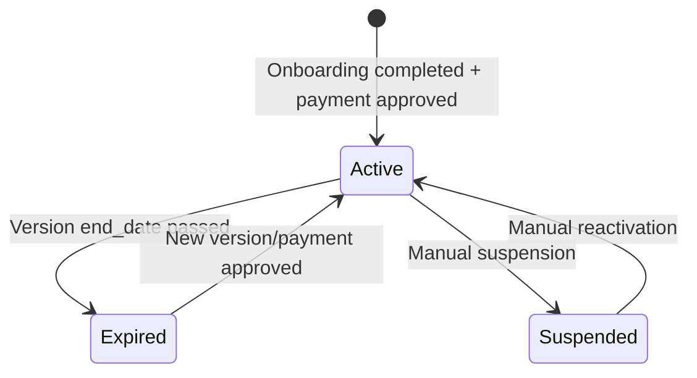

# 03 — Subscriptions & Billing Module

---

## What It Does
Manages the SaaS subscription lifecycle: plan catalog (super-admin), subscription versions with module/feature items, billing periods, MercadoPago payment processing, subscription status management (active/expired/suspended), and multi-branch setup. This is the multi-tenancy backbone — every tenant is a `Subscription`.

---

## Key Files

### Backend
| File | Role |
|---|---|
| `app/Models/Subscription.php` | Central tenant model with status logic, limits checking |
| `app/Models/SubscriptionVersion.php` | Versioned plan periods (start/end dates) |
| `app/Models/SubscriptionItem.php` | Line items in a version (modules, features) |
| `app/Models/SubscriptionPayment.php` | Payment records with MercadoPago integration |
| `app/Models/PlanItem.php` | Plan catalog (super-admin CRUD) |
| `app/Models/Branch.php` | Branch model (scoped to subscription) |
| `app/Models/BusinessType.php` | Business type categorization |
| `app/Enums/SubscriptionStatus.php` | `activa`, `expirada`, `suspendida` |
| `app/Enums/SubscriptionPaymentStatus.php` | `pendiente`, `aprobado`, `rechazado` |
| `app/Enums/BillingPeriod.php` | `mensual`, `anual`, etc. |
| `app/Enums/PlanItemType.php` | `modulo`, `funcionalidad`, etc. |
| `app/Actions/Subscription/ProcessSubscriptionPaymentAction.php` | Payment orchestration |
| `app/Actions/Subscription/ApproveSubscriptionPaymentAction.php` | Approval flow |
| `app/Actions/Subscription/RejectSubscriptionPaymentAction.php` | Rejection flow |
| `app/Actions/Subscription/RevertFailedSubscriptionAction.php` | Revert on failure |
| `app/Http/Controllers/SubscriptionController.php` | Subscriber-facing subscription pages |
| `app/Http/Controllers/Subscription/ReferralController.php` | Subscriber referral management |
| `app/Http/Controllers/Admin/SubscriptionController.php` | Super-admin subscription management |
| `app/Http/Controllers/Admin/SubscriptionPaymentController.php` | Super-admin payment review |
| `app/Http/Controllers/Admin/PlanItemController.php` | Plan catalog CRUD |
| `app/Http/Controllers/BranchController.php` | Branch CRUD |
| `app/Http/Controllers/BusinessTypeController.php` | Business type management |
| `app/Http/Controllers/SwitchBranchController.php` | Branch switching |
| `app/Services/MercadoPagoService.php` | MercadoPago gateway integration |
| `app/Services/PlatformMercadoPagoService.php` | Platform-level MercadoPago operations |
| `app/Middleware/CheckSubscriptionStatus.php` | Blocks expired/suspended subscriptions |
| `app/Middleware/CheckOnboardingStatus.php` | Redirects to onboarding |
| `app/Traits/HasSubscription.php` | Multi-tenant scoping trait |
| `routes/web/subscriptions.php` | Subscriber routes |
| `routes/web/branches.php` | Branch routes |
| `routes/web/switch-branch.php` | Branch switching routes |
| `routes/web/super-admin.php` | Admin routes |

### Frontend
| File | Purpose |
|---|---|
| `Pages/Subscription/Show.vue` | Subscription status & details |
| `Pages/Subscription/ManageSubscription.vue` | Plan management / upgrade |
| `Pages/Admin/Subscriptions/Index.vue` | Super-admin: all subscriptions |
| `Pages/Admin/Subscriptions/Show.vue` | Super-admin: subscription detail |
| `Pages/Admin/PlanItems/Index.vue` | Plan catalog list |
| `Pages/Admin/PlanItems/Create.vue` | Create plan item |
| `Pages/Admin/PlanItems/Edit.vue` | Edit plan item |
| `Pages/Admin/Payment/Index.vue` | Payments to review |
| `Pages/Admin/Payment/Show.vue` | Payment detail |

---

## Main Endpoints

### Subscriber-facing (`/subscription`)
- `GET /subscription` — `subscription.show` — Subscription status & details
- `PUT /subscription` — `subscription.update` — Update business info
- `POST /subscription/documents` — Upload fiscal documents
- `GET /subscription/manage` — `subscription.manage` — Plan management page
- `POST /subscription/manage` — `subscription.manage.store` — Process plan change
- `GET /subscription/payment/{payment}/pay` — Redirect to MercadoPago checkout
- `GET /subscription/payment/{payment}/return` — MercadoPago callback
- `POST /subscription/payments/{payment}/request-invoice` — Request CFDI invoice
- `DELETE /subscription/revert` — Revert failed upgrade

### Branches (`/branches`)
- `POST /branches` — Create branch
- `PUT /branches/{branch}` — Update branch
- `DELETE /branches/{branch}` — Delete branch
- `PUT /switch-branch/{branch}` — Switch active branch session

### Super-admin (`/admin/*`)
- `GET /admin/subscriptions` — All subscriptions
- `GET /admin/subscriptions/{subscription}` — Subscription detail
- `POST /admin/subscriptions/{subscription}/versions` — Create new version
- `PUT /admin/subscriptions/versions/{version}` — Update version dates
- `PUT /admin/subscriptions/versions/{version}/items` — Update version items
- `DELETE /admin/subscriptions/versions/{version}` — Delete version
- `POST /admin/subscriptions/{subscription}/settings` — Update subscription settings
- `GET /admin/payments` — All payments needing review
- `GET /admin/payments/{payment}` — Payment detail
- `POST /admin/payments/{payment}/approve` — Approve payment
- `POST /admin/payments/{payment}/reject` — Reject payment
- Full CRUD: `/admin/plan-items` — Plan catalog management
- `GET /admin/reports` — Super admin reports

---

## Subscription Lifecycle

### Version System
Each time a plan changes (upgrade, downgrade, renewal), a new `SubscriptionVersion` is created with `start_date` and `end_date`. The version contains `SubscriptionItem` records (one per module/feature). `SubscriptionPayment` records are linked to versions — one payment per version/billing period.

### Computed Status
`Subscription::$appends = ['computed_status']` evaluates the real status at runtime by checking the latest version's `end_date`. This prevents stale `status` column values.

---

## Limits Checking (Subscription model methods)
- `getActiveModuleKeys()` — Returns active module keys from current version
- `hasReachedProductLimit()` — Checks if product count exceeds plan
- `hasReachedServiceLimit()` — Checks service count limit
- `getUserLimitData()` — Returns user limit vs current count
- `hasReachedUserLimit()` — Boolean user limit check
- `getCurrentMonthlyCost()` — Calculates current monthly cost from version items
- `getAiCreditLimitData()` — AI agent credit limits

---

## MercadoPago Integration
- Platform model: Uses MercadoPago Marketplace/Platform API
- `PlatformMercadoPagoService` handles connected accounts
- Subscribers pay via MercadoPago checkout (redirect flow)
- Webhook (`WebhookController`) receives payment notifications
- Payment flow: Create preference → Redirect to MP → Webhook callback → Approve/Reject

---

## Dependencies
- **Auth/Users**: Super-admin role required for `/admin/*` routes (`CheckSuperAdmin` middleware)
- **Referrals**: Subscription payments can have referral discounts applied
- **Invoices**: Subscription payments can request CFDI invoices
- **Online Store**: Each subscription can have one `StoreConfig`

---

## Known Limitations / Technical Debt
1. **No automated recurring billing** — Payments are manual (admin reviews proof of payment and approves). No automatic credit card rebilling.
2. **Version history is append-only** — No editing of past versions. If a mistake is made in a version, a new one must be created.
3. **No proration logic** — When upgrading/downgrading mid-period, there's no prorated cost calculation.
4. **Limit checks are not enforced at write time** — `hasReachedProductLimit()` is checked ad-hoc but there's no hard database-level enforcement.
5. **MercadoPago is the only gateway** — No Stripe, PayPal, or other payment gateways implemented.
