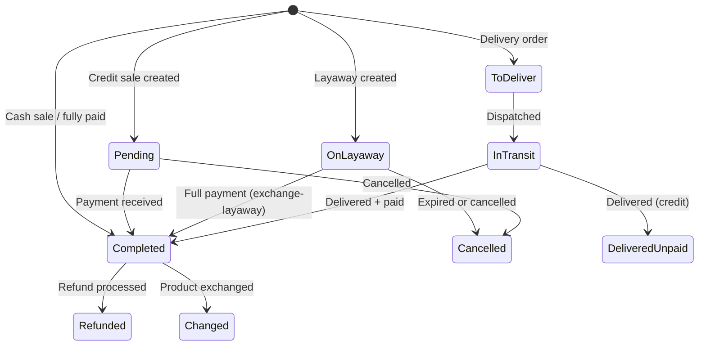

# 05 — POS & Sales (Transactions) Module

---

## What It Does
Point of Sale terminal (desktop and mobile views), transaction processing (sales, layaways, credit sales, delivery orders), payment registration, product exchanges, and layaway management. This is the core revenue-generating module.

---

## Key Files

### Backend
| File | Role |
|---|---|
| `app/Models/Transaction.php` | Central sales entity with computed totals |
| `app/Models/TransactionItem.php` | Line items (polymorphic to products/services) |
| `app/Models/Payment.php` | Payment records per transaction |
| `app/Enums/TransactionStatus.php` | `completado`, `pendiente`, `cancelado`, `reembolsado`, `apartado`, `cambiado`, `por_entregar`, `en_ruta`, `entregado_por_pagar` |
| `app/Enums/TransactionChannel.php` | Sales channel (POS, online, etc.) |
| `app/Enums/PaymentMethod.php` | `efectivo`, `tarjeta`, `transferencia` |
| `app/Enums/PaymentStatus.php` | Payment statuses |
| `app/Actions/Transactions/ProcessLayawayExchange.php` | Layaway-to-sale exchange |
| `app/Actions/Transactions/ProcessProductExchange.php` | Product exchange logic |
| `app/Actions/Store/CreateStoreTransactionAction.php` | Online store → transaction creation |
| `app/Http/Controllers/PointOfSaleController.php` | POS terminal + checkout |
| `app/Http/Controllers/TransactionController.php` | Transaction CRUD + operations |
| `app/Http/Controllers/PaymentController.php` | Payment registration |
| `app/Http/Controllers/TransactionPaymentController.php` | Payment CRUD on transactions |
| `app/Services/PaymentService.php` | Payment business logic |
| `app/Services/TransactionPaymentService.php` | Payment processing |
| `app/Services/TransactionQueryService.php` | Transaction search/filter queries |
| `routes/web/POS.php` | POS routes |
| `routes/web/transactions.php` | Transaction routes |
| `routes/web/payments.php` | Payment routes |

### Frontend
| File | Purpose |
|---|---|
| `Pages/POS/Index.vue` | Desktop POS terminal |
| `Pages/POS/IndexMobile.vue` | Mobile POS terminal |
| `Pages/Transaction/Index.vue` | Transaction list/history |
| `Pages/Transaction/Show.vue` | Transaction detail |
| `Components/VirtualNumpad.vue` | On-screen number pad |
| `Components/PaymentModal.vue` | Payment collection modal |
| `Components/PaymentModalPartials/` | Payment sub-components |
| `Components/CreateProductModal.vue` | Quick product creation from POS |
| `Components/CreateCustomerModal.vue` | Quick customer creation from POS |

---

## Main Endpoints

### POS (`/pos`)
- `GET /pos` — `pos.index` — POS terminal view
- `POST /pos/checkout` — `pos.checkout` — Process sale
- `POST /pos/layaway` — `pos.layaway` — Create layaway
- `GET /pos/customers/search` — Search customers
- `GET /pos/check-entity` — Check if product/service/customer exists
- `GET /pos/online-orders` — Fetch pending online orders for processing
- `PUT /pos/online-orders/{order}/status` — Update online order status

### Transactions (`/transactions`)
- `GET /transactions` — `transactions.index` — List/filter transactions
- `GET /transactions/{transaction}` — `transactions.show` — Detail view
- `POST /transactions/{transaction}/cancel` — Cancel transaction
- `POST /transactions/{transaction}/refund` — Full refund
- `POST /transactions/{transaction}/payment` — Add payment
- `PUT /transactions/{transaction}/payments/{payment}` — Edit payment
- `DELETE /transactions/{transaction}/payments/{payment}` — Delete payment
- `POST /transactions/{transaction}/exchange` — Product exchange
- `PUT /transactions/{transaction}/reschedule-order` — Reschedule delivery
- `PUT /transactions/{transaction}/extend-layaway` — Extend layaway expiration
- `POST /transactions/{transaction}/exchange-layaway` — Convert layaway to sale
- `PUT /transactions/{transaction}/update-date` — Change transaction date
- `POST /pos/store-order` — Process online store order as POS transaction

### Payments (`/transactions/{transaction}/payments`)
- `POST /transactions/{transaction}/payments` — `payments.store` — Register payment

---

## Transaction Status Flow

---

## Transaction Computed Properties

On `Transaction` model (accessors):
- `total` = `(subtotal - total_discount) + total_tax + shipping_cost`
- `total_paid` = sum of all `payments.amount`
- `remaining_due` = `max(0, total - total_paid)`
- `isFullyPaid()` = `remaining_due <= 0.01` (helper method)

---

## Key Business Rules

1. **Layaway expiration**: Each layaway has `layaway_expiration_date`. After expiry, it can be cancelled.
2. **Credit sales**: Transactions with `status = pendiente` track customer balance via `CustomerBalanceMovement`.
3. **Product exchange**: `ProcessProductExchange` creates a new transaction and marks the original as `cambiado`. Stock is adjusted accordingly.
4. **Layaway exchange**: `ProcessLayawayExchange` converts a layaway to a completed sale, handling partial payments.
5. **Delivery workflow**: Online orders go through `por_entregar → en_ruta → entregado_por_pagar/completado`.

---

## Dependencies
- **Products/Inventory**: Stock deduction during checkout via `processStockChange()`
- **Customers**: Customer balance tracking on credit sales
- **Cash Register**: All POS transactions are linked to a `CashRegisterSession`
- **Payments**: Payment registration tracks cash/bank
- **Promotions**: Cart-level promotions applied via `promotion_transaction` pivot
- **Online Store**: Orders from the store become transactions
- **Invoices**: Transactions can be invoiced (`invoiced` flag)

---

## Known Limitations / Technical Debt
1. **No cart persistence** — If the browser is refreshed during POS, the cart is lost. There's no server-side cart storage.
2. **No receipt auto-print** — Printing is triggered manually via the print modal.
3. **No barcode scanner integration** — Product lookup is by search/name only.
4. **Payment methods are limited** — No card terminal integration (MercadoPago is only for online store and subscriptions).
5. **No tax engine** — `total_tax` is stored as a flat value per transaction, not calculated from a tax rule system.
6. **Layaway management is basic** — No automated expiration job; cancellations must be manual.
