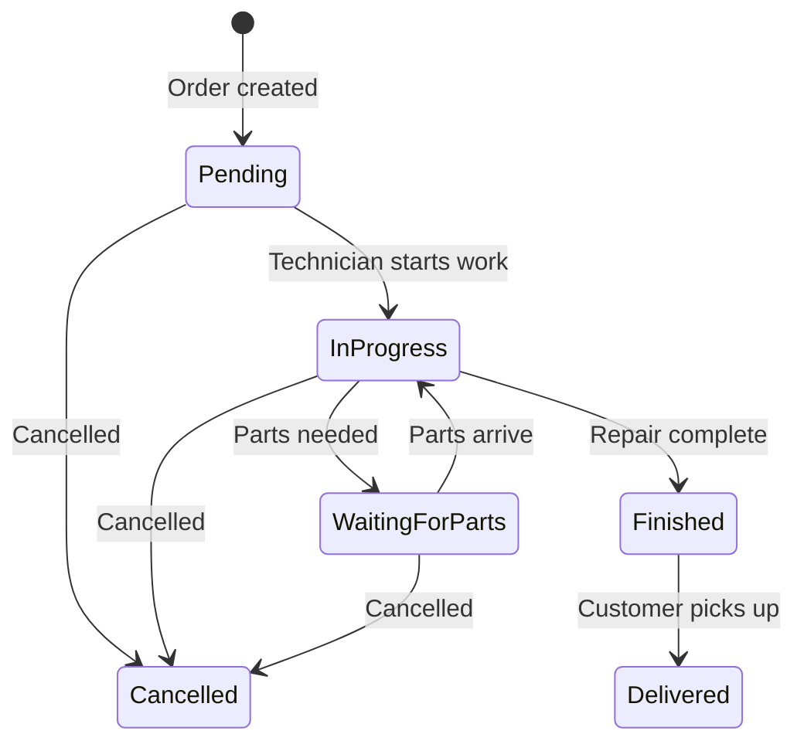

# 07 — Services & Service Orders Module

---

## What It Does
Manages a catalog of services (repair, maintenance, installation, etc.) with pricing variants, and service orders that track the workflow from intake through diagnosis, repair, and delivery. Service orders can include both services and parts (products). Supports technician assignment, commission tracking, and before/after photo evidence.

---

## Key Files

### Backend
| File | Role |
|---|---|
| `app/Models/Service.php` | Service catalog entry |
| `app/Models/ServiceVariant.php` | Pricing tiers per service |
| `app/Models/ServiceOrder.php` | Service order with full workflow |
| `app/Models/ServiceOrderItem.php` | Line items (services + products) |
| `app/Enums/ServiceOrderStatus.php` | `pendiente`, `en_progreso`, `esperando_refaccion`, `terminado`, `entregado`, `cancelado` |
| `app/Actions/Service/StoreServiceAction.php` | Create service |
| `app/Actions/Service/UpdateServiceAction.php` | Update service |
| `app/Actions/ServiceOrders/CreateServiceOrderAction.php` | Create service order |
| `app/Actions/ServiceOrders/UpdateServiceOrderAction.php` | Update service order |
| `app/Actions/ServiceOrders/ChangeServiceOrderStatusAction.php` | Status transitions |
| `app/Http/Controllers/ServiceController.php` | Service CRUD |
| `app/Http/Controllers/ServiceOrderController.php` | Service order CRUD + operations |
| `app/Http/Requests/StoreServiceRequest.php` | Service validation |
| `app/Http/Requests/UpdateServiceRequest.php` | Service validation |
| `app/Http/Requests/StoreServiceOrderRequest.php` | Order validation |
| `app/Http/Requests/UpdateServiceOrderRequest.php` | Order validation |
| `app/Services/ServiceOrderReportService.php` | Service order reports |
| `app/Exports/ServiceOrdersExport.php` | Export |
| `app/Exports/ServicesExport.php` | Services export |
| `routes/web/services.php` | Service routes |
| `routes/web/service-orders.php` | Service order routes |

### Frontend
| File | Purpose |
|---|---|
| `Pages/Service/Index.vue` | Service catalog list |
| `Pages/Service/Create.vue` | Create service |
| `Pages/Service/Edit.vue` | Edit service |
| `Pages/Service/Show.vue` | Service detail |
| `Pages/ServiceOrder/Index.vue` | Service order list |
| `Pages/ServiceOrder/Create.vue` | Create service order |
| `Pages/ServiceOrder/Edit.vue` | Edit / update diagnosis |
| `Pages/ServiceOrder/Show.vue` | Service order detail |
| `Pages/ServiceOrder/Print.vue` | Print service order |
| `Components/SelectVariantModal.vue` | Select service variant |

---

## Main Endpoints

### Services (`/services`)
- Full resource CRUD: `index`, `create`, `store`, `show`, `edit`, `update`, `destroy`
- `POST /services/batch-destroy` — Bulk delete

### Service Orders (`/service-orders`)
- Full resource CRUD: `index`, `create`, `store`, `show`, `edit`, `update`, `destroy`
- `POST /service-orders/batch-destroy` — Bulk delete
- `PATCH /service-orders/{serviceOrder}/status` — Update status
- `GET /service-orders/{serviceOrder}/print` — Print service order
- `POST /service-orders/{serviceOrder}/save-diagnosis` — Save technician diagnosis + evidence photos

---

## Service Order Status Workflow

---

## Service Order Key Features

### Polymorphic Item Being Serviced
The `itemable` morph on the order can reference any product/device being repaired. This allows tracking "iPhone 13 — screen repair" where the device is a product in the catalog.

### Line Items Mix
`ServiceOrderItem` can contain both:
- Services (labor): `itemable` → `Service` or `ServiceVariant`
- Parts/products: `itemable` → `Product` or `ProductAttribute`

### Technician Fields
- `technician_name` — Assigned technician
- `technician_commission_type` — `percentage` or `fixed`
- `technician_commission_value` — Commission amount/rate

### Evidence Photos
Uses Spatie Media Library with two collections:
- `initial-service-order-evidence` — Device condition on intake
- `closing-service-order-evidence` — After repair

### Diagnosis Workflow
The `save-diagnosis` endpoint saves:
- `technician_diagnosis` text
- Closing evidence photos
- Can trigger status change to `Finished`

---

## Dependencies
- **Products/Inventory**: Parts used in service orders deduct from stock
- **Customers**: Each order links to a customer
- **Quotes**: An order can originate from a quote (`quote_id`)
- **Transactions**: A completed service order can be linked to a transaction (`transactionable` morph)
- **Branches**: Scoped via `HasSubscription` trait
- **Activity Log**: Status changes are logged
- **Custom Fields**: Service orders support custom field definitions
- **Media Library**: Evidence photo management

---

## Known Limitations / Technical Debt
1. **No technician scheduling/calendar** — `promised_at` is a simple date; no time-slot booking.
2. **No inventory reservation for parts** — Parts used in service orders are deducted at completion time, not reserved when the order is created.
3. **Status transitions are not strictly validated** — Any status can be set to any other status; there's no finite state machine enforcement.
4. **No customer notification system** — No automated SMS/email when status changes.
5. **Commission calculation is manual** — Technician commissions are stored but not used in any payroll module.
6. **No warranty tracking** — Completed service orders have no warranty expiration or claim tracking.
