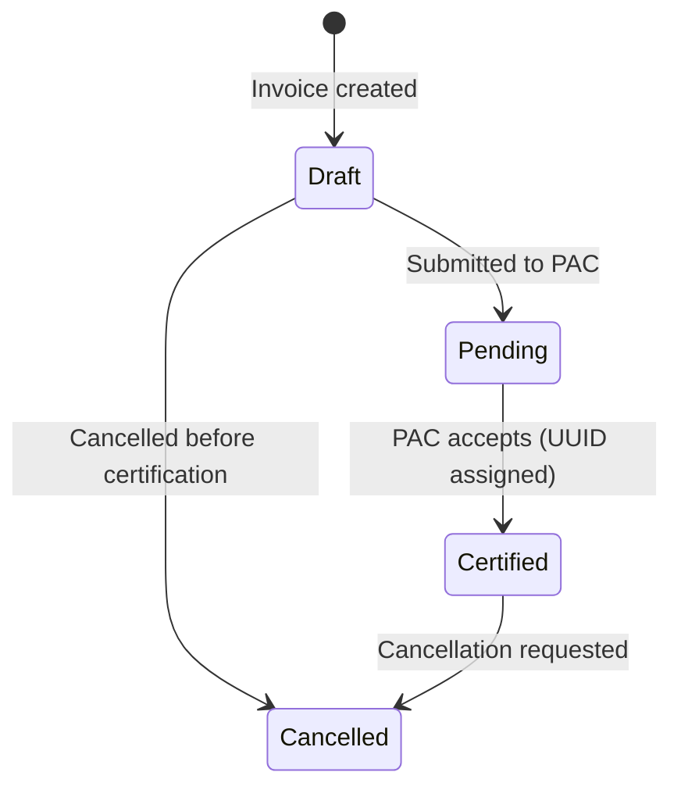
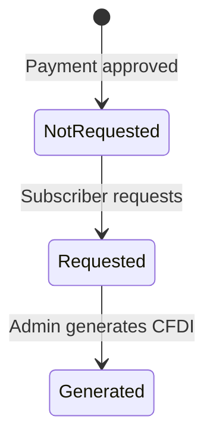

# 09 — Invoices Module (CFDI)

---

## What It Does
Electronic invoicing (CFDI 4.0 for Mexico): create invoices from transactions, manage billing settings per branch (RFC, tax regime, fiscal address), generate XML/PDF, and cancel invoices. Also handles invoice requests for subscription payments.

---

## Key Files

### Backend
| File | Role |
|---|---|
| `app/Models/Invoice.php` | Invoice with SAT UUID, status lifecycle |
| `app/Models/InvoiceItem.php` | Line items with SAT product codes |
| `app/Models/BillingSetting.php` | Per-branch fiscal configuration |
| `app/Enums/InvoiceStatus.php` | `no_solicitada`, `solicitada`, `generada`, `borrador`, `pendiente`, `certificada`, `cancelada` |
| `app/Actions/Invoices/CreateInvoiceAction.php` | Invoice creation orchestration |
| `app/Actions/Invoices/CancelInvoiceAction.php` | Invoice cancellation |
| `app/Actions/Invoices/SaveBillingSettingsAction.php` | Billing settings update |
| `app/Http/Controllers/Invoices/InvoiceController.php` | Invoice CRUD + cancel |
| `app/Http/Requests/Invoices/StoreInvoiceRequest.php` | Create validation |
| `app/Http/Requests/Invoices/CancelInvoiceRequest.php` | Cancel validation |
| `app/Http/Requests/Invoices/SaveBillingSettingsRequest.php` | Settings validation |
| `app/Services/Invoices/` | Invoice business logic services |
| `routes/web/invoices.php` | Invoice routes |

### Frontend
| File | Purpose |
|---|---|
| `Pages/Invoices/Index.vue` | Invoice list |
| `Pages/Invoices/Create.vue` | Create invoice form |
| `Pages/Invoices/Show.vue` | Invoice detail with XML/PDF |
| `Pages/Invoices/Settings.vue` | Billing settings configuration |

---

## Main Endpoints

### Invoices (`/invoices`)
- `GET /invoices` — `invoices.index` — List invoices
- `GET /invoices/create` — `invoices.create` — Create invoice form
- `POST /invoices` — `invoices.store` — Generate invoice
- `GET /invoices/{invoice}` — `invoices.show` — View invoice + download XML/PDF
- `POST /invoices/{invoice}/cancel` — `invoices.cancel` — Cancel invoice

### Billing Settings (`/invoices/settings`)
- `GET /invoices/settings` — `invoices.settings` — View settings
- `PUT /invoices/settings` — `invoices.updateSettings` — Update settings

---

## Invoice Status Lifecycle

For subscription payment invoices:

---

## Key Business Rules

1. **CFDI 4.0 compliance**: Invoices store SAT catalog codes (`sat_unit_code`, `sat_product_code`, `cfdi_use`, `payment_form`, `payment_method`).
2. **Per-branch billing settings**: Each branch can have different emitter data (RFC, legal name, tax regime, postal code). Stored in `BillingSetting`.
3. **External PAC API**: The `api_key` in `BillingSetting` is encrypted and used for communicating with a third-party PAC (Provider de Certificación).
4. **Invoice from transaction**: Invoices are created from completed transactions. The `invoiced` flag on `Transaction` marks it as invoiced.
5. **Cancellation requires reason**: The `cancellation_reason` field is stored when an invoice is cancelled.

---

## Dependencies
- **Transactions**: Invoices are created from transactions
- **Customers**: Invoice receiver data comes from customer
- **Branches**: Billing settings are per-branch
- **Subscriptions**: Subscription payments can request invoices

---

## Known Limitations / Technical Debt
1. **PAC integration not fully implemented** — The `api_key` and CFDI fields suggest PAC integration is planned, but the actual PAC communication may not be complete. Check `app/Services/Invoices/` for current state.
2. **No invoice from service order directly** — Service orders must be converted to transactions first.
3. **No complemento de pago (payment complement)** — For partial payments, Mexico requires a "complemento de pago" which may not be implemented.
4. **No automatic invoicing** — Invoices are manually created; no auto-generation after transaction completion.
5. **No invoice email sending** — Generated XML/PDF must be downloaded manually.
