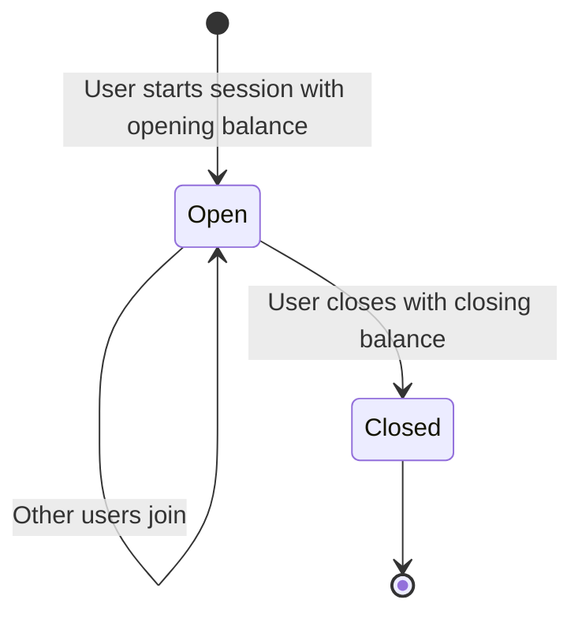

# 11 — Cash Register Module

---

## What It Does
Cash register management and session tracking: create cash registers per branch, open/close sessions with opening/closing balance verification, track cash inflows/outflows during sessions, support multi-user sessions (multiple cashiers on one register), and generate session reports with cash difference calculation.

---

## Key Files

### Backend
| File | Role |
|---|---|
| `app/Models/CashRegister.php` | Cash register entity |
| `app/Models/CashRegisterSession.php` | Session with opening/closing balances |
| `app/Models/SessionCashMovement.php` | Cash inflows/outflows during session |
| `app/Enums/CashRegisterSessionStatus.php` | Session statuses |
| `app/Enums/SessionCashMovementType.php` | `inflow`, `outflow` |
| `app/Http/Controllers/CashRegisterController.php` | Cash register CRUD |
| `app/Http/Controllers/CashRegisterSessionController.php` | Session lifecycle |
| `app/Http/Controllers/SessionCashMovementController.php` | Cash movement CRUD |
| `app/Http/Requests/StoreCashRegisterRequest.php` | Validation |
| `app/Http/Requests/UpdateCashRegisterRequest.php` | Validation |
| `app/Http/Requests/StoreCashRegisterSessionRequest.php` | Session validation |
| `app/Http/Requests/UpdateCashRegisterSessionRequest.php` | Session validation |
| `app/Http/Requests/StoreSessionCashMovementRequest.php` | Movement validation |
| `app/Services/CashRegisterReportService.php` | Session reports |
| `routes/web/cash-registers.php` | Cash register routes |
| `routes/web/cash-register-sessions.php` | Session routes |
| `routes/web/cash-register-session-movements.php` | Movement routes |

### Frontend
| File | Purpose |
|---|---|
| `Pages/FinancialControl/CashRegister/Index.vue` | Cash register list |
| `Pages/FinancialControl/CashRegister/Create.vue` | Create register |
| `Pages/FinancialControl/CashRegister/Edit.vue` | Edit register |
| `Pages/FinancialControl/CashRegister/Show.vue` | Register detail |
| `Pages/FinancialControl/CashRegisterSession/Index.vue` | Session list |
| `Pages/FinancialControl/CashRegisterSession/Show.vue` | Session detail |
| `Pages/FinancialControl/CashRegisterSession/PrintReport.vue` | Print session report |
| `Components/StartSessionModal.vue` | Open session modal |
| `Components/CloseSessionModal.vue` | Close session modal |
| `Components/JoinSessionModal.vue` | Join existing session |
| `Components/SessionClosedModal.vue` | Session closed summary |
| `Components/SessionHistoryModal.vue` | Session history |
| `Components/CashMovementModal.vue` | Add cash movement |

---

## Main Endpoints

### Cash Registers (`/cash-registers`)
- Full resource CRUD: `index`, `create`, `store`, `show`, `edit`, `update`, `destroy`

### Cash Register Sessions (`/cash-register-sessions`)
- Full resource CRUD: `index`, `create`, `store`, `show`, `edit`, `update`, `destroy`
- `GET /cash-register-sessions/{session}/print` — Print session report
- `POST /cash-register-sessions/{session}/join` — Join multi-user session
- `POST /cash-register-sessions/{session}/leave` — Leave session
- `POST /cash-register-sessions/rejoin-or-start` — Smart rejoin
- `PATCH /cash-register-sessions/{session}/update-closing-cash` — Set closing balance

### Session Cash Movements (`/cash-register-sessions/{session}/movements`)
- `POST /cash-register-sessions/{session}/movements` — Add cash movement
- `PUT /session-cash-movements/{movement}` — Update movement
- `DELETE /session-cash-movements/{movement}` — Delete movement

---

## Session Lifecycle

### Cash Difference Calculation
At session close:
1. `calculated_cash_total` = opening balance + all sales (cash) + inflows - outflows - expenses (cash)
2. `cash_difference` = `closing_cash_balance` (counted) - `calculated_cash_total` (expected)
3. Positive difference = surplus; negative = shortage

### Multi-User Sessions
- `cash_register_session_user` pivot table tracks all users in a session
- Real-time updates via Pusher/Laravel Echo so all users see the same session state

---

## Dependencies
- **Transactions/POS**: All POS transactions are linked to a session
- **Expenses**: Cash-paid expenses create session cash movements
- **Banking**: `opening_bank_balances` snapshot bank accounts at session start
- **Branches**: Cash registers belong to branches
- **Subscriptions**: Scoped via `HasSubscription` trait

---

## Known Limitations / Technical Debt
1. **No real-time sync for offline mode** — If Pusher connection drops, multi-user session state may diverge.
2. **No cash denomination breakdown** — Closing balance is a single number; no breakdown by bill/coin denominations.
3. **No forced closure** — If a user forgets to close a session, an admin cannot force-close it remotely.
4. **Session report is basic** — The print report shows totals but no breakdown by payment method or category.
5. **No audit trail for balance edits** — `opening_cash_balance` and `closing_cash_balance` can be edited without an audit log entry.
