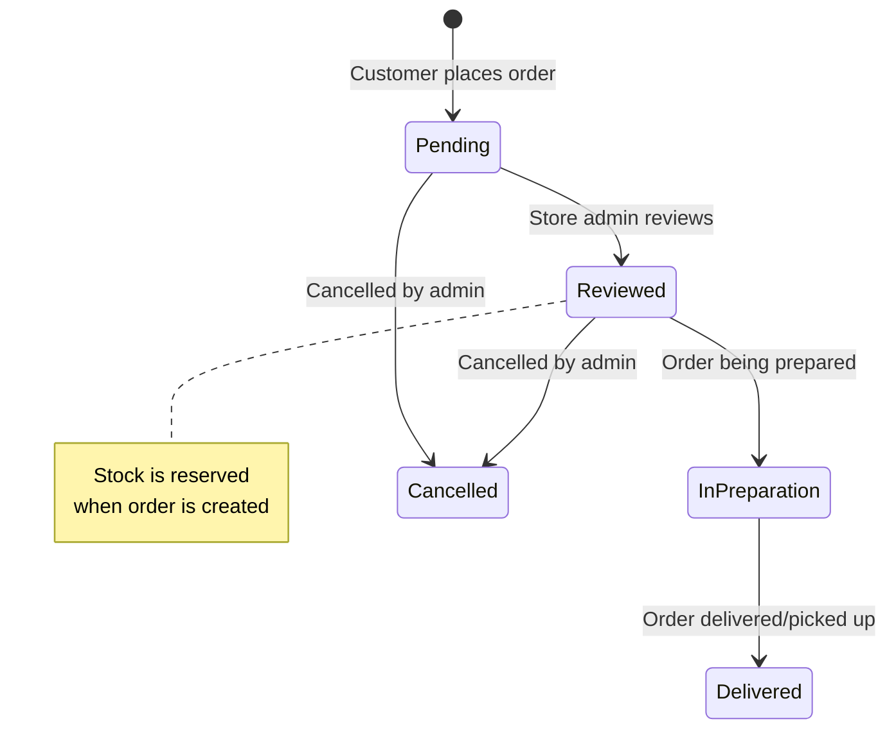

# 13 — Online Store Module

---

## What It Does
Public-facing e-commerce storefront for each tenant: store configuration (branding, policies, delivery settings), MercadoPago payment gateway integration, product browsing and cart, order placement with pickup/delivery options, and order management (status updates, POS processing). The store is accessible via subdomain/slug without authentication.

---

## Key Files

### Backend
| File | Role |
|---|---|
| `app/Models/StoreConfig.php` | Store configuration (branding, payments, delivery) |
| `app/Models/Order.php` | Online store orders |
| `app/Models/OrderItem.php` | Order line items |
| `app/Models/OrderStatusLog.php` | Order status change history |
| `app/Enums/OrderStatus.php` | `pending`, `reviewed`, `in_preparation`, `delivered`, `cancelled` |
| `app/Actions/Store/CreateStoreTransactionAction.php` | Order → POS transaction |
| `app/Http/Controllers/OnlineStore/StoreConfigController.php` | Store config CRUD |
| `app/Http/Controllers/OnlineStore/MercadoPagoController.php` | MercadoPago OAuth connect |
| `app/Http/Controllers/OnlineStore/OrderController.php` | Order management |
| `app/Http/Controllers/Store/PublicStoreController.php` | Public storefront rendering |
| `app/Http/Requests/OnlineStore/` | Store validation |
| `app/Services/MercadoPagoService.php` | MercadoPago payment processing |
| `app/Services/TiendaUrlService.php` | Store URL resolution |
| `app/Middleware/ResolveStore.php` | Resolves store from slug/subdomain |
| `routes/tienda.php` | Public store routes (no auth) |
| `routes/web/online-store.php` | Admin store management routes |

### Frontend
| File | Purpose |
|---|---|
| `Pages/Store/Index.vue` | Public store homepage (product listing) |
| `Pages/Store/Show.vue` | Product detail page |
| `Pages/Store/Cart.vue` | Shopping cart |
| `Pages/Store/Confirmed.vue` | Order confirmation page |
| `Pages/Store/Policies.vue` | Store policies page |
| `Pages/OnlineStore/Config.vue` | Admin store configuration |
| `Pages/OnlineStore/Orders/Index.vue` | Admin order list |
| `Pages/OnlineStore/Orders/Show.vue` | Admin order detail |
| `Layouts/StoreLayout.vue` | Public store layout (different from AppLayout) |

---

## Main Endpoints

### Public Store (`routes/tienda.php` — no auth)
- `GET /tienda/{slug}` — Store homepage
- `GET /tienda/{slug}/producto/{product:slug}` — Product detail
- `GET /tienda/{slug}/carrito` — Cart
- `POST /tienda/{slug}/carrito` — Add to cart
- `POST /tienda/{slug}/pedido` — Place order
- `GET /tienda/{slug}/pedido/{order}/confirmado` — Order confirmation
- `GET /tienda/{slug}/politicas` — Store policies
- MercadoPago webhook endpoints for payment notifications

### Admin Store Config (`/online-store`)
- `GET /online-store/config` — `online-store.config` — View config
- `PUT /online-store/config` — `online-store.config.update` — Update config
- `POST /online-store/config/check-slug` — Check slug availability
- `GET /online-store/mp/connect` — Connect MercadoPago
- `GET /online-store/mp/callback` — MercadoPago OAuth callback
- `POST /online-store/mp/disconnect` — Disconnect MercadoPago

### Admin Order Management (`/online-store/orders`)
- `GET /online-store/orders` — `online-store.orders.index` — Order list
- `GET /online-store/orders/{order}` — `online-store.orders.show` — Order detail
- `PUT /online-store/orders/{order}/status` — Update order status

---

## Order Flow

---

## Key Business Rules

1. **Store activation**: `StoreConfig.is_active` must be true for the store to be accessible.
2. **MercadoPago OAuth**: Each store connects its own MercadoPago account via OAuth. Tokens are stored encrypted in `StoreConfig`.
3. **Dual payment methods**: Cash on pickup/delivery (`payment_cash_enabled`) and MercadoPago (`payment_mp_enabled`).
4. **Stock reservation**: When an order is placed, stock is reserved via `reserved_stock` on `BranchProduct`. Stock is deducted when the order is processed in POS.
5. **Order → POS integration**: Orders appear in the POS terminal (`pos.online-orders` endpoint) for processing. Processing creates a `Transaction` and links it to the `Order`.
6. **Delivery tracking**: Orders track delivery type (`pickup`/`delivery`), delivery address, and delivery fee. Orders can be rescheduled via POS.
7. **Notification emails**: When `notify_email_enabled`, new order notifications are sent to configured email addresses.

---

## Dependencies
- **Products**: Products with `show_online = true` appear in the store
- **Subscriptions**: One `StoreConfig` per subscription
- **POS/Transactions**: Orders become transactions when processed
- **MercadoPago**: Payment processing gateway
- **Media Library**: Store logo and banners via Spatie

---

## Known Limitations / Technical Debt
1. **No customer accounts on storefront** — Orders are placed as guest; no login/signup for repeat customers.
2. **No order history for customers** — Customers can't view their past orders on the storefront.
3. **No inventory sync delay handling** — If stock changes while a customer is browsing, there's no real-time stock update (only checked at order time).
4. **Cart is client-side only** — No server-side cart persistence; refreshing loses the cart.
5. **Limited theming** — Only primary/secondary color customization; no full theme system.
6. **No SEO optimization** — Basic meta tags; no structured data or sitemap generation.
7. **No shipping cost calculation by distance/weight** — Only flat delivery fee or free above minimum.
