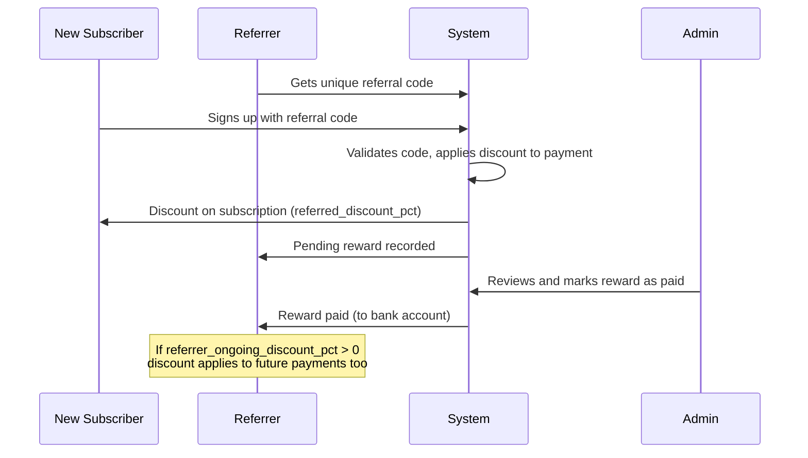

# 16 — Referrals Module

---

## What It Does
Referral program for subscription growth: each user gets a unique referral code, when a new subscription signs up with that code, the referred subscriber gets a discount on their subscription payment, and the referrer gets a reward (one-time + optional ongoing discount). Admins manage referral settings, approve payouts, and track usage.

---

## Key Files

### Backend
| File | Role |
|---|---|
| `app/Models/ReferralSettings.php` | Global referral program config (singleton) |
| `app/Models/ReferralCode.php` | Per-user referral codes |
| `app/Models/ReferralUsage.php` | When a code is used |
| `app/Models/ReferrerBankAccount.php` | Bank account for referrer payouts |
| `app/Actions/Referral/GenerateReferralCodeAction.php` | Create code for user |
| `app/Actions/Referral/ApplyReferralDiscountAction.php` | Apply discount to payment |
| `app/Actions/Referral/ProcessReferralOnPaymentApprovedAction.php` | Process rewards on approval |
| `app/Actions/Referral/UpdateReferrerOngoingDiscountAction.php` | Manage ongoing discount |
| `app/Http/Controllers/Subscription/ReferralController.php` | Subscriber referral page |
| `app/Http/Controllers/Admin/AdminReferralController.php` | Admin management |
| `app/Http/Requests/Subscription/UpdateReferrerBankAccountRequest.php` | Bank account validation |
| `app/Http/Requests/Admin/UpdateReferralSettingsRequest.php` | Settings validation |
| `routes/web/referrals.php` | Referral routes |
| `routes/web/super-admin.php` | Admin referral routes (under `/admin/referrals`) |

### Frontend
| File | Purpose |
|---|---|
| `Pages/Subscription/Referral/Index.vue` | User's referral dashboard |
| `Pages/Admin/Referral/Index.vue` | Admin: usage tracking |
| `Pages/Admin/Referral/Settings.vue` | Admin: program config |
| `Components/Referral/` | Referral-related components |

---

## Main Endpoints

### Subscriber (`/referrals`)
- `GET /referrals` — `referrals.index` — Referral dashboard
- `GET /referrals/code` — `referrals.code` — Get user's code
- `GET /referrals/validate` — `referrals.validate` — Validate a code
- `POST /referrals/mark-seen` — `referrals.mark-seen` — Mark as viewed
- `POST /referrals/bank-account` — `referrals.bank-account` — Save bank account

### Admin (`/admin/referrals`)
- `GET /admin/referrals` — `admin.referrals.index` — All usage records
- `POST /admin/referrals/{usage}/pay` — `admin.referrals.pay` — Mark reward paid
- `GET /admin/referrals/settings` — `admin.referrals.settings` — View settings
- `PUT /admin/referrals/settings` — `admin.referrals.settings.update` — Update settings

---

## Referral Flow

---

## Key Business Rules

1. **One code per user**: Each user gets one referral code (`GenerateReferralCodeAction`).
2. **One usage per subscription**: A subscription can only use one referral code (`referralUsageAsReferred` is hasOne).
3. **Discount snapshot**: When a referral is used, the discount/reward percentages at that moment are saved in `ReferralUsage`, so changing settings later doesn't affect existing referrals.
4. **Ongoing discount**: If `referrer_ongoing_discount_pct` is set, the referrer gets a discount on all future subscription payments (managed by `UpdateReferrerOngoingDiscountAction`).
5. **Payout requires bank account**: Referrers must save their bank account info via `ReferrerBankAccount` to receive rewards.

---

## Dependencies
- **Subscriptions**: Discounts applied to subscription payments; usage linked to referred subscription
- **Users**: Referral codes belong to users
- **Banking**: Referrer payouts via bank accounts

---

## Known Limitations / Technical Debt
1. **No automated payouts** — Rewards are manually marked as paid by admin; no integration with payment APIs for automatic transfers.
2. **No fraud detection** — No checks for self-referral, same IP, or other fraud patterns.
3. **No referral link** — Users get a code, not a shareable signup link with the code pre-filled.
4. **Migration fixes** (`2026_06_12_000007_fix_referral_codes_table.php` and `2026_06_12_000009_switch_referral_to_user_based.php`) suggest the referral system was recently refactored from subscription-based to user-based codes. Edge cases may remain.
5. **No referral analytics for users** — Users can see their code but not detailed stats on clicks/conversions.
