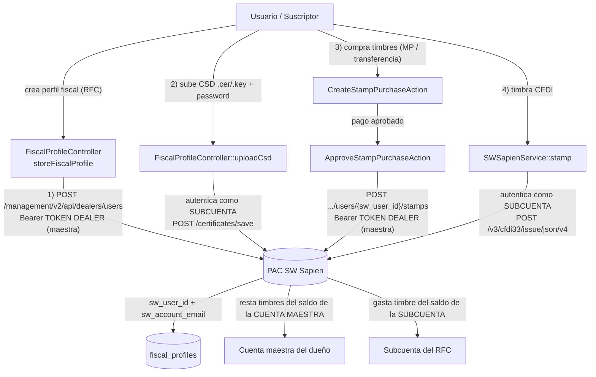

# Diagnóstico Fase 1 — Flujo actual de Facturación / Timbrado (PAC SW Sapien)

> **Fecha:** 2026-08-10
> **Alcance:** Solo diagnóstico del flujo actual. No se propone ni implementa ningún cambio todavía (Fase 2 pendiente de confirmación).
> **PAC:** SW Sapien — Esquema 2 (subcuentas con cuota propia de timbres), Management V2.
> **Entorno activo:** `.env` apunta a **TEST** (`https://services.test.sw.com.mx` / `https://api.test.sw.com.mx`, `.env:85-87`).

---

## 1. Resumen ejecutivo

El módulo de facturación asume en **todo** el stack que **cada RFC emisor (FiscalProfile) es una subcuenta (sub-usuario) de la cuenta maestra del dueño de la plataforma** en SW Sapien. No existe ningún concepto de "cuenta normal" ni de cliente que traiga su propia cuenta PAC.

El flujo actual es:

1. El suscriptor activa la facturación (`subscriptions.facturacion_habilitada` = toggle manual).
2. El suscriptor crea un perfil fiscal (RFC) desde Configuración → Facturación.
3. **Automáticamente** se crea una subcuenta en el PAC bajo la cuenta maestra del dueño (`POST /management/v2/api/dealers/users` con el token dealer del dueño).
4. El suscriptor sube su CSD (.cer/.key) — el PAC lo guarda bajo la **subcuenta** (no bajo el dealer).
5. El suscriptor firma el Manifiesto SAT con su FIEL (en memoria, nunca se persiste).
6. Para timbrar, el sistema se **autentica como la subcuenta** (`/v2/security/authenticate` con el email/contraseña de la subcuenta) y timbra con el CSD y el saldo de timbres de esa subcuenta.
7. Los timbres: el cliente compra timbres (Mercado Pago o transferencia), el dueño aprueba y se asignan desde el **saldo de la cuenta maestra** a la subcuenta (`POST /management/v2/api/dealers/users/{id}/stamps`).

Diagrama de arquitectura actual:



---

## 2. Punto 1 — ¿Dónde y cómo se crea la subcuenta del cliente en el PAC?

### Disparador
- **`FiscalProfileController::storeFiscalProfile()`** — `app/Http/Controllers/Billing/FiscalProfileController.php:45-130`.
- Se ejecuta al guardar un perfil fiscal desde `Billing/Settings/Index.vue` (ruta `POST /billing/settings/fiscal-profiles`, `routes/web/billing.php:61`).
- Guard previo: solo si `facturacion_habilitada` está activa (`FiscalProfileController.php:56-59`).
- La creación de la subcuenta es **automática e inseparable** de la creación del perfil: se llama justo después de `create()` del perfil, dentro de la misma transacción DB (`FiscalProfileController.php:75-83`).

### Endpoint y credenciales
- **`SWUserService::createSubaccountForProfile()`** — `app/Services/SW/SWUserService.php:42-140`.
- Endpoint: `POST {management_endpoint}/management/v2/api/dealers/users`
  - `management_endpoint` = `config('services.swsapien.management_endpoint')` → `SW_SAPIEN_MANAGEMENT_ENDPOINT` = `https://api.test.sw.com.mx` (`SWUserService.php:51-54,77`; `config/services.php:53-61`; `.env:86`).
  - Resolución con fallback en `resolveManagementEndpoint()` (`SWUserService.php:401-410`).
- **Credencial:** Bearer token **DEALER (cuenta maestra del dueño)** = `config('services.swsapien.token')` = `SW_SAPIEN_TOKEN` del `.env` (`SWUserService.php:39,54`; `.env:87`).

### Payload (`SWUserService.php:59-69`)
```php
$payload = [
    'taxId'             => $profile->rfc,
    'name'              => $profile->razon_social,
    'email'             => $email,                    // email del perfil
    'password'          => $password,                 // Str::random(16) generada en el controller
    'stamps'            => config('services.swsapien.default_stamps', 10), // 10 timbres iniciales
    'isUnlimited'       => false,
    'notificationEmail' => $email,
    'phone'             => $profile->phone ?? '',
];
```
- La contraseña de la subcuenta se genera con `Str::random(16)` en `FiscalProfileController.php:74` y se guarda **cifrada** en la BD (ver Punto 2).
- El PAC asigna `stamps: 10` timbres iniciales a la subcuenta al crearla.

### Manejo de la respuesta
- Parsea `data.idUser` / `data.id` / `idUser` / `id` (`SWUserService.php:110-120`).
- Persiste `sw_user_id` y `sw_account_email` en `fiscal_profiles` (`SWUserService.php:124-128`).
- Si el PAC rechaza (RFC duplicado, validación, etc.) lanza `RuntimeException` → la transacción hace **rollback** y el perfil local se borra (`FiscalProfileController.php:112-121`).

### Otros usos de gestión de subcuentas (mismo token dealer)
| Operación | Método | Endpoint |
|---|---|---|
| Listar subcuentas | `SWUserService::listSubaccounts()` (`:143`) | `GET .../dealers/users` |
| Desactivar subcuenta | `SWUserService::deactivateSubaccount()` (`:185`) | `PATCH .../dealers/users/{id}` `{isActive:false}` |
| Saldo de subcuenta | `SWUserService::getStampsBalance()` (`:240`) | `GET .../dealers/balance/users/{id}` |
| Agregar timbres | `SWUserService::addStampsToSubaccount()` (`:292`) | `POST .../dealers/users/{id}/stamps` |
| Retirar timbres | `SWUserService::removeStampsFromSubaccount()` (`:347`) | `DELETE .../dealers/users/{id}/stamps` |
| Saldo de cuenta maestra | `SWUserService::getMasterAccountBalance()` (`:426`) | `GET .../users/balance` |

---

## 3. Punto 2 — ¿Cómo y dónde se almacenan las credenciales/tokens de cada subcuenta?

### Tabla `fiscal_profiles`
- Migración: `database/migrations/2026_06_26_000001_create_fiscal_profiles_table.php` (+ ampliaciones posteriores).
- Modelo: `app/Models/Billing/FiscalProfile.php`.

| Campo | Tipo / origen | Notas |
|---|---|---|
| `subscription_id` | FK `subscriptions` | Perfil pertenece a una suscripción |
| `rfc` | string(13) | RFC del emisor |
| `razon_social` | string | Razón social fiscal |
| `sw_user_id` | string nullable | **ID de la subcuenta en el PAC** — es el "cable" que conecta con SW Sapien. `null` = sin subcuenta. Migración `:15-16` |
| `sw_account_email` | string nullable | Correo de login de la subcuenta en el PAC (migración `2026_06_27_000001...:15`) |
| `email` | string | Email del perfil (se usa como fallback del login de subcuenta) |
| `password` | string | Contraseña de la **subcuenta PAC**; cast `'encrypted'` (`FiscalProfile.php:57`), oculta de serialización (`:49-52`) — se cifra con `APP_KEY` |
| `is_active` | boolean | Activo/inactivo |
| `certificate_number`, `valid_from`, `valid_to` | | Metadatos del CSD (migración `2026_06_27_000002...`) |
| `cer_file_path`, `key_file_path` | string | Rutas locales de los archivos CSD (mismo migration) |
| `manifest_signed_at`, `manifest_*` | | Flujo del Manifiesto SAT |

### Tokens
- **Token dealer (maestra):** NO está en BD. Vive solo en `.env` → `SW_SAPIEN_TOKEN` (`.env:87`) y se lee vía `config('services.swsapien.token')`.
- **Token temporal de subcuenta:** NO se persiste. Se obtiene en vivo con `authenticateSubaccount()` (`SWSapienService.php:879-963`) y se guarda en **cache** 110 minutos con clave `sw_subaccount_token_{profile_id}` (`SWSapienService.php:883`). Login: `POST /v2/security/authenticate` con `{user: sw_account_email ?? email, password}` (`SWSapienService.php:896-907`).

---

## 4. Punto 3 — ¿Cómo se relaciona la cuenta de suscriptor con su subcuenta del PAC?

La cadena completa es:

```
User (usuario logueado)
  └─ branch (sucursal)                      → User->branch
       └─ subscription (suscripción/tenant)  → Branch->subscription
            └─ fiscalProfiles (1..N RFC)     → Subscription->fiscalProfiles (hasMany)
                 └─ sw_user_id  ⇄  Subcuenta PAC (1:1)
```

- **Llave foránea local:** `fiscal_profiles.subscription_id` → `subscriptions.id` (migración `2026_06_26_000001...:17`).
- **"Cable" hacia el PAC:** `fiscal_profiles.sw_user_id` (nullable). Si está lleno → el RFC existe como sub-usuario en el PAC. Si está `null` → no hay subcuenta.
- **Facturas:** `invoices.fiscal_profile_id` → `fiscal_profiles.id` (migración `2026_06_26_000002_add_fiscal_profile_id_to_invoices_table.php`).
- Helpers del modelo:
  - `FiscalProfile::hasSwSubaccount()` → `! empty($this->sw_user_id)` (`app/Models/Billing/FiscalProfile.php:157-160`).
  - `FiscalProfile::isReadyForInvoicing()` → `is_active && hasSwSubaccount()` (`:166-169`).

**No existe** una tabla/entidad separada "cuenta PAC". La subcuenta es un concepto implícito dentro de `fiscal_profiles` (campos `sw_user_id`/`sw_account_email`). Esto es relevante para la Fase 2 (diferenciar cuenta normal vs subcuenta no tiene hoy representación en el esquema).

---

## 5. Punto 4 — ¿Cómo se asignan/compran los timbres a una subcuenta?

### 5.1 Depósito inicial (apertura de subcuenta)
- El PAC asigna `stamps: 10` al crear la subcuenta (payload de `createSubaccountForProfile`, `SWUserService.php:64`; config `SW_SAPIEN_DEFAULT_STAMPS`).
- Se registra un `StampPurchase` de auditoría con status `STAMPS_APPLIED` y `admin_note = 'Depósito inicial por apertura de cuenta'` — **sin llamada al PAC** (los timbres ya vienen del alta). `FiscalProfileController.php:85-106`.

### 5.2 Compra por el cliente (usuario final)
- **Flujo:** `Billing/Settings/Show.vue` → `StampPurchaseController::store()` (`app/Http/Controllers/Billing/StampPurchaseController.php:48-96`), ruta `POST /billing/fiscal-profiles/{fiscalProfile}/stamps` (`routes/web/billing.php:47`). Permiso `stamps.purchase`.
- **`CreateStampPurchaseAction::execute()`** (`app/Actions/Billing/CreateStampPurchaseAction.php:26-127`):
  - Recalcula precio **server-side** con `StampPurchaseService::calculatePrice()` (tiers de `stamp_pricing_tiers`, `StampPurchaseService.php:38-77`).
  - Crea `StampPurchase` (status `pending` / `awaiting_review` según método y umbral).
  - **Mercado Pago:** crea preferencia de checkout con `PlatformMercadoPagoService` (`CreateStampPurchaseAction.php:114-121`) y redirige (`StampPurchaseController.php:86-89`).
  - **Transferencia:** queda `awaiting_review` con comprobante subido.
- **Quién paga:** el **cliente** (suscriptor) paga a la plataforma (MP o transferencia a las cuentas bancarias de la plataforma).
- **De dónde salen los timbres:** del **saldo de la cuenta maestra del dueño**, no del cliente. `StampPurchaseService::checkMasterBalance()` (`StampPurchaseService.php:173-215`) consulta `getMasterAccountBalance()` (token dealer) y bloquea la compra si no hay saldo en la maestra.

### 5.3 Aprobación y aplicación al PAC
- **Mercado Pago:** webhook `WebhookController::mercadopago()` (`app/Http/Controllers/WebhookController.php:109-185`) → valida pago, re-checa saldo de maestra, y aplica vía `ApproveStampPurchaseAction`. Compras grandes (≥ umbral, default 1000) quedan `awaiting_review`.
- **Transferencia:** cola de revisión admin `AdminStampPurchaseController::index()` (`:32-67`) → `approve()` (`:73-110`) → `ApproveStampPurchaseAction` (`app/Actions/Billing/ApproveStampPurchaseAction.php:22-52`).
- **Aplicación:** `StampPurchaseService::applyStampsToPac()` (`StampPurchaseService.php:94-140`) → `SWUserService::addStampsToSubaccount(sw_user_id, ...)` (`SWUserService.php:292-330`) → `POST /management/v2/api/dealers/users/{sw_user_id}/stamps` con **token dealer**. Es un **abono (delta)**, no fija el total.
- **Asíncrono alternativo:** `App\Jobs\Billing\ApplyStampsToPacJob` (`app/Jobs/Billing/ApplyStampsToPacJob.php`) — idempotente vía status `stamps_applied`.
- **Registro en BD:**
  - `stamp_purchases` (migración `2026_07_18_000002_create_stamp_purchases_table.php`): `fiscal_profile_id`, `stamp_quantity`, `unit_price`, `amount_total`, `pricing_tier_id`, `payment_method`, `status` (`pending|awaiting_review|approved|rejected|failed|stamps_applied`), `proof_file_path`, `reviewed_*`, `rejection_reason`, `pac_stamps_response_raw`, `stamps_applied_at`, `adjustment_type`.
  - `stamp_movements` (ledger, `2026_07_24_000001...`; servicios `StampMovementService.php`, `StampMovementObserver.php`).

### 5.4 Retiro (correcciones de superadmin)
- `SWUserService::removeStampsFromSubaccount()` (`:347-393`) → `DELETE .../users/{sw_user_id}/stamps`. Usado por ajustes manuales tipo `remove`.

---

## 6. Punto 5 — ¿Cómo se realiza el timbrado en sí?

### Orquestación
- **`SWSapienService::stamp()`** — `app/Services/Billing/SWSapienService.php:552-660`.
- Se invoca desde:
  - `CreateInvoiceAction::execute()` cuando la factura no es draft (`app/Actions/Billing/CreateInvoiceAction.php:33-39`) — dentro de transacción DB.
  - `InvoiceController::stamp()` para timbrar una prefactura guardada (`app/Http/Controllers/Billing/InvoiceController.php:649-667`).

### Armado del CFDI
- **`SWSapienService::buildPayload()`** (`:167-441`): construye el JSON CFDI 4.0 (Emisor/Receptor/Conceptos/Impuestos, FormaPago/MetodoPago solo para I/E, Complemento de Pago 2.0 para Tipo P vía `buildPagoComplement()` `:444-551`, TipoCambio, CondicionesDePago, etc.).
- Todas las cantidades se formatean como strings con decimales explícitos (reglas del PAC).

### Guards antes de timbrar (`stamp()`)
1. Configuración presente (`endpoint` + `token` dealer) — `:554-557`.
2. `facturacion_habilitada` en la suscripción — `:563-571`.
3. Perfil fiscal asociado — `:576-579`.
4. **Manifiesto SAT firmado** (`fiscalProfile->hasSignedManifest()`) — `:584-591`. Sin esto el PAC rechaza.
5. **Autenticación como subcuenta**: `authenticateSubaccount($invoice->fiscalProfile)` — `:587` (def `:879-963`), usa `sw_account_email`/`password` de la subcuenta.

### Llamada al PAC
- `POST {endpoint}/v3/cfdi33/issue/json/v4` con `Content-Type: application/jsontoxml` y **Bearer token de la subcuenta** — `:589-591`.

### Manejo de errores del PAC
- **HTTP error** (`$response->failed()`): extrae `message` / `messageDetail` / body → `Log::error` → lanza `RuntimeException('Se rechazó el timbrado: ...')` — `:593-604`.
- **`status !== 'success'`**: log con payload completo → `RuntimeException` — `:606-617`.
- **Sin uuid/cfdi** en respuesta: `RuntimeException` — `:619-621`.
- El `RuntimeException` sube a los controladores:
  - `CreateInvoiceAction` → `InvoiceController::store()` lo captura y redirige con `->with('error')` (`InvoiceController.php:211-220`).
  - `InvoiceController::stamp()` lo captura y muestra `->with('warning')` (`InvoiceController.php:657-662`).
- **Sin reintentos automáticos** de timbrado (a nivel servicio); el usuario puede reintentar manualmente con el botón "Timbrar".

### Persistencia post-timbrado (`:623-657`)
- Guarda en `invoices`: `uuid`, `xml_url` (XML real en `storage/app/public/invoices/xml/{uuid}.xml`), `pdf_url`, `fecha_timbrado`, `sello_cfdi`, `sello_sat`, `no_certificado_sat`, `rfc_prov_certif` (extraído de la cadena original), `cadena_original_sat`, `qr_code_base64`, `status = CERTIFIED`, `issued_at`.
- El **consumo del timbre** lo hace el PAC internamente contra el saldo de la subcuenta; la app no decrementa nada local (el saldo autoritativo se consulta en vivo al PAC).

### Cancelación
- **`SWSapienService::cancel()`** (`:670-730`): también **autentica como subcuenta** (`:698`), `POST /cfdi33/cancel/{rfc}/{uuid}/{motivo}/{folio}`. Mismos guards de `facturacion_habilitada`. El resultado puede requerir aceptación del receptor (estado `cancelacion_pendiente` + `SatConsultationService`).

---

## 7. Punto 6 — Lugares donde se asume que TODA cuenta de facturación es una subcuenta (hardcode)

> Esto es lo más importante del diagnóstico. Lista exhaustiva de dónde la suposición "perfil = subcuenta mía" está incrustada.

### A. Provisionamiento automático como subcuenta
| # | Archivo:Línea | Qué hace |
|---|---|---|
| A1 | `FiscalProfileController.php:78-83` | Al crear un perfil fiscal **siempre** llama `createSubaccountForProfile()` (subcuenta bajo la maestra). No hay alternativa "cuenta normal". |
| A2 | `FiscalProfileController.php:74` | Genera la contraseña de la subcuenta con `Str::random(16)` (no existe credencial del cliente). |
| A3 | `FiscalProfileController.php:85-106` | Registra el depósito inicial de 10 timbres (auditoría de subcuenta). |
| A4 | `CreateFiscalSubaccountAction.php:26-53` | Action dedicada a (re)vincular un perfil como subcuenta. |

### B. Guards de "tiene subcuenta" (`sw_user_id` como condición de existencia)
| # | Archivo:Línea | Qué hace |
|---|---|---|
| B1 | `FiscalProfile.php:157-160` | `hasSwSubaccount()` = `!empty(sw_user_id)` — el modelo entiende "vinculado al PAC" como "tiene subcuenta". |
| B2 | `FiscalProfile.php:166-169` | `isReadyForInvoicing()` = activo + subcuenta. |
| B3 | `FiscalProfileController.php:164-166` | `uploadCsd()` rechaza si `! $profile->sw_user_id` ("aún no tiene una cuenta"). |
| B4 | `FiscalProfileController.php:243-245` | `show()` solo consulta saldo si `sw_user_id`. |
| B5 | `FiscalProfileController.php:301-303` | `destroy()` desactiva la **subcuenta** si existe (`deactivateSubaccount`). |
| B6 | `SWSapienService.php:799-802` | `uploadCsd()` exige `sw_user_id`. |
| B7 | `StampPurchaseService.php:106-110` | `applyStampsToPac()` lanza error si no hay `sw_user_id`. |
| B8 | `AdminStampPurchaseController.php:266-267` | `balance()` → "Este perfil no tiene subcuenta PAC." |
| B9 | `AdminStampPurchaseController.php:300-302` | `history()` solo consulta saldo si `sw_user_id`. |

### C. Filtros de listados (solo aparecen perfiles con subcuenta)
| # | Archivo:Línea | Qué hace |
|---|---|---|
| C1 | `InvoiceController.php:174-175` | `create()`: carga solo perfiles `active()->whereNotNull('sw_user_id')`. |
| C2 | `InvoiceController.php:177-178` | `create()`: `hasFiscalProfiles` = existen perfiles **con subcuenta**. |
| C3 | `InvoiceController.php:242` | `edit()`: filtra `->whereNotNull('sw_user_id')`. |
| C4 | `AdminStampDashboardController.php:64` | KPI "Subcuentas" = `FiscalProfile::active()->whereNotNull('sw_user_id')->count()`. |
| C5 | `AdminStampDashboardController.php:70-74,147-153` | Suma de `stampsAssigned` solo de perfiles con `sw_user_id` (timbres distribuidos). |
| C6 | `AdminStampDashboardController.php:248-250` | Lista de emisores solo con `sw_user_id`. |
| C7 | `Admin/SubscriptionController.php:228-230` | Saldo por perfil solo con `sw_user_id`. |
| C8 | `Jobs/Billing/RefreshStampGlobalStatsJob.php:39,49` | Estadísticas globales solo con `sw_user_id` (corre cada 30 min, `routes/console.php:8`). |

### D. Autenticación y operaciones PAC como subcuenta
| # | Archivo:Línea | Qué hace |
|---|---|---|
| D1 | `SWSapienService.php:587` | `stamp()` autentica como subcuenta. |
| D2 | `SWSapienService.php:698` | `cancel()` autentica como subcuenta. |
| D3 | `SWSapienService.php:822` | `uploadCsd()` autentica como subcuenta. |
| D4 | `SWSapienService.php:879-963` | `authenticateSubaccount()`: usa `sw_account_email ?? email` + `password` cifrada. Hardcode del concepto "subcuenta". |
| D5 | `SWUserService.php:42-140` | `createSubaccountForProfile()` — única vía de alta PAC. |
| D6 | `SWUserService.php:292-330,347-393` | Asignación/retiro de timbres vía endpoints de **subcuentas** con token dealer. |
| D7 | `StampPurchaseService.php:116,122` | `applyStampsToPac()` usa `add/removeStampsFromSubaccount(sw_user_id)`. |

### E. Frontend (interfaz)
| # | Archivo:Línea | Qué hace |
|---|---|---|
| E1 | `resources/js/Pages/Billing/Settings/Index.vue:100-199` | Estado "Activo/Pendiente/CSD" basado en `profile.sw_user_id`. |
| E2 | `resources/js/Pages/Billing/Settings/Show.vue:283,560-565` | "Este emisor aún no tiene una subcuenta PAC vinculada"; bloques condicionados a `sw_user_id`. |
| E3 | `resources/js/Pages/Billing/Dashboard/Index.vue:226-227` | Badge "Activo/Pendiente" por `sw_user_id`. |
| E4 | `resources/js/Pages/Admin/Subscriptions/Show.vue:482` | "Sin subcuenta PAC vinculada." |
| E5 | `resources/js/Pages/Admin/Stamps/Index.vue:15-16,56-65,315-339` | KPI "Subcuentas" y "Timbres distribuidos de todas las subcuentas". |

### F. Configuración / documentación
- `config/services.php:53-61` — bloque `swsapien` con token dealer y paths de Management V2 (subcuentas).
- `docs/MODULO_FACTURACION.md` — documenta todo el esquema como "Esquema Multi-RFC con subcuentas".

---

## 8. Punto 7 — Gestión del CSD (certificado de sello digital)

### ¿Quién lo sube?
- **El cliente (suscriptor)** lo sube desde su panel (Configuración → Facturación → perfil fiscal), formulario `Billing/Settings/Index.vue` (acciones de CSD), con permiso `invoices.settings.access`/`upload_csd`.
- Ruta: `POST /billing/settings/fiscal-profiles/upload-csd` (`routes/web/billing.php:62`).

### Flujo técnico
1. **`FiscalProfileController::uploadCsd()`** (`app/Http/Controllers/Billing/FiscalProfileController.php:133-220`):
   - Valida `.cer`, `.key` y `password` (validación inline en el controller, no en FormRequest — nota: no sigue el patrón SOLID del proyecto).
   - Guard: requiere `sw_user_id` (`:164-166`).
2. **`SWSapienService::uploadCsd()`** (`app/Services/Billing/SWSapienService.php:790-870`):
   - Convierte PEM → DER (`extractDerFromPem`, `:1050-1076`), base64.
   - **Autentica como subcuenta** (no dealer) para que el CSD quede bajo la subcuenta (`:821-824`).
   - `POST {endpoint}/certificates/save` con `{b64Key, b64Cer, password, type: 'stamp'}` (`:826-834`).
   - Errores: HTTP y `status != success` → `RuntimeException` con mensaje del PAC (`:838-866`).
3. **Metadatos:** el PAC no devuelve datos del certificado; se extraen localmente con `openssl_x509_parse()` (`extractCertificateData`, `:1006-1049`) y se persisten en `fiscal_profiles` (`certificate_number`, `valid_from`, `valid_to`) vía `processCsdResponse()` (`:965-1004`).

### ¿Dónde se guarda y cómo se cifra?
- **En el PAC:** el CSD queda guardado en la subcuenta de SW Sapien (es lo que usa el PAC para timbrar).
- **Localmente (app):** el controller copia los archivos a `storage/app/csds/{profile_id}/certificado.cer` y `llave.key` con `storeAs` sobre el disco por defecto (**`local`**, `config/filesystems.php:16`) — `FiscalProfileController.php:195-210`.
  - ⚠️ **NO están cifrados** en disco; son archivos planos en el servidor (fuera de `public`, pero sin cifrado en reposo).
  - Se guardan rutas en `cer_file_path` / `key_file_path`.
- **El password del CSD NO se guarda** (solo viaja en el request al PAC).
- **La FIEL (.key del manifiesto)** nunca se persiste: se usa en memoria durante el firmado y se descarta (`SWManifestService.php:26-31`).

### Relación con el timbrado
- El CSD debe estar subido **y** el manifiesto firmado para poder timbrar (guard en `stamp()`, `SWSapienService.php:584-591`).

---

## 9. Punto 8 — ¿Qué determina que una cuenta "tenga el módulo de facturación" y cuándo se dispara la creación de la cuenta PAC?

### Activación del módulo
- **Campo:** `subscriptions.facturacion_habilitada` (boolean, **default `false`**) — migración `2026_07_16_000001_add_facturacion_habilitada_to_subscriptions.php:18-22`.
- **Toggle manual:** `InvoiceController::toggleFacturacion()` (`app/Http/Controllers/Billing/InvoiceController.php:690-705`), ruta `POST /billing/settings/toggle-facturacion` (`routes/web/billing.php:60`), permiso `invoices.settings.toggle` (`database/seeders/PermissionSeeder.php:75`).
- **NO está ligado automáticamente** al módulo de plan `module_billing` (`database/seeders/PlanItemSeeder.php:75-79`): el módulo del plan existe, pero `facturacion_habilitada` se activa/desactiva por separado (no hay código que la sincronice con el plan).
- **Permisos de facturación:** grupo "Facturación" en `PermissionSeeder.php:59-75` (`invoices.access/create/stamp/cancel/settings...`) — controlan el acceso a la UI, no la creación de la cuenta PAC.
- Con `facturacion_habilitada = false`, los controladores devuelven "safe defaults" sin llamadas al PAC (`InvoiceController.php:47-58, 529-536`).

### Punto exacto donde se dispara la creación de la cuenta PAC
- **No se crea al activar la facturación**, sino al crear el **primer perfil fiscal** (RFC) con facturación activa:
  `FiscalProfileController::storeFiscalProfile()` → `createSubaccountForProfile()` (`FiscalProfileController.php:78-83`).
- Es decir: **suscripción activa** (guard de `$subscription` en `:52-55`) + **`facturacion_habilitada = true`** (`:56-59`) + **guardar un perfil fiscal** = creación de subcuenta PAC bajo la cuenta maestra del dueño.

---

## 10. Hallazgos adicionales relevantes para la Fase 2

1. **Entorno TEST activo**: `.env:85-87` apunta a los endpoints de prueba de SW Sapien (`services.test.sw.com.mx`, `api.test.sw.com.mx`). El token dealer es el de prueba.
2. **Saldo autoritativo = PAC**: la app no lleva contabilidad de saldo; consulta en vivo (`getStampsBalance`) y usa `stamp_movements` solo como ledger de auditoría.
3. **CSD en disco sin cifrar** (`storage/app/csds/{id}/...`): riesgo a considerar al añadir el flujo de "cuenta normal" (el cliente deja de ser subcuenta, pero la app seguiría manejando sus archivos).
4. **El manifiesto (FIEL) es un bloqueante** para timbrar; en una cuenta normal del cliente aplica igual (el cliente firma su propio manifiesto).
5. **Doble vía de asignación de timbres**: el `ApplyStampsToPacJob` y las aprobaciones síncronas conviven; la idempotencia se apoya en `status = stamps_applied`.
6. **El umbral de revisión manual** de compras grandes (default 1000 timbres) y la revisión de transferencias ya existen como flujo semi-manual (`CreateStampPurchaseAction.php:63-70,97-108`; `WebhookController.php:123-158`) — buena base para el flujo "pago → confirmación de revendedor" de la Fase 2.
7. **`stamp_purchases` no tiene concepto de "cuenta destino"** más allá de `fiscal_profile_id`; para diferenciar subcuenta vs cuenta normal habrá que tocar esquema (Fase 2).
8. **Validación de CSD inline** en `FiscalProfileController::uploadCsd` (`:133-160`) en vez de FormRequest — inconsistencia con las guías del proyecto.

---

*Fin del diagnóstico Fase 1. Pendiente de confirmación del usuario para elaborar la propuesta de la Fase 2 (patrón adaptador `PacAccountProvider`, cambios de esquema, onboarding de cuenta normal, flujo de timbres con revendedor, riesgos y plan de migración).*
