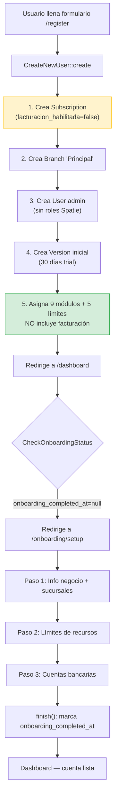

# Flujo de Registro de Nueva Cuenta — EzyVentas

> **Fecha de análisis:** 2026-07-16  
> **Alcance:** Documenta el comportamiento REAL del código actual, sin asumir ni completar huecos.  
> **Archivos analizados:** ~25 archivos entre controladores, acciones, middleware, modelos, seeders, migraciones, rutas y configuración.

---

## 1. Endpoints y controladores involucrados

### 1.1 Ruta de registro (Fortify)

| Concepto | Ubicación |
|---|---|
| Registro habilitado | `config/fortify.php` línea 144: `Features::registration()` |
| Stack de Jetstream | `config/jetstream.php` línea 53: `'stack' => 'inertia'` |
| Términos y privacidad | `config/jetstream.php` línea 58: `Features::termsAndPrivacyPolicy()` |
| Redirección post-login | `config/fortify.php` línea 72: `'home' => '/dashboard'` |

**Las rutas de registro (`/register`, `POST /register`) son registradas automáticamente por Laravel Fortify.** No están definidas manualmente en `routes/web.php`.

### 1.2 Acción de creación de usuario

| Archivo | Línea | Rol |
|---|---|---|
| `app/Actions/Fortify/CreateNewUser.php` | 17 | Implementa `CreatesNewUsers` (contrato de Fortify) |
| `app/Actions/Fortify/CreateNewUser.php` | 27–146 | Método `create()` — orquesta toda la creación |

### 1.3 Middleware que intervienen (en orden)

| Middleware | Archivo | Línea | Qué hace |
|---|---|---|---|
| `HandleInertiaRequests` | `app/Http/Middleware/HandleInertiaRequests.php` | 11 | Comparte datos globales de auth, permisos, módulos activos, flash |
| `CheckOnboardingStatus` | `app/Http/Middleware/CheckOnboardingStatus.php` | 23 | Redirige a `/onboarding/setup` si `onboarding_completed_at` es null |
| `CheckSubscriptionStatus` | `app/Http/Middleware/CheckSubscriptionStatus.php` | 23 | Bloquea empleados si no hay `currentVersion()` activa |
| `EnsureSubscriptionScope` | `app/Http/Middleware/EnsureSubscriptionScope.php` | 27 | Verifica que modelos route-bound pertenezcan a la suscripción del usuario |

> Los tres últimos se registran en `bootstrap/app.php` líneas 23–27 como `web` middleware global.

### 1.4 Onboarding

| Endpoint | Método | Controlador | Archivo | Línea |
|---|---|---|---|---|
| `GET /onboarding/setup` | `show()` | `OnboardingController` | `app/Http/Controllers/OnboardingController.php` | 17 |
| `POST /onboarding/step-1` | `storeStep1()` | `OnboardingController` | mismo archivo | 43 |
| `POST /onboarding/step-2` | `storeStep2()` | `OnboardingController` | mismo archivo | 142 |
| `POST /onboarding/step-3` | `storeStep3()` | `OnboardingController` | mismo archivo | 161 |
| `POST /onboarding/finish` | `finish()` | `OnboardingController` | mismo archivo | 210 |

Rutas definidas en `routes/web.php` líneas 29–34.

---

## 2. Orden de ejecución paso a paso

### Paso 1 — El usuario completa el formulario de registro

El formulario (renderizado por Fortify/Inertia) envía un `POST /register` con estos campos validados:

```
business_name  → required, string, max:255, unique:subscriptions
name           → required, string, max:255
email          → required, string, email, max:255, unique:users
password       → reglas de Fortify (mín 8 chars, etc.)
terms          → required, accepted (Jetstream)
```

**Archivo:** `app/Actions/Fortify/CreateNewUser.php`, líneas 30–41.

### Paso 2 — Transacción de base de datos

Todo ocurre dentro de `DB::transaction()` en `CreateNewUser::create()` (línea 44).

#### 2a. Crear la Suscripción (el "negocio")

```php
// CreateNewUser.php, líneas 47–53
Subscription::create([
    'business_name'   => $input['business_name'],
    'commercial_name' => $input['business_name'],  // ← mismo valor que business_name
    'contact_email'   => $input['email'],
    'slug'            => Str::slug($input['business_name']),
    'status'          => 'activo',
]);
```

**Campos NO establecidos explícitamente (quedan con defaults de DB o null):**
- `facturacion_habilitada` → `false` (default de la migración `2026_07_16_000001`)
- `tax_id` → `null`
- `address` → `null`
- `onboarding_completed_at` → `null`
- `referrer_discount_active` → `false` (default)
- `contact_phone` → `null`

#### 2b. Crear la Sucursal principal

```php
// CreateNewUser.php, líneas 56–60
$branch = $subscription->branches()->create([
    'name'     => 'Principal',
    'is_main'  => true,
    'timezone' => 'America/Mexico_City',
]);
```

#### 2c. Crear el Usuario administrador

```php
// CreateNewUser.php, líneas 64–69
User::create([
    'name'      => $input['name'],
    'email'     => $input['email'],
    'password'  => Hash::make($input['password']),
    'branch_id' => $branch->id,
]);
```

**El usuario NO recibe ningún rol de Spatie.** El método `isOwner()` del modelo `User` retorna `true` cuando `$this->roles()->exists()` es `false`. Esto es intencional: el dueño no tiene roles, y el `Gate::before()` en `AppServiceProvider` le concede acceso basado en los módulos activos de su suscripción.

#### 2d. Crear la versión inicial de la suscripción (trial de 30 días)

```php
// CreateNewUser.php, líneas 72–75
$version = $subscription->versions()->create([
    'start_date' => now(),
    'end_date'   => now()->addDays(30),
]);
```

#### 2e. Asignar los PlanItems iniciales (módulos + límites)

```php
// CreateNewUser.php, líneas 78–91
$planItems = $this->getInitialPlanItems();
$itemsData = $planItems->map(function ($item) {
    return [
        'item_key'       => $item->key,
        'item_type'      => $item->type,
        'name'           => $item->name,
        'quantity'       => $item->type == PlanItemType::MODULE ? 1 : ($item->meta['quantity'] ?? 1),
        'unit_price'     => $item->monthly_price,
        'billing_period' => BillingPeriod::MONTHLY,
    ];
});
$version->items()->createMany($itemsData->toArray());
```

### Paso 3 — Redirección

Fortify redirige a `/dashboard` (configurado en `config/fortify.php` línea 72).

### Paso 4 — Intercepción por CheckOnboardingStatus

```php
// CheckOnboardingStatus.php, línea 23
if ($user && !$user->subscription->onboarding_completed_at) {
```

Como `onboarding_completed_at` es `null` (recién creado), el middleware redirige a `route('onboarding.setup')` → `GET /onboarding/setup`.

**Excepciones:** No redirige si la ruta actual es `onboarding.*`, `logout`, `verification.*`, o `profile.*` (líneas 28–32).

### Paso 5 — Onboarding (3 pasos)

1. **Paso 1** (`storeStep1`): Guarda nombre comercial, razón social, teléfono, dirección, sucursales y horarios.
2. **Paso 2** (`storeStep2`): Actualiza las cantidades (`quantity`) de los límites (`limit_users`, `limit_cash_registers`, `limit_products`, `limit_print_templates`) en la versión actual.
3. **Paso 3** (`storeStep3`): Guarda cuentas bancarias.
4. **Finish** (`finish`): Ejecuta `storeStep3`, marca `onboarding_completed_at = now()`, envía `WelcomeEmail`, redirige al dashboard con mensaje flash.

---

## 3. Módulos que se activan/asignan automáticamente

### Lista exacta definida en `CreateNewUser::getInitialPlanItems()`

**Archivo:** `app/Actions/Fortify/CreateNewUser.php`, líneas 98–110.

```php
$defaultModuleKeys = [
    'module_pos',                // Punto de Venta
    'module_financial_reports',  // Reportes financieros
    'module_transactions',       // Historial de Ventas
    'module_products',           // Productos
    'module_expenses',           // Gastos
    'module_customers',          // Clientes
    'module_services',           // Servicios
    'module_cash_registers',     // Cajas
    'module_settings',           // Configuraciones
];

$defaultLimitKeys = [
    'limit_branches',
    'limit_users',
    'limit_products',
    'limit_cash_registers',
    'limit_print_templates',
];
```

Estos `keys` se buscan en la tabla `plan_items` (poblada por `PlanItemSeeder`). Los PlanItems que existen en el seeder y coinciden con estas claves son:

| Key | Name | Type | Monthly Price | Default Quantity |
|---|---|---|---|---|
| `module_pos` | Punto de Venta | module | $130.00 | 1 |
| `module_financial_reports` | Reportes financieros | module | $25.00 | 1 |
| `module_transactions` | Historial de Ventas | module | $0.00 | 1 |
| `module_products` | Productos | module | $0.00 | 1 |
| `module_expenses` | Gastos | module | $0.00 | 1 |
| `module_customers` | Clientes | module | $30.00 | 1 |
| `module_services` | Servicios | module | $50.00 | 1 |
| `module_cash_registers` | Cajas | module | $0.00 | 1 |
| `module_settings` | Configuraciones | module | $0.00 | 1 |
| `limit_branches` | Sucursales | limit | $30.00 | 1 |
| `limit_users` | Usuarios | limit | $7.50 | 1 |
| `limit_products` | Productos | limit | $1.50 | 100 |
| `limit_cash_registers` | Cajas Registradoras | limit | $7.50 | 1 |
| `limit_print_templates` | Plantillas personalizadas | limit | $3.00 | 1 |

**Fuente de los PlanItems:** `database/seeders/PlanItemSeeder.php`, líneas 14–56.

### Módulos del seeder que NO se asignan automáticamente

| Key | Name | Por qué no se asigna |
|---|---|---|
| `module_quotes` | Cotizaciones | No está en `$defaultModuleKeys` de `CreateNewUser` |
| `module_ai_agent` | Asistente IA | No está en `$defaultModuleKeys` de `CreateNewUser` |
| `limit_services` | Servicios (límite) | No está en `$defaultLimitKeys` de `CreateNewUser` |

### Módulos que NO existen en absoluto

| Concepto | Evidencia |
|---|---|
| `module_billing` | No existe en `PlanItemSeeder.php`. Búsqueda `grep "module_billing"` en todo el proyecto devuelve **0 resultados**. |
| `module_facturacion` | No existe. |
| Cualquier `PlanItem` con tipo `module` relacionado a facturación | No existe. |

---

## 4. Todo lo relacionado con facturación/PAC

### 4.1 ¿Existe un "módulo de facturación"?

**No.** No hay un `PlanItem` de tipo `module` para facturación. La facturación no se "contrata" como módulo. Se controla exclusivamente mediante la columna `facturacion_habilitada` en la tabla `subscriptions`.

### 4.2 Columna `facturacion_habilitada`

| Concepto | Detalle |
|---|---|
| Migración | `database/migrations/2026_07_16_000001_add_facturacion_habilitada_to_subscriptions.php` |
| Tabla | `subscriptions` |
| Tipo | `boolean`, default `false` |
| Modelo | `app/Models/Subscription.php`, línea 26 (`$fillable`), línea 34 (`$casts` como `boolean`) |

### 4.3 Permisos de facturación

Los siguientes permisos son referenciados en el código pero **NO existen en el `PermissionSeeder`** ni en ninguna migración:

| Permiso | Dónde se usa |
|---|---|
| `invoices.access` | `InvoiceController.php` línea 24, `AppMenu.vue` línea 17, `EzyVentasToolProvider.php` línea 357 |
| `invoices.see_details` | `InvoiceController.php` línea 26 |
| `invoices.edit` | `InvoiceController.php` línea 27 |
| `create invoices` | `InvoiceController.php` línea 25 |
| `cancel invoices` | `InvoiceController.php` línea 28 |
| `invoices.settings.access` | `InvoiceController.php` línea 29, `FiscalProfileController.php` línea 26, `StoreFiscalProfileRequest.php` línea 14 |

**Consecuencia directa:** Como estos permisos no existen en la base de datos, **todas las rutas de facturación retornan 403 Forbidden** para cualquier usuario (incluyendo al dueño). Esto se debe a:

1. El `Gate::before()` en `AppServiceProvider.php` (líneas 27–50) consulta `Permission::where('name', $ability)` — y no encuentra el permiso.
2. Para el dueño, retorna `null` (deja que Spatie decida).
3. Spatie tampoco encuentra el permiso porque no existe en la BD.
4. Resultado: `false` → 403.

> ⚠️ **POSIBLE CAMBIO RECIENTE:** El `PermissionSeeder` no incluye permisos de facturación. Si en algún momento la facturación funcionó, estos permisos debieron insertarse manualmente en la base de datos, o existía una versión anterior del seeder que los incluía y fue modificada.

### 4.4 Rutas de facturación

**Archivo:** `routes/web/billing.php`

Todas las rutas están protegidas por middleware `can:`:

```php
// InvoiceController middleware (líneas 22–30):
'can:invoices.access'           → index
'can:create invoices'           → create, store
'can:invoices.see_details'      → show
'can:invoices.edit'             → edit, update
'can:cancel invoices'           → cancel
'can:invoices.settings.access'  → settings, dashboard

// FiscalProfileController middleware (líneas 24–26):
'can:invoices.settings.access'  → todos los métodos
```

### 4.5 ¿En qué punto del registro se valida la facturación?

**En ningún punto.** El registro no toca facturación:

- `CreateNewUser::create()` no menciona facturación, PAC, ni SW Sapien.
- `OnboardingController` no menciona facturación.
- `facturacion_habilitada` queda en `false` por defecto.
- No se crean `FiscalProfile` durante el registro.
- No se llama a `SWUserService` ni a `SWSapienService` durante el registro.

### 4.6 ¿Es condicional u obligatoria la configuración de PAC?

**No es obligatoria para el registro.** Es más: es **completamente inaccesible** para una cuenta nueva porque los permisos no existen en la BD. Incluso si los permisos existieran, `facturacion_habilitada` por defecto es `false`, y los controladores (`InvoiceController@dashboard`, `@settings`, `@create`) ahora devuelven valores seguros cuando está desactivado (cambio reciente del 2026-07-16).

---

## 5. Validaciones que bloquean el registro

### 5.1 Validaciones que SÍ bloquean

| Validación | Archivo | Línea | Bloquea si... |
|---|---|---|---|
| `business_name` único | `CreateNewUser.php` | 32 | Ya existe una suscripción con ese `business_name` |
| `email` único en users | `CreateNewUser.php` | 34 | Ya existe un usuario con ese email |
| `terms` aceptados | `CreateNewUser.php` | 36 | Jetstream tiene `Features::termsAndPrivacyPolicy()` |
| Password rules | `CreateNewUser.php` | 35 | No cumple reglas de Fortify |
| PlanItems existen en BD | `CreateNewUser.php` | 105–107 | Las claves `$defaultModuleKeys`/`$defaultLimitKeys` no existen en `plan_items` (rompería con error 500, no con validación) |

### 5.2 Validaciones que NO bloquean

| Concepto | Evidencia |
|---|---|
| Facturación / PAC | No se referencia en `CreateNewUser`, `OnboardingController`, ni ningún middleware de registro |
| `facturacion_habilitada` | No se consulta durante el registro |
| Perfiles fiscales | No se crean ni se validan durante el registro |
| SW Sapien | No se llama a ningún endpoint del PAC durante el registro |
| `onboarding_completed_at` | No bloquea el registro — bloquea el acceso post-registro hasta completar el onboarding |

---

## 6. Notas "⚠️ POSIBLE CAMBIO RECIENTE"

### 6.1 Columna `facturacion_habilitada` — ⚠️ POSIBLE CAMBIO RECIENTE

- **Migración:** `2026_07_16_000001_add_facturacion_habilitada_to_subscriptions.php` (fecha: 2026-07-16, hoy)
- **Modelo:** `Subscription.php` — se agregó `facturacion_habilitada` a `$fillable` (línea 26) y `$casts` (línea 34)
- **Controladores:** `InvoiceController` — métodos `dashboard()`, `settings()`, `create()` ahora verifican `facturacion_habilitada` y devuelven defaults seguros si es `false`
- **Ruta nueva:** `POST /billing/settings/toggle-facturacion` (agregada hoy en `routes/web/billing.php`)
- **Vista:** `Billing/Settings/Index.vue` — ahora tiene banner de activación y botón "Activar facturación"
- **Vista:** `Billing/Dashboard/Index.vue` — ahora muestra estado "Facturación no activada" cuando `facturacionHabilitada` es `false`

### 6.2 OnboardingController — ⚠️ POSIBLE CAMBIO RECIENTE

- **Archivo:** `app/Http/Controllers/OnboardingController.php`, líneas 30–33
- El método `show()` ahora usa null-safe operator en `$currentVersion?->items?->where(...)` en lugar de acceso directo (`$subscription->versions->first()->items`). Esto evita el crash `Cannot read properties of undefined` cuando no hay versión o items.

### 6.3 Setup.vue — ⚠️ POSIBLE CAMBIO RECIENTE

- **Archivo:** `resources/js/Pages/Onboarding/Setup.vue`, líneas 65–68
- Ahora usa `props.currentLimits?.limit_users?.quantity ?? 5` (optional chaining + fallback) en lugar de `props.currentLimits.limit_users.quantity`.

### 6.4 Permisos de facturación ausentes — ⚠️ POSIBLE CAMBIO RECIENTE

- Los permisos `invoices.access`, `invoices.settings.access`, `invoices.see_details`, `invoices.edit`, `create invoices`, `cancel invoices` **NO existen en `PermissionSeeder.php`**.
- No hay migración que los cree.
- Sin embargo, son referenciados en `InvoiceController`, `FiscalProfileController`, `AppMenu.vue`, `EzyVentasToolProvider.php`, y `SiteNavigationRegistry.php`.
- **Esto significa que el módulo de facturación completo es inaccesible para cualquier usuario**, a menos que los permisos se hayan insertado manualmente en la BD de producción, o se hayan removido del seeder en un cambio reciente sin actualizar las referencias.
- El `PermissionSeeder` tampoco define un módulo llamado `'Facturación'` — los módulos definidos son: `'Punto de Venta'`, `'Historial de Ventas'`, `'Productos'`, `'Gastos'`, `'Clientes'`, `'Servicios'`, `'Cotizaciones'`, `'Reportes financieros'`, `'Cajas'`, `'Configuraciones'`, `'Tienda en línea'`, `'Sistema'`, `'Agente IA'`.
- Si se agregaran los permisos al seeder con módulo `'Facturación'`, el `Gate::before()` de `AppServiceProvider.php` los filtraría de todas formas porque `getAvailableModuleNames()` solo devuelve nombres de módulos que existan como `PlanItem` en la versión activa de la suscripción — y `module_billing` no existe como `PlanItem`.

---

## Resumen visual del flujo



> **Leyenda:** Amarillo = facturación desactivada por defecto. Verde = módulos base asignados.

---

## Verificación de la afirmación del usuario

> *"El sistema asume que TODOS los usuarios van a facturar, lo que causa errores como `Cannot read properties of undefined (reading 'quantity')` en la vista de `Setup.vue` cuando se registra un usuario nuevo que no tiene subcuenta ni timbres contratados."*

**Conclusión del análisis:**

1. El error `Cannot read properties of undefined (reading 'quantity')` en `Setup.vue` **no era causado por facturación/PAC**. Era causado porque `OnboardingController@show()` accedía a `$subscription->versions->first()->items` sin verificar que `versions->first()` no fuera `null`. Esto ya fue corregido (ver sección 6.2).

2. El sistema **NO asume que todos los usuarios van a facturar**. La facturación:
   - No se asigna como módulo durante el registro.
   - `facturacion_habilitada` es `false` por defecto.
   - Los permisos de facturación ni siquiera existen en la base de datos.
   - Las rutas de facturación son inaccesibles (403).

3. La facturación es **completamente opcional y actualmente inaccesible** para cuentas nuevas. Solo estaría disponible si:
   - Se insertan manualmente los permisos de facturación en la BD.
   - El usuario activa `facturacion_habilitada` desde el panel de configuración (el botón existe en `Billing/Settings/Index.vue` pero la página misma es inaccesible sin los permisos — paradoja).
