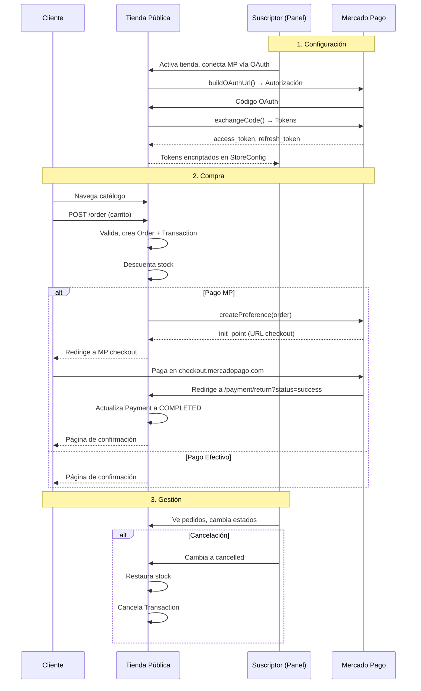

# Arquitectura: Tienda en Línea + Mercado Pago (Multi-tenant SaaS)

## Visión General

Cada suscriptor de la plataforma SaaS puede activar el módulo **Tienda en Línea** (`module_online_store`) para tener su propia tienda pública en la web. Cada tienda:
- Tiene su propio slug único (URL) y configuración independiente.
- Se conecta a su **propia cuenta de Mercado Pago** mediante OAuth — la plataforma nunca toca el dinero.
- Puede aceptar pagos en línea (Mercado Pago) o en efectivo contra entrega.
- Los pedidos de la tienda se reflejan automáticamente en el inventario y el historial de ventas del suscriptor.

---

## 1. Activación del Módulo

El módulo está definido como un `PlanItem` con:
- `key = 'module_online_store'`
- `type = PlanItemType::MODULE`
- Se asigna a la suscripción mediante `SubscriptionVersion` > `SubscriptionVersionItem` (con `item_type = 'module'` e `item_key = 'module_online_store'`).

**Verificación de disponibilidad:**
- El backend expone los módulos activos mediante `$subscription->getActiveModuleKeys()`.
- Se comparten globalmente en Inertia como `auth.active_modules` (array de strings como `['module_pos', 'module_online_store', ...]`).
- En el frontend se consulta con: `usePage().props.auth.active_modules?.includes('module_online_store')`.

---

## 2. Modelos de Datos

### `StoreConfig` (`store_configs` table)
Una fila por suscriptor (relación 1:1 con `Subscription`).

| Campo | Tipo | Descripción |
|---|---|---|
| `subscription_id` | FK | Suscripción propietaria |
| `slug` | string (unique) | Identificador URL de la tienda |
| `is_active` | boolean | Si la tienda es visible al público |
| `store_name` | string | Nombre comercial de la tienda |
| `description` | text | Descripción de la tienda |
| `tagline` | string | Eslogan corto |
| `logo_url` | string? | URL del logo |
| `primary_color` / `secondary_color` | string | Colores de marca (formato #HEX) |
| `theme_mode` | 'light' \| 'dark' | Tema visual |
| `accepts_pickup` / `accepts_delivery` | boolean | Tipos de entrega disponibles |
| `allow_out_of_stock_purchases` | boolean | Permitir compra de agotados |
| `out_of_stock_extra_minutes` | int | Minutos extra si requiere re-stock |
| `whatsapp_number` | string | Contacto WhatsApp |
| `delivery_fee` / `free_shipping_minimum` | decimal | Costos de envío |
| `preparation_time_minutes` | int | Tiempo estimado de preparación |
| `delivery_policy` / `terms_policy` | text | Políticas legales |
| `footer_note` | text | Texto del pie de página |
| `payment_mp_enabled` | boolean | MP activo como método de pago |
| `payment_cash_enabled` | boolean | Efectivo activo como método |
| `cash_instructions` | text | Instrucciones para pago en efectivo |
| `notify_email_enabled` | boolean | Enviar correo al recibir pedido |
| `notification_emails` | array | Hasta 3 correos de notificación |
| `mp_access_token` / `mp_refresh_token` | text (encrypted) | Tokens de MP |
| `mp_user_id` | string | ID de usuario de MP |
| `mp_public_key` | string | Public key para frontend SDK |
| `mp_token_expires_at` | datetime | Expiración del token |
| `custom_domain` | string? | Dominio personalizado |

**Colecciones multimedia:**
- `store-logo` — Logo de la tienda (1 archivo).
- `store-banners` — Banners promocionales (hasta 3).

**Mercado Pago:** Los tokens `mp_access_token` y `mp_refresh_token` se almacenan **encriptados** usando `encrypt()`/`decrypt()` de Laravel mediante accesors/mutators.

### `Order` (`orders` table)
Una fila por pedido recibido.

| Campo | Tipo | Descripción |
|---|---|---|
| `subscription_id` | FK | Suscripción |
| `store_config_id` | FK? | Config de tienda |
| `transaction_id` | FK? | Vínculo a `Transaction` (contabilidad) |
| `order_number` | int | Número secuencial por tienda |
| `status` | OrderStatus (enum) | `pending → reviewed → in_preparation → ready → delivered` o `cancelled` |
| `delivery_type` | 'pickup' \| 'delivery' | Tipo de entrega |
| `customer_name` / `customer_phone` / `customer_email` | strings | Snapshot del cliente |
| `delivery_address` | text? | Dirección de entrega |
| `customer_notes` | text? | Notas del cliente |
| `subtotal` / `delivery_fee` / `total` | decimal(10,2) | Totales |
| `payment_method` | 'mercadopago' \| 'cash' | Método de pago |
| `delivered_at` | timestamp? | Fecha de entrega |

**Generación de order_number:** Auto-incremental por `subscription_id`. Se calcula con `MAX(order_number) + 1` al crear.

**OrderStatus (enum):** Los estados tienen transiciones permitidas:
```
pending → [reviewed, cancelled]
reviewed → [in_preparation, cancelled]
in_preparation → [ready, cancelled]
ready → [delivered, cancelled]
delivered → []
cancelled → []
```

**Formatted order number:** Se formatea con ceros a la izquierda (mínimo 4 dígitos). Ej: `0001`, `0042`, `12345`.

### `OrderItem` (`order_items` table)
Snapshot de cada producto en el pedido (precio, cantidad, subtotal).

### `OrderStatusLog` (`order_status_logs` table)
Bitácora de cambios de estado (quién, desde, hasta, nota, timestamp).

---

## 3. Flujo Completo de una Venta en Línea

### A. El suscriptor configura su tienda
1. Accede al panel **OnlineStore/Config** (`/online-store/config`).
2. Establece slug, nombre, logo, colores, métodos de pago, políticas, etc.
3. Activa la tienda (`is_active = true`) → la URL pública funciona.
4. Conecta su cuenta de Mercado Pago vía OAuth.

### B. Conexión Mercado Pago (OAuth)
```
Suscriptor → Clic "Conectar" en el panel
  → GET /online-store/mp/connect
    → MercadoPagoService::buildOAuthUrl($subscriptionId)
      → Redirige a: https://auth.mercadopago.com/authorization?client_id=...&state={subscriptionId}&redirect_uri=...
  → El suscriptor autoriza en MP
  → MP redirige a: /online-store/mp/callback?code=...&state={subscriptionId}
    → MercadoPagoController::callback()
      → Valida que state == subscription_id
      → MercadoPagoService::exchangeCode($code)
        → POST https://api.mercadopago.com/oauth/token
        → Recibe: access_token, refresh_token, user_id, public_key, expires_in
      → Guarda los tokens en StoreConfig (encriptados)
```

**Modo de prueba:** En entorno `local`, se usa un `test_access_token` de las config de servicios (`config('services.mercadopago.test_access_token')`). El StoreConfig detecta automáticamente el modo con `app()->environment('local')`.

### C. Cliente visita la tienda pública
La URL se resuelve mediante el middleware `ResolveStore`:
- **Path mode:** `/store/{slug}/...`
- **Subdomain mode:** `{slug}.dominio.com/...`

El middleware:
1. Extrae el slug de la URL (`TiendaUrlService::resolveSlugFromRequest()`).
2. Busca `StoreConfig` por slug o custom_domain.
3. Verifica que `is_active = true` (sino, 404).
4. Inyecta `app('resolvedStore')` en el contenedor.
5. Comparte datos de la tienda en Inertia (`Inertia::share('store', ...)`).

### D. Cliente realiza un pedido

```
Cliente → /store/{slug} (Productos) → /store/{slug}/product/{id} (Detalle)
  → /store/{slug}/cart (Carrito)
  → POST /store/{slug}/order
    → PublicStoreController::placeOrder()
      → Rate limiting: 5 por minuto por IP
      → Valida: items, datos del cliente, tipo de entrega, método de pago
      → Valida: tipo de entrega está habilitado en la tienda
      → Valida: los productos existen, son show_online=true y pertenecen a la suscripción
      → Calcula: subtotal, delivery_fee, total
      
      DB Transaction:
      1. Crea Order (status: pending)
      2. Crea OrderItems (snapshot de productos)
      3. Log: OrderStatusLog (pending → pending, "Pedido realizado por el cliente")
      4. Crea Transaction (CreateStoreTransactionAction):
         - Transaction (channel: ONLINE_STORE)
         - TransactionItems (vinculados a Product, línea por línea)
         - Descuenta stock del producto (Product::deductStock)
         - Payment record:
           * Si es cash → Payment (CASH, COMPLETED)
           * Si es MP → Payment (CARD, PROCESSING)
         - Transaction status:
           * MP → PENDING (hasta que se confirme el pago)
           * Cash → COMPLETED
      
      → Si notify_email_enabled → envía NewStoreOrderNotification
      
      → Si pago es cash → redirige a confirmación
      → Si pago es MP → redirige a /store/{slug}/order/{id}/pay
```

### E. Pago con Mercado Pago

```
GET /store/{slug}/order/{order}/pay
  → PublicStoreController::pay()
    → Carga Order con items
    → MercadoPagoService::createPreference($storeConfig, $orderData)
      → Usa mp_access_token del StoreConfig (o test_access_token en local)
      → Crea preferencia en MP API:
        POST https://api.mercadopago.com/checkout/preferences
        Payload: items (productos + shipping), back_urls, external_reference (order_id),
                 notification_url, statement_descriptor
      → Recibe: init_point (URL de checkout de MP)
    → Redirige al cliente a: init_point (checkout.mercadopago.com/...)
```

### F. Retorno de Mercado Pago

```
MP redirige a: /store/{slug}/order/{order}/payment/return?status=success&payment_id=...
  → PublicStoreController::paymentReturn()
    → Si status=success y payment_id existe:
      → Actualiza Payment de PROCESSING a COMPLETED
      → Si la transacción está fully paid → cambia Transaction status a COMPLETED
    → Redirige a la página de confirmación
```

### G. Gestión del pedido (panel del suscriptor)

El suscriptor gestiona los pedidos en `OnlineStore/Orders`:
- **Index:** Lista con filtros por estado, DataTable con paginación.
- **Show:** Detalle del pedido, datos del cliente, items, historial de estado, enlace WhatsApp, enlace para llamar.
- **Cambio de estado:** Selector con transiciones permitidas. Si se cancela:
  - Se restaura el stock (`OrderController::restoreOrderStock`):
    - `Product::restock()` — repone el inventario.
    - Si existe Transaction vinculada → se cancela.
  - Se registra en `OrderStatusLog`.

---

## 4. Rutas

### Panel del suscriptor (protegidas con auth)

| Método | Ruta | Controlador |
|---|---|---|
| GET | `/online-store/config` | `StoreConfigController::show` |
| PUT/POST | `/online-store/config` | `StoreConfigController::update` |
| POST | `/online-store/config/check-slug` | `StoreConfigController::checkSlug` |
| GET | `/online-store/mp/connect` | `MercadoPagoController::connect` |
| GET | `/online-store/mp/callback` | `MercadoPagoController::callback` |
| POST | `/online-store/mp/disconnect` | `MercadoPagoController::disconnect` |
| GET | `/online-store/orders` | `OrderController::index` |
| GET | `/online-store/orders/{order}` | `OrderController::show` |
| PUT | `/online-store/orders/{order}/status` | `OrderController::updateStatus` |

### Tienda pública

| Método | Ruta | Descripción |
|---|---|---|
| GET | `/store/{slug}` | Catálogo de productos |
| GET | `/store/{slug}/product/{product}` | Detalle del producto |
| GET | `/store/{slug}/cart` | Carrito / formulario de pedido |
| POST | `/store/{slug}/order` | Crear pedido |
| GET | `/store/{slug}/order/{order}/pay` | Redirigir a MP checkout |
| GET | `/store/{slug}/order/{order}/payment/return` | Retorno de MP |
| GET | `/store/{slug}/order/{order}/confirmed` | Confirmación |
| GET | `/store/{slug}/policies` | Políticas de la tienda |

---

## 5. Seguridad y Consideraciones

- **Los tokens de MP se almacenan encriptados** en base de datos.
- **Cada suscriptor usa su propia cuenta de MP** — los pagos van directo a su cuenta, la plataforma no es intermediaria financiera.
- **El stock se descuenta al crear el pedido**, no al confirmar el pago. Para MP la transacción queda PENDING hasta que MP confirma el pago en el callback de retorno.
- **Rate limiting:** 5 pedidos por minuto por IP.
- **Autorización de pedidos:** Se verifica que el pedido pertenezca a la suscripción del usuario autenticado antes de mostrar o modificar.
- **Restauración de stock:** Al cancelar un pedido, se repone el stock automáticamente y se cancela la transacción vinculada.

---

## 6. Diagrama de Flujo (Mermaid)



---

## 7. Archivos Clave por Capa

### Backend
| Capa | Archivos |
|---|---|
| **Controllers** | `OnlineStore/StoreConfigController.php`, `OnlineStore/OrderController.php`, `OnlineStore/MercadoPagoController.php`, `Store/PublicStoreController.php` |
| **Actions** | `Store/CreateStoreTransactionAction.php` |
| **Services** | `MercadoPagoService.php`, `TiendaUrlService.php` |
| **Models** | `StoreConfig.php`, `Order.php`, `OrderItem.php`, `OrderStatusLog.php` |
| **Enums** | `OrderStatus.php` |
| **Requests** | `OnlineStore/UpdateStoreConfigRequest.php` |
| **Middleware** | `ResolveStore.php` |
| **Mail** | `NewStoreOrderNotification.php` |
| **Routes** | `web/online-store.php`, `tienda.php` |
| **Migrations** | `*_create_store_configs_table`, `*_create_orders_table`, `*_add_mercadopago_to_store_configs` |

### Frontend (Vue 3 + Inertia)
| Capa | Archivos |
|---|---|
| **Config** | `Pages/OnlineStore/Config.vue` |
| **Config Partials** | `VisibilitySection`, `BasicInfoSection`, `BrandingSection`, `DeliverySection`, `PaymentsSection`, `NotificationsSection`, `PoliciesSection`, `FooterSection` |
| **Orders** | `Pages/OnlineStore/Orders/Index.vue`, `Orders/Show.vue` |
| **Public Store** | `Pages/Store/Index.vue`, `Show.vue`, `Cart.vue`, `Confirmed.vue`, `Policies.vue` |
