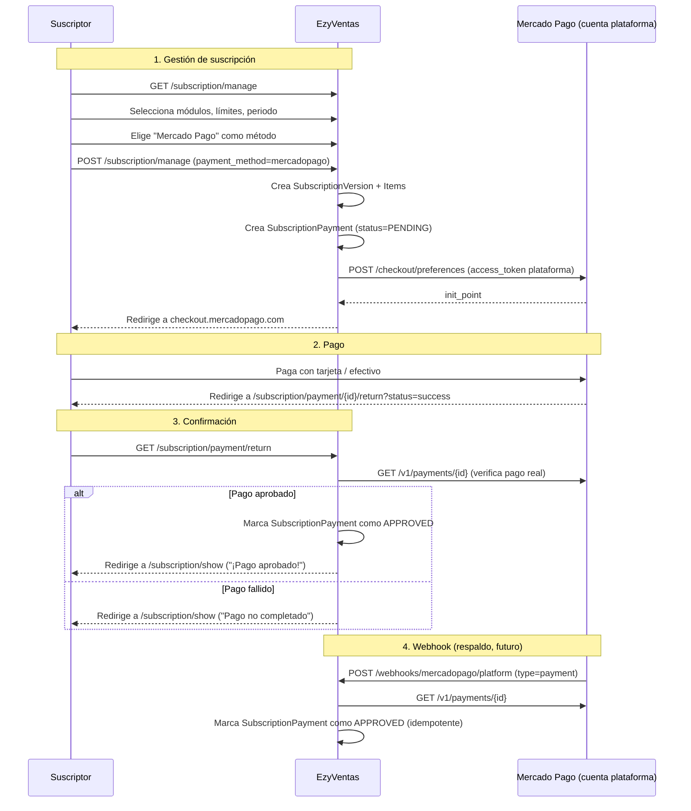

# Guía: Pago de Suscripciones (Mensual/Anual) con Mercado Pago Checkout Pro

## 0. Contexto: por qué Checkout Pro y no PreApproval (Suscripciones recurrentes)

La guía original (`mercadopago-suscripciones-plataforma-guide.md`) sugería usar **PreApproval Plans** de Mercado Pago para cobrar automáticamente mes a mes. **Se descartó ese enfoque** por:

1. El suscriptor debe decidir **activamente** cada vez que paga su suscripción. No queremos descontar dinero de sus cuentas bancarias de forma recurrente sin que él inicie el proceso.
2. Cada pago (mensual o anual) es un evento **único e iniciado por el suscriptor** desde el panel "Gestionar suscripción".
3. El producto correcto de Mercado Pago para esto es **Checkout Pro** (preferencias de pago), el mismo que ya se usa en el módulo de Tienda en Línea.

> **Diferencia clave:** En Tienda en Línea la cuenta de MP es **del suscriptor** (OAuth). Para cobrar la suscripción del SaaS, la cuenta de MP es **de la plataforma** (una sola cuenta, la tuya). El dinero va a la cuenta de la plataforma.

---

## 1. Estado Actual del Sistema de Suscripciones

### Modelos existentes (NO tocarlos estructuralmente)

| Modelo | Tabla | Rol |
|---|---|---|
| `Subscription` | `subscriptions` | Datos del tenant (business_name, commercial_name, slug, status, etc.) |
| `SubscriptionVersion` | `subscription_versions` | Cada contratación/renovación: start_date, end_date |
| `SubscriptionItem` | `subscription_items` | Items contratados en cada versión (módulos y límites) |
| `SubscriptionPayment` | `subscription_payments` | Pagos asociados a una versión (amount, status, payment_method, etc.) |
| `PlanItem` | `plan_items` | Catálogo maestro de módulos y límites con precios |

### Enums existentes

- `SubscriptionPaymentStatus`: `PENDING`, `APPROVED`, `REJECTED`
- `BillingPeriod`: `mensual`, `anual`
- `InvoiceStatus`: `NOT_REQUESTED`, `REQUESTED`, `GENERATED`

### Flujo actual (solo transferencia)

```
Suscriptor → GET /subscription/manage → Selecciona módulos, límites, periodo
  → POST /subscription/manage
    → SubscriptionController::processManagement()
      → Valida items, total_amount, payment_method
      → ProcessSubscriptionPaymentAction::execute()
        → Si transferencia:
          1. Crea/actualiza SubscriptionVersion (start_date, end_date)
          2. Crea SubscriptionItems
          3. Crea SubscriptionPayment (status=PENDING)
          4. Adjunta comprobante (proof_of_payment)
          5. Crea Expense (opcional)
          6. Notifica al admin
        → Redirige con mensaje "Pago en revisión"
      
Admin → Aprueba/Rechaza desde panel admin
  → ApproveSubscriptionPaymentAction / RejectSubscriptionPaymentAction
```

### Configuración actual de Mercado Pago (`config/services.php`)

```php
'mercadopago' => [
    'client_id'         => env('MP_CLIENT_ID'),
    'client_secret'     => env('MP_CLIENT_SECRET'),
    'redirect_uri'      => env('MP_REDIRECT_URI'),
    'platform_token'    => env('MP_PLATFORM_ACCESS_TOKEN'),
    'test_access_token' => env('MP_TEST_ACCESS_TOKEN'),
    'env'               => env('MP_ENV', 'sandbox'),
],
```

> `platform_token` será la credencial usada. En producción es el `Access Token` de la cuenta de MP de la plataforma. En desarrollo local es `TEST-...`.

---

## 2. Lo que hay que implementar

Añadir **Mercado Pago Checkout Pro** como método de pago alternativo a "Transferencia bancaria" en el flujo de gestión de suscripción. El suscriptor podrá elegir entre transferir o pagar en línea con tarjeta vía MP.

### 2.1 Flujo con Mercado Pago

```
Suscriptor → GET /subscription/manage → Elige módulos, límites, periodo
  → Selecciona "Mercado Pago" (en vez de "Transferencia")
  → POST /subscription/manage
    → SubscriptionController::processManagement()
      → Valida payment_method = 'mercadopago'
      → ProcessSubscriptionPaymentAction::execute()
        → Si mercadopago:
          1. Crea/actualiza SubscriptionVersion (start_date, end_date)
          2. Crea SubscriptionItems
          3. Crea SubscriptionPayment (status=PENDING, payment_method='mercadopago')
          4. Crea preferencia de pago en MP (PlatformMercadoPagoService)
          5. Redirige al init_point de MP
  
Suscriptor → Paga en checkout.mercadopago.com
MP redirige → GET /subscription/payment/return?status=success&payment_id=...
  → SubscriptionController::paymentReturn()
    → Si status=success:
      → Verifica el pago contra API de MP
      → Marca SubscriptionPayment como APPROVED
      → La suscripción ya está activa porque la versión ya se creó
    → Si status=failure/pending:
      → Marca o deja el pago como corresponde
    → Redirige a /subscription/show con mensaje

(Opcional futuro: Webhook)
POST /webhooks/mercadopago/platform
  → Recibe notificación de pago
  → Verifica firma
  → Si el pago fue aprobado → marca SubscriptionPayment como APPROVED
```

### 2.2 Diferencias con el flujo de transferencia

| | Transferencia | Mercado Pago |
|---|---|---|
| Estado inicial del pago | PENDING | PENDING |
| ¿Requiere aprobación manual? | Sí (admin revisa comprobante) | No (MP confirma el pago automáticamente) |
| ¿Se sube comprobante? | Sí (obligatorio) | No |
| ¿Cuándo se aprueba? | Admin manualmente | Automático al confirmar MP |
| Redirección post-pago | subscription.show | A checkout MP → return URL |

---

## 3. Archivos a Modificar / Crear

### 3.1 Crear: `App\Services\PlatformMercadoPagoService.php`

Encapsula las llamadas a la API de MP usando el `platform_token` de la plataforma. Similar a `MercadoPagoService` pero independiente (no usa StoreConfig, usa el token de plataforma).

```php
namespace App\Services;

use Illuminate\Support\Facades\Http;
use Illuminate\Support\Facades\Log;

class PlatformMercadoPagoService
{
    /**
     * Obtiene el access token de plataforma.
     * En local usa test_access_token, en prod usa platform_token.
     */
    public function getAccessToken(): string
    {
        if (app()->environment('local')) {
            return config('services.mercadopago.test_access_token');
        }
        return config('services.mercadopago.platform_token');
    }

    /**
     * Crea una preferencia de pago para una suscripción.
     * 
     * @param array $orderData  { items, payer_email, subscription_payment_id, description }
     * @return array  Respuesta de MP con init_point, id, sandbox_init_point
     */
    public function createPreference(array $orderData): array
    {
        $accessToken = $this->getAccessToken();

        $items = array_map(function ($item) {
            return [
                'id'          => (string) $item['id'],
                'title'       => $item['title'],
                'description' => $item['description'] ?? '',
                'quantity'    => (int) $item['quantity'],
                'unit_price'  => (float) $item['unit_price'],
                'currency_id' => 'MXN',
            ];
        }, $orderData['items']);

        $payload = [
            'items'               => $items,
            'payer'               => [
                'email' => $orderData['payer_email'],
            ],
            'back_urls'           => [
                'success' => $orderData['success_url'],
                'failure' => $orderData['failure_url'],
                'pending' => $orderData['pending_url'],
            ],
            'auto_return'         => 'approved',
            'external_reference'  => (string) $orderData['subscription_payment_id'],
            'statement_descriptor' => mb_substr($orderData['description'] ?? 'Suscripción EzyVentas', 0, 20),
            'notification_url'    => $orderData['webhook_url'] ?? null,
        ];

        $response = Http::withToken($accessToken)
            ->post('https://api.mercadopago.com/checkout/preferences', $payload);

        if (!$response->successful()) {
            Log::error('MP Platform preference creation failed', [
                'body' => $response->body(),
            ]);
            throw new \RuntimeException('No se pudo crear la preferencia de pago.');
        }

        return $response->json();
    }

    /**
     * Obtiene el detalle de un pago por su ID.
     */
    public function getPayment(string $paymentId): array
    {
        $accessToken = $this->getAccessToken();

        $response = Http::withToken($accessToken)
            ->get("https://api.mercadopago.com/v1/payments/{$paymentId}");

        if (!$response->successful()) {
            Log::error('MP Platform getPayment failed', [
                'payment_id' => $paymentId,
                'body' => $response->body(),
            ]);
            throw new \RuntimeException('No se pudo consultar el pago.');
        }

        return $response->json();
    }
}
```

### 3.2 Modificar: `SubscriptionController`

#### 3.2.1 Método `processManagement()`: Añadir `mercadopago` al array de métodos de pago

En el `$request->validate()`:

```php
'payment_method' => ['required', Rule::in(['transferencia', 'mercadopago'])],
```

#### 3.2.2 Método `processManagement()`: Ajustar regla de `proof_of_payment`

```php
'proof_of_payment' => ['nullable', 'required_if:payment_method,transferencia', 'file', ...],
```

#### 3.2.3 Método `processManagement()`: Ajustar el mensaje de éxito

```php
$message = match($validated['payment_method']) {
    'transferencia' => '¡Tu pago ha sido enviado! Está en revisión y se activará pronto.',
    'mercadopago'   => 'Redirigiendo a Mercado Pago para completar tu pago...',
    default         => '¡Tu suscripción ha sido actualizada con éxito!',
};
```

#### 3.2.4 Método `processManagement()`: Redirigir para Mercado Pago

Si `payment_method === 'mercadopago'`, en vez de redirigir a `subscription.show`, redirigir a la nueva ruta de pago:

```php
if ($validated['payment_method'] === 'mercadopago') {
    return redirect()->route('subscription.pay', [
        'payment' => $payment->id,
    ]);
}
```

> El `$payment` es el `SubscriptionPayment` recién creado. `ProcessSubscriptionPaymentAction` debe devolverlo o el controller debe obtenerlo de otra forma. Lo más limpio: el Action devuelve el `SubscriptionPayment` creado.

#### 3.2.5 Nuevo método: `pay(SubscriptionPayment $payment)`

```php
use App\Services\PlatformMercadoPagoService;

public function pay(SubscriptionPayment $payment, PlatformMercadoPagoService $mpService): RedirectResponse
{
    $user = Auth::user();
    if ($user->roles()->exists()) abort(403);
    if ($payment->subscriptionVersion->subscription_id !== $user->branch->subscription_id) abort(403);
    if ($payment->payment_method !== 'mercadopago' || $payment->status !== SubscriptionPaymentStatus::PENDING) {
        return redirect()->route('subscription.show')->with('error', 'Este pago no se puede procesar con Mercado Pago.');
    }

    $subscription = $user->branch->subscription;

    try {
        $preference = $mpService->createPreference([
            'items' => [[
                'id'          => "sub-{$payment->id}",
                'title'       => "Suscripción {$subscription->commercial_name}",
                'description' => $payment->subscriptionVersion->items->first()?->billing_period->value === 'anual'
                    ? 'Plan anual EzyVentas'
                    : 'Plan mensual EzyVentas',
                'quantity'    => 1,
                'unit_price'  => (float) $payment->amount,
            ]],
            'payer_email'            => $subscription->contact_email ?? $user->email,
            'subscription_payment_id' => $payment->id,
            'description'            => "Suscripción {$subscription->commercial_name}",
            'success_url'            => route('subscription.payment.return', ['payment' => $payment->id, 'status' => 'success']),
            'failure_url'            => route('subscription.payment.return', ['payment' => $payment->id, 'status' => 'failure']),
            'pending_url'            => route('subscription.payment.return', ['payment' => $payment->id, 'status' => 'pending']),
            'webhook_url'            => route('webhooks.mercadopago.platform'),
        ]);

        return redirect()->away($preference['init_point']);
    } catch (\Exception $e) {
        Log::error('MP subscription preference failed', ['payment_id' => $payment->id, 'error' => $e->getMessage()]);
        return redirect()->route('subscription.show')
            ->with('error', 'No se pudo iniciar el pago con Mercado Pago. Intenta con transferencia.');
    }
}
```

#### 3.2.6 Nuevo método: `paymentReturn(SubscriptionPayment $payment, Request $request)`

```php
public function paymentReturn(SubscriptionPayment $payment, Request $request, PlatformMercadoPagoService $mpService): RedirectResponse
{
    $user = Auth::user();
    if ($user->roles()->exists()) abort(403);
    if ($payment->subscriptionVersion->subscription_id !== $user->branch->subscription_id) abort(403);

    $status = $request->query('status');
    $paymentId = $request->query('payment_id');

    if ($status === 'success' && $paymentId) {
        // Verificar el pago contra la API de MP (nunca confiar solo en el query string)
        try {
            $mpPayment = $mpService->getPayment($paymentId);
            if (($mpPayment['status'] ?? '') === 'approved') {
                // Aprobar automáticamente
                app(ApproveSubscriptionPaymentAction::class)->execute($payment);
                return redirect()->route('subscription.show')
                    ->with('success', '¡Pago aprobado! Tu suscripción ha sido activada.');
            }
        } catch (\Exception $e) {
            Log::error('MP payment verification failed', ['payment_id' => $paymentId]);
        }
    }

    if ($status === 'failure' || $status === 'pending') {
        // Si falló o quedó pendiente, el pago sigue PENDING en nuestra BD.
        // El suscriptor puede intentar de nuevo desde el panel.
        return redirect()->route('subscription.show')
            ->with('warning', 'El pago no se completó. Puedes intentarlo de nuevo desde tu panel de suscripción.');
    }

    return redirect()->route('subscription.show');
}
```

### 3.3 Modificar: `ProcessSubscriptionPaymentAction`

#### 3.3.1 Devolver el `SubscriptionPayment` creado

Cambiar la firma para que `execute()` devuelva `SubscriptionPayment`:

```php
public function execute(Request $request, Subscription $subscription, array $validated, $allPlanItems): SubscriptionPayment
{
    if ($validated['payment_method'] === 'transferencia') {
        return $this->handleTransferPayment($request, $subscription, $validated, $allPlanItems);
    }
    
    if ($validated['payment_method'] === 'mercadopago') {
        return $this->handleMercadoPagoPayment($request, $subscription, $validated, $allPlanItems);
    }
    
    throw new \InvalidArgumentException('Método de pago no soportado.');
}
```

#### 3.3.2 Nuevo método: `handleMercadoPagoPayment()`

Es casi idéntico a `handleTransferPayment` pero sin subir comprobante:

```php
private function handleMercadoPagoPayment(Request $request, Subscription $subscription, array $validated, $allPlanItems): SubscriptionPayment
{
    $amount = (float) $validated['total_amount'];
    
    // Misma lógica de descuento por referido que en handleTransferPayment...
    $referralDiscountPct = null;
    $referralDiscountAmount = null;
    $referralData = null;
    
    if (!empty($validated['referral_code'])) {
        // Igual que en handleTransferPayment...
    }
    
    $referrerActivePct = $validated['billing_period'] === 'mensual'
        ? $subscription->getReferrerActiveDiscountPct()
        : 0;
    
    if ($referrerActivePct > 0) {
        $discountFromReferrer = round($amount * ($referrerActivePct / 100), 2);
        $amount -= $discountFromReferrer;
        if ($referralDiscountPct) {
            $referralDiscountPct = $referralDiscountPct + $referrerActivePct;
            $referralDiscountAmount = round($referralDiscountAmount + $discountFromReferrer, 2);
        } else {
            $referralDiscountPct = $referrerActivePct;
            $referralDiscountAmount = $discountFromReferrer;
        }
    }
    
    $payment = DB::transaction(function () use ($request, $subscription, $validated, $allPlanItems, $amount, $referralDiscountPct, $referralDiscountAmount, $referralData) {
        $billingPeriod = BillingPeriod::from($validated['billing_period']);
        $mode = $validated['mode'];
        
        // 1. Resolver versión base (misma lógica que transferencia)
        $latestVersion = $subscription->versions()->latest('id')->first();
        $baseVersion = $latestVersion;
        if ($latestVersion) {
            $lastPayment = $latestVersion->payments()->latest('id')->first();
            if ($lastPayment && $lastPayment->status === SubscriptionPaymentStatus::REJECTED) {
                $baseVersion = $subscription->versions()->where('id', '!=', $latestVersion->id)->latest('id')->first();
            }
        }
        
        // 2. Calcular fechas
        [$startDate, $endDate] = $this->calculateSubscriptionDates($baseVersion, $mode, $billingPeriod);
        
        // 3. Crear o reutilizar versión (misma lógica)
        $newVersion = $subscription->versions()
            ->whereHas('payments', fn($q) => $q->where('status', SubscriptionPaymentStatus::REJECTED))
            ->whereDoesntHave('payments', fn($q) => $q->whereIn('status', [SubscriptionPaymentStatus::APPROVED, SubscriptionPaymentStatus::PENDING]))
            ->latest('id')
            ->first();
        
        if (!$newVersion) {
            $newVersion = $subscription->versions()->create(['start_date' => $startDate, 'end_date' => $endDate]);
        } else {
            $newVersion->update(['start_date' => $startDate, 'end_date' => $endDate]);
            $newVersion->items()->delete();
        }
        
        // 3.5 Finalizar versión anterior si es upgrade
        if ($mode === 'upgrade' && $baseVersion && $baseVersion->id !== $newVersion->id) {
            if (Carbon::parse($baseVersion->end_date)->isFuture()) {
                $baseVersion->update(['end_date' => clone $startDate]);
            }
        }
        
        // 4. Insertar items (misma lógica)
        $subscriptionItems = [];
        foreach ($validated['items'] as $item) {
            $planItem = $allPlanItems->get($item['key']);
            if (!$planItem) continue;
            $subscriptionItems[] = [
                'subscription_version_id' => $newVersion->id,
                'item_key' => $planItem->key,
                'item_type' => $planItem->type,
                'name' => $planItem->name,
                'quantity' => $item['quantity'],
                'unit_price' => $billingPeriod === BillingPeriod::ANNUALLY ? $planItem->monthly_price * 10 : $planItem->monthly_price,
                'billing_period' => $billingPeriod,
                'created_at' => now(),
                'updated_at' => now(),
            ];
        }
        DB::table('subscription_items')->insert($subscriptionItems);
        
        // 5. Crear pago sin comprobante (no hay archivo físico)
        $payment = $newVersion->payments()->create([
            'amount' => $amount,
            'payment_method' => 'mercadopago',
            'status' => SubscriptionPaymentStatus::PENDING,
            'invoice_status' => InvoiceStatus::NOT_REQUESTED,
            'payment_details' => $mode === 'upgrade' ? [
                'is_upgrade' => true,
                'original_end_date' => $endDate->toIso8601String(),
            ] : [],
            'referral_discount_pct' => $referralDiscountPct,
            'referral_discount_amount' => $referralDiscountAmount,
        ]);
        
        // 6. Registrar ReferralUsage si aplica
        if ($referralData) {
            $settings = $referralData['settings'];
            $referralCode = $referralData['referral_code'];
            $monthlyBase = $this->calculateMonthlyBase($validated['items'], $allPlanItems);
            
            ReferralUsage::create([
                'referral_code_id' => $referralCode->id,
                'referred_subscription_id' => $subscription->id,
                'subscription_payment_id' => $payment->id,
                'reward_status' => 'pending',
                'referred_discount_pct' => $referralDiscountPct,
                'referrer_reward_pct' => $settings->referrer_reward_pct,
                'referrer_ongoing_discount_pct' => $settings->referrer_ongoing_discount_pct,
                'monthly_base_amount' => $monthlyBase,
                'reward_amount' => round($monthlyBase * ((float) $settings->referrer_reward_pct / 100), 2),
            ]);
        }
        
        return $payment;
    });
    
    return $payment;
}
```

> **IMPORTANTE:** Refactorizar para extraer la lógica común entre `handleTransferPayment` y `handleMercadoPagoPayment` a un método privado `createVersionAndItems()` que reciba los datos base y devuelva la versión creada. Esto evita duplicar ~80 líneas de código.

### 3.4 Modificar: `ManageSubscription.vue` (Frontend)

#### 3.4.1 Habilitar opción "Mercado Pago" en el SelectButton

```html
<SelectButton v-model="form.payment_method"
    :options="[
        { label: 'Mercado Pago', value: 'mercadopago' },
        { label: 'Transferencia Bancaria', value: 'transferencia' },
    ]"
    optionLabel="label" optionValue="value"
    class="w-full" />
```

> Ya no estará disabled. Remover `:disabled="true"`.

#### 3.4.2 Sección de instrucciones para Mercado Pago

```html
<!-- Detalles para Mercado Pago -->
<div v-if="form.payment_method === 'mercadopago'" class="mt-4">
    <Message severity="info" :closable="false">
        Serás redirigido a Mercado Pago para completar tu pago de forma segura con tarjeta de crédito, débito o efectivo en tiendas de conveniencia.
    </Message>
    <p class="text-xs text-gray-500 mt-2">
        Tu suscripción se activará automáticamente una vez que el pago sea confirmado.
    </p>
</div>
```

#### 3.4.3 Ajustar el botón de submit

```html
<Button @click="submit"
    :disabled="... || (form.payment_method === 'transferencia' && !form.proof_of_payment)"
    :loading="form.processing"
    :label="form.payment_method === 'mercadopago' ? 'Pagar con Mercado Pago' : (isRetry ? 'Reintentar pago' : (mode === 'renew' ? 'Confirmar y pagar' : 'Enviar comprobante'))"
    ... />
```

> Nota: `!form.proof_of_payment` solo es requerido si el método es transferencia.

### 3.5 Modificar: Rutas (`routes/web/subscriptions.php`)

```php
// Pago con Mercado Pago
Route::get('/payment/{payment}/pay', [SubscriptionController::class, 'pay'])->name('pay');
Route::get('/payment/{payment}/return', [SubscriptionController::class, 'paymentReturn'])->name('payment.return');
```

### 3.6 (Futuro) Crear: Webhook de Mercado Pago (Plan B para confirmación asíncrona)

```php
// routes/web/webhooks.php (o api.php)
Route::post('/webhooks/mercadopago/platform', [PlatformWebhookController::class, 'handle'])
    ->name('webhooks.mercadopago.platform')
    ->withoutMiddleware([\App\Http\Middleware\VerifyCsrfToken::class]);
```

El webhook es **opcional pero recomendado**. Si MP no puede redirigir al suscriptor (cierra el navegador, etc.), el webhook asegura que el pago se marque como aprobado. La lógica es idempotente: si el pago ya está APPROVED, no se reprocesa.

---

## 4. Diagrama de Flujo (Mermaid)



---

## 5. Consideraciones de Seguridad y Negocio

1. **El `access_token` de plataforma es único y vive en `.env`** (`MP_PLATFORM_ACCESS_TOKEN`). No por tenant.
2. **El monto en la preferencia de MP debe coincidir exactamente** con el `amount` del `SubscriptionPayment`. Si no, el pago no es válido y no se debe aprobar.
3. **Nunca confiar en el `?status=success` del query string.** Siempre verificar `GET /v1/payments/{id}` contra la API de MP.
4. **Idempotencia:** Un mismo `SubscriptionPayment` no debe procesarse dos veces. Verificar si ya está APPROVED antes de aprobar.
5. **Sin OAuth:** No se usa OAuth para este flujo porque la cuenta de MP es de la plataforma, no del suscriptor.
6. **El `external_reference`** en la preferencia debe ser el ID del `SubscriptionPayment`. Esto permite trazar el pago.
7. **Modo de prueba (sandbox):** Usar `TEST-...` token en `local`. En producción, usar el token productivo (`APP_...`). Las tarjetas de prueba de MP se pueden usar en sandbox.
8. **La suscripción se crea ANTES de pagar** (a diferencia de otros sistemas). Esto es correcto: la versión queda creada con `SubscriptionPayment.status = PENDING` y se activa al confirmar. Si el pago no se completa, la versión queda ahí pero no se usa porque `currentVersion()` busca versiones con pagos aprobados (o sin pagos rechazados). Revisar que `getActiveModuleKeys()` y `currentVersion()` manejen correctamente este caso.

---

## 6. Resumen de Cambios (Checklist)

| # | Archivo | Acción |
|---|---|---|
| 1 | `App\Services\PlatformMercadoPagoService.php` | **Crear** |
| 2 | `SubscriptionController.php` | **Modificar** — añadir `pay()`, `paymentReturn()`, ajustar `processManagement()` |
| 3 | `ProcessSubscriptionPaymentAction.php` | **Modificar** — refactorizar lógica común, añadir `handleMercadoPagoPayment()`, devolver `SubscriptionPayment` |
| 4 | `ManageSubscription.vue` | **Modificar** — habilitar opción MP, añadir UI, ajustar validaciones |
| 5 | `routes/web/subscriptions.php` | **Modificar** — añadir rutas `pay` y `payment.return` |
| 6 | (Opcional) `PlatformWebhookController.php` | **Crear** — webhook de respaldo |
| 7 | (Opcional) `routes/web/webhooks.php` | **Crear** — ruta del webhook |

---

## 7. Nota sobre la integridad del sistema actual

**No se modifica** la estructura de las tablas existentes:
- `subscription_payments` ya tiene `payment_method` (varchar) — se añade el valor `'mercadopago'`.
- `subscription_payments` ya tiene `status` (PENDING/APPROVED/REJECTED) — se reutiliza completamente.
- `ApproveSubscriptionPaymentAction` se reutiliza tal cual para aprobar pagos de MP (el admin también puede aprobar manualmente si es necesario).

**No se necesita**:
- Crear tablas nuevas.
- Modificar migraciones.
- Tocar `StoreConfig`, `MercadoPagoService`, ni el módulo de Tienda en Línea.
- Implementar PreApproval ni cobros recurrentes.
